# ✅ Arduino Starter Kit Numbered Checklist 
# 🔌 Core Boards & Interfaces
 **1, Arduino Uno board** ແມ່ນບອດຄວບຄຸມອິເລັກໂຕຣນິກທີ່ຖືກອອກແບບມາໃຫ້ໃຊ້ງານງ່າຍ ແລະ ເໝາະສຳລັບການຮຽນຮູ້ການພັດທະນາອຸປະກອນອິເລັກໂຕຣນິກ. ມັນໃຊ້ໃນການຄວບຄຸມອຸປະກອນຕ່າງໆ ເຊັ່ນ ໄຟ LED, ມໍເຕີ, ຊິບສື່ສານ, ແລະ ອຸປະກອນວັດຄ່າ.
    ໃຊ້ເປັນຕົວຄວບຄຸມຫຼັກໃນໂປຣເຈັກອີເລັກໂທນິກ ສາມາດອ່ານຂໍ້ມູນຈາກເຊັນເຊີ ແລະ ຄວບຄຸມອຸປະກອນຕ່າງໆ
    
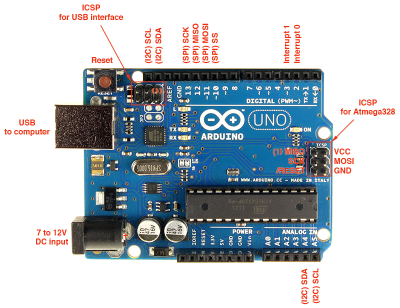

 ຕົວຢ່າງໂຄງການທີ່ນຳ Arduino Uno ໄປໃຊ້
- **ລະບົບຄວບຄຸມໄຟສ່ອງສວ່າງ**: ໃຊ້ Digital Pins ເພື່ອຄວບຄຸມ LED ໃຫ້ເປີດ/ປິດຕາມເວລາ.
- **ການວັດອຸນຫະພູມ**: ໃຊ້ Analog Pins ກັບເ຋ັນເຊີວັດອຸນຫະພູມແລ້ວສະແດງຜົນຜ່ານ LCD.
- **ລະບົບກວດຈັບການເຄື່ອນໄຫວ**: ໃຊ້ກັບ PIR Sensor ເພື່ອແຈ້ງເຕືອນຫາກມີການເຄື່ອນໄຫວ.
- **ລະບົບປະຕູອັດຕະໂນມັດ**: ໃຊ້ກັບ Servo Motor ເພື່ອເປີດ/ປິດປະຕູຕາມຄຳສັ່ງ
 
 **2, Breadboards** ແມ່ນອຸປະກອນທີ່ໃຊ້ໃນການປະກອບວົງຈອນອິເລັກໂຕຣນິກໂດຍບໍ່ຈໍາເປັນຕ້ອງບັດຫຼືຕໍ່ສາຍ.ມັນເຫຼາະສົມສໍາລັບການທົດລອງ ແລະພັດທະນາໂຄງການໃໝ່ໆ.
    ໃຊ້ເປັນແຜ່ນທົດລອງເພື່ອເຊື່ອມຕໍ່ອຸປະກອນ ແລະ ທົດລອງວົງຈອນອີເລັກໂທນິກ
    - ບໍ່ຈໍາເປັນຕ້ອງບັດສາຍ ເພາະສາມາດສຽບສາຍລົງໃນຮູໄດ້ເລີຍ
    - ສາມາດທົດລອງວົງຈອນໄດ້ຢ່າງງ່າຍດາຍ ແລະປ່ຽນແປງໄດ້ໄວ
    - ມັກໃຊ້ກັບ Arduino ເພື່ອປະກອບໂຄງການຕ່າງ
    
 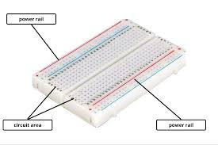
 
ຕົວຢ່າງໂຄງການທີ່ໃຊ້ Breadboard
- **ວົງຈອນ LED Blink:** ຕໍ່ LED ກັບຕົວຕ້ານແລ້ວຄວບຄຸມດ້ວຍ Arduino
- **ວົງຈອນກວດຈັບແສງ:** ໃຊ້ LDR ເພື່ອກວດຈັບຄວາມສວ່າງ ແລ້ວເຮັດໃຫ້ LED ເປີດ/ປິດ
- **ລະບົບແຈ້ງເຕືອນດ້ວຍ Buzzer:** ຕໍ່ Buzzer ກັບ Sensor ເພື່ອແຈ້ງເຕືອນຫາກມີການເຄື່ອນໄຫວ

**3, USB cable** ແມ່ນສາຍທີ່ໃຊ້ເຊື່ອມຕໍ່ອຸປະກອນອິເລັກໂຕຣນິກເພື່ອສົ່ງຂໍ້ມູນ ແລະຈ່າຍໄຟ. ມີຫຼາຍຊະນິດຕາມຮູບແບບຂອງຫົວຕໍ່ ແລະຄວາມໄວໃນການສົ່ງຂໍ້ມູນ.
    ໃຊ້ງານ USB Cable
    - **ສົ່ງຂໍ້ມູນ:** ລະຫວ່າງອຸປະກອນ (ເຊັ່ນ ມືຖືກັບຄອມພິວເຕີ)
    - **ຈ່າຍໄຟ:** ຊາຈອຸປະກອນເຊັ່ນ ມືຖື, ແທັບເລັດ, ລົດຖ່ານ
    - **ສື່ສານຂໍ້ມູນພາຍໃນ:** ໃຊ້ໃນວົງຈອນ Arduino ເພື່ອອັບໂຫຼດໂຄດ
    
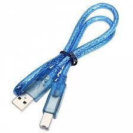

ຕົວຢ່າງການນຳໃຊ້
- **ເຊື່ອມ Arduino ກັບຄອມພິວເຕີ:** ໃຊ້ USB-A ທໍາມະດາເຂົ້າຫາ USB-B ຫຼື USB-C ຂຶ້ນກັບບອດ
- **ຊາຈມືຖື:** ໃຊ້ USB-C ຫຼື Micro-USB ຕໍ່ກັບ Adapter
- **ເຊື່ອມຕໍ່ກ້ອງຖ່າຍຮູບກັບຄອມ:** ໃຊ້ Mini-USB ຫຼື USB-B

# 🧵 Wiring & Connectors
**4, Jumper wires (male-to-male)**  ແມ່ນສາຍຕໍ່ທີ່ມີຂົວເຫຼັກ (pin) ທັງສອງຂ້າງ ໃຊ້ເພື່ອເຊື່ອມຕໍ່ລະຫວ່າງ breadboard ແລະອຸປະກອນອື່ນໆ ຢ່າງງ່າຍດາຍ.
    ໃຊ້ເຊື່ອມຕໍ່ລະຫວ່າງບອດ Arduino ແລະ ສ່ວນປະກອບຕ່າງໆເທິງແຜ່ນທົດລອງວົງຈອນ
    - **Male-to-male jumper wires** ແມ່ນສາຍທີ່ມີຂົວ pin ທັງສອງຂ້າງ ເຫຼາະສົມສໍາລັບການຕໍ່ລະຫວ່າງ breadboard ແລະບອດ Arduino, Raspberry Pi ຫຼືອຸປະກອນອື່ນໆ.
    - ມັກໃຊ້ໃນການທົດລອງວົງຈອນຊົ່ວຄາວ ໂດຍບໍ່ຈໍາເປັນຕ້ອງບັດສາຍ.
    - ມີຫຼາຍສີເພື່ອຊ່ວຍໃຫ້ການຈັດການວົງຈອນງ່າຍຂຶ້ນ (ສີບໍ່ມີຄວາມໝາຍທາງວິທະຍາສາດແຕ່ຊ່ວຍໃຫ້ຈຳໄດ້ງ່າຍ).
    
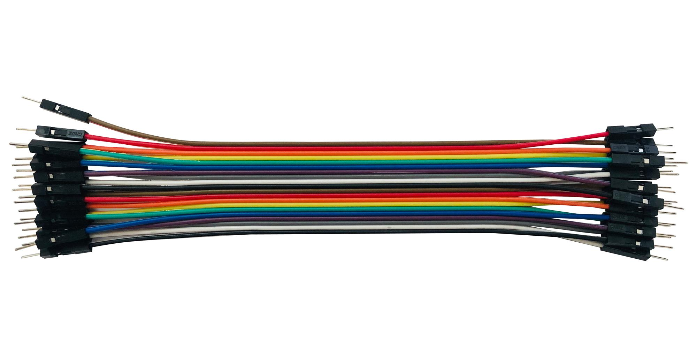

ຕົວຢ່າງການນຳໃຊ້
- **ຕໍ່ LED ກັບ breadboard:** ນຳສາຍ male-to-male ຕໍ່ຈາກ pin ຂອງ Arduino ໄປຫາຂາຂອງ LED ຜ່ານ breadboard.
- **ຕໍ່ sensor ກັບ Arduino:** ເຊັ່ນ PIR sensor ຫຼື DHT11 ສາມາດໃຊ້ jumper wire ເຊື່ອມຕໍ່ຂາ VCC, GND, ແລະ Data.
- **ທົດລອງວົງຈອນ logic gates:** ຕໍ່ລະຫວ່າງຊິບ logic ກັບອຸປະກອນອື່ນໆໃນ breadboard.

**5, Jumper wires (male-to-female)** ແມ່ນສາຍຕໍ່ທີ່ມີຂົວ pin ຂ້າງໜຶ່ງ (male) ແລະຮູຮັບຂົວ (female) ອີກຂ້າງໜຶ່ງ. ມັນເຫຼາະສົມສໍາລັບການຕໍ່ລະຫວ່າງ breadboard ແລະອຸປະກອນທີ່ມີ pin ອອກ.
    ໃຊ້ເຊື່ອມຕໍ່ສ່ວນປະກອບທີ່ມີຂາທ້າຍແບບຊາຍໄປຍັງບອດ Arduino ທີ່ມີຫົວຕໍ່ຍິງ
    - **Male-to-female jumper wires** ໃຊ້ເຊື່ອມຕໍ່ລະຫວ່າງ breadboard ຫຼື Arduino ກັບອຸປະກອນທີ່ມີຂາ pin ອອກ (ເຊັ່ນ sensor, module, motor).
    - ຂົວ male ສາມາດສຽບເຂົ້າ breadboard ຫຼື pin Arduino, ແລະຂົວ female ສາມາດຮັບຂາອຸປະກອນອື່ນໆ.
    - ມັກໃຊ້ໃນການທົດລອງວົງຈອນທີ່ຕ້ອງການຄວາມຍືດຫຍຸ້ນ ແລະບໍ່ຕ້ອງບັດສາຍ
    
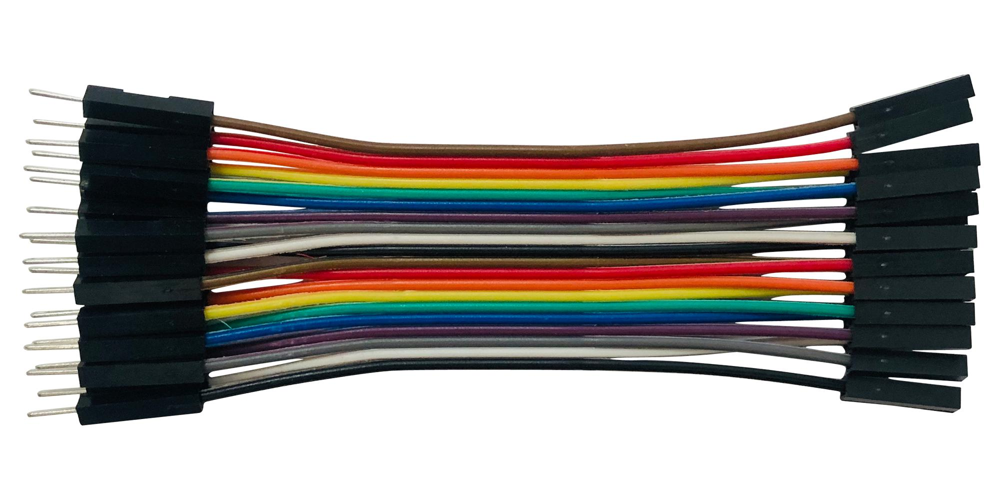

ຕົວຢ່າງການນຳໃຊ້
- **ຕໍ່ sensor DHT11 ກັບ Arduino:** ຂາຂອງ sensor ເປັນ pin ຊາຍ ເຂົ້າຫາ female ຂອງ jumper wire ແລ້ວຕໍ່ male ເຂົ້າ breadboard.
- **ຕໍ່ module Bluetooth HC-05:** ຂາ TX/RX ຂອງ module ເຂົ້າ female jumper wire ແລ້ວຕໍ່ male ເຂົ້າ Arduino.
- **ຕໍ່ servo motor:** ຂາ signal ຂອງ motor ເຂົ້າ female jumper wire ແລ້ວຕໍ່ male ເຂົ້າ breadboard ຫຼື Arduino.

**6, Jumper wires (female-to-female)** ແມ່ນສາຍຕໍ່ທີ່ມີຮູຮັບຂົວ (female connector) ທັງສອງຂ້າງ ເຫຼາະສົມສໍາລັບການຕໍ່ອຸປະກອນທີ່ມີ pin ອອກໄປຫາ pin ອອກອື່ນໆ.
    ໃຊ້ເຊື່ອມຕໍ່ສ່ວນປະກອບທີ່ມີຫົວຕໍ່ຍິງ ຫຼື ເຊື່ອມກັບບອດ Arduino
    - ມັກໃຊ້ໃນການຕໍ່ລະຫວ່າງ module ຫຼື sensor ທີ່ມີຂາ pin ອອກ ໄປຫາອຸປະກອນອື່ນໆ ເຊັ່ນ Arduino, Raspberry Pi, ESP32 ທີ່ມີຂາ pin ອອກເຊັ່ນກັນ.
    - ຂົວ female ຈະຮັບຂາ pin ຂອງອຸປະກອນໄດ້ແນ່ນຫນາ ແລະບໍ່ຫຼຸດງ່າຍ.
    - ມີຫຼາຍສີເພື່ອຊ່ວຍໃນການຈັດການວົງຈອນໃຫ້ມີລະບຽບ
    

ຕົວຢ່າງການນຳໃຊ້
- **ຕໍ່ module Bluetooth HC-05 ກັບ ESP32:** ຂາ TX/RX ຂອງທັງສອງອຸປະກອນເປັນ pin ຊາຍ ຈຶ່ງຕ້ອງໃຊ້ female-to-female jumper wire ເພື່ອຕໍ່ກັນ.
- **ຕໍ່ sensor ultrasonic HC-SR04 ກັບ Raspberry Pi:** ຂາ VCC, Trig, Echo, GND ທັງໝົດເປັນ pin ຊາຍ ຈຶ່ງຕ້ອງໃຊ້ female-to-female jumper wire.
- **ຕໍ່ LED strip ກັບ power supply:** ບາງລຸ້ນມີ pin ຊາຍອອກ ຈຶ່ງຕ້ອງໃຊ້ female-to-female jumper wire ເພື່ອຕໍ່ໄຟ.

**7, 9V Battery Connector** ແມ່ນອຸປະກອນທີ່ໃຊ້ເຊື່ອມຕໍ່ຖ່ານໄຟ 9V ເຂົ້າຫາວົງຈອນອິເລັກໂຕຣນິກ ເພື່ອຈ່າຍໄຟໃຫ້ກັບອຸປະກອນ. ມັນເປັນອຸປະກອນພື້ນຖານທີ່ຈໍາເປັນໃນໂຄງການທີ່ໃຊ້ Arduino ຫຼືວົງຈອນແບບພົດພາ.
    ໃຊ້ເພື່ອຈ່າຍພະລັງງານໃຫ້ກັບ Arduino ສຳລັບໂປຣເຈັກທີ່ຕ້ອງການພະລັງງານຈາກແບັດເຕີລີ້
    - ຕໍ່ຖ່ານໄຟ 9V ເຂົ້າຫົວຕໍ່ຂອງ connector
    - ນໍາສາຍສີແດງໄປຫາ pin VCC ແລະສາຍສີດໍາໄປຫາ GND ຂອງ Arduino ຫຼື breadboard
    - ສາມາດໃຊ້ກັບ voltage regulator ກ່ອນເຂົ້າ Arduino ເພື່ອປ້ອງກັນຄ່າໄຟເກີນ
    
 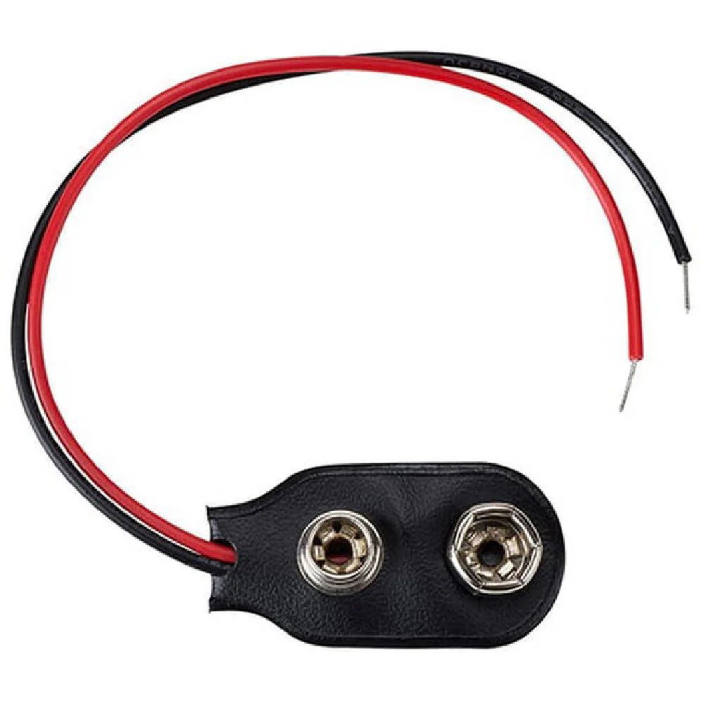
 
ຕົວການນຳໃຊ້
- **ປະຕູອັດຕະໂນມັດກັບ Servo Motor:** ໃຊ້ 9V battery ເພື່ອຈ່າຍໄຟໃຫ້ motor ຜ່ານ connector
- **ລະບົບກວດຈັບການເຄື່ອນໄຫວ:** ໃຊ້ battery ເພື່ອໃຫ້ຄວາມເປັນອິດສະຫຼະໃນການຕິດຕັ້ງ
- **ວົງຈອນສະແດງອຸນຫະພູມກັບ LCD:** ຈ່າຍໄຟໃຫ້ກັບ Arduino ແລະ LCD ຜ່ານ battery connector

# 💡 Basic Components
**8, LEDs (Red: 5, Yellow: 5, Blue: 5, RGB: 1)** ແມ່ນໄດໂອດປ່ອຍແສງຫຼາຍສີ.
EX: ໃຊ້ສະແດງສະຖານະ ຫຼື  ໃຫ້ຜົນຕອບຮັບທາງສາຍຕາໃນໂປຣເຈັກ

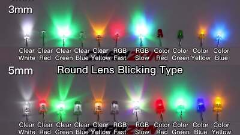

ຕົວຢ່າງທີ່ນຳໃຊ້
- ໃຊ້ Red, Yellow, Blue ເພື່ອສະແດງສະຖານະຈາກສັນຍາຈາກ Arduino
-  ຕໍ່ຜ່ານ breadboard ກັບຕົວຕ້ານ 220Ω
- ໃຊ້ RGB LED ກັບສັນຍາ PWM ຈາກ Arduino ເພື່ອປັບສີໄດ້ຕາມຄ່າອຸນຫະພູມ ຫຼືຄ່າ sensor
- ໃຊ້ Red, Yellow, Blue ເພື່ອສະແດງຈໍານວນການນັບຈາກ button ຫຼື sensor
- ໃຊ້ LED ແຕ່ລະສີເພື່ອສະແດງສະຖານະຂອງ sensor ເຊັ່ນ PIR, DHT11, ຫຼື ultrasonic

**9, RGB module** ແມ່ນອຸປະກອນທີ່ລວມ LED ສີແດງ (Red), ສີຂຽວ (Green), ແລະ ສີຟ້າ (Blue) ເຂົ້າໃນດວງດຽວ ເພື່ອສ້າງສີຫຼາຍສີໄດ້ດ້ວຍການປັບຄ່າຄວາມສວ່າງຂອງແຕ່ລະສີ. ມັນເຫຼາະສົມສໍາລັບໂຄງການທີ່ຕ້ອງການສີສັນທີ່ປັບໄດ້ ເຊັ່ນ ການສະແດງສະຖານະ, ການຕົບແຕ່ງແສງ, ຫຼືການສື່ສານຜ່ານສີ.
    ໃຊ້ສະແດງສີທີ່ແຕກຕ່າງກັນຕາມສັນຍານທີ່ຄວບຄຸມ
    - **PWM (Pulse Width Modulation):** ການປັບຄ່າຄວາມສວ່າງຂອງແຕ່ລະສີໂດຍການສົ່ງສັນຍາດິຈິຕອນທີ່ມີຄ່າ duty cycle ຕ່າງກັນ
    - **ການຜະສົມສີ:** ການປັບຄ່າ R, G, B ພ້ອມກັນ ຈະເຮັດໃຫ້ໄດ້ສີໃໝ່ໆ (ເຊັ່ນ R+G = ສີເຫຼືອງ)
    
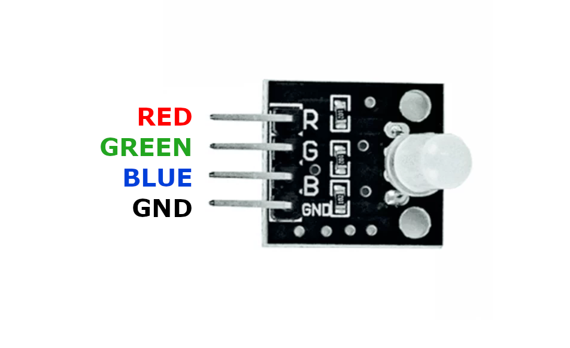

ຕົວຢ່າງທີ່ນໍາໃຊ້
1. **RGB Mood Light**
- ປັບສີຕາມອາລົມ ຫຼືຄ່າ sensor
- ຕົວຢ່າງ: ສີຟ້າເມື່ອອຸນຫະພູມຕໍາ, ສີແດງເມື່ອອຸນຫະພູມສູງ
2. **Status Indicator**
- ສະແດງສະຖານະຂອງລະບົບ: ສີແດງ = error, ສີຂຽວ = OK, ສີຟ້າ = standby
3. **Color Mixing Demo**
- ສະແດງການຜະສົມສີດ້ວຍການປັບຄ່າ PWM ຂອງ R, G, B
4. **Remote-Controlled RGB Lamp**
- ຄວບຄຸມສີຜ່ານ Bluetooth ຫຼື IR remote

**10, Resistors (220Ω, 1kΩ, 10kΩ)** ແມ່ນອຸປະກອນພື້ນຖານໃນວົງຈອນອິເລັກໂຕຣນິກ ທີ່ໃຊ້ໃນການຈໍາກັດກະແສໄຟຟ້າ ແລະປ້ອງກັນອຸປະກອນອື່ນໆ ຈາກຄ່າໄຟເກີນ. ຄ່າຂອງຕົວຕ້ານຈະຖືກວັດເປັນໂອມ (Ω).
    ໃຊ້ປ້ອງກັນສ່ວນປະກອບຕ່າງໆ ຈາກກະແສໄຟຟ້າທີ່ຫຼາຍເກີນໄປ ແລະ ປັບລະດັບສັນຍານ
    
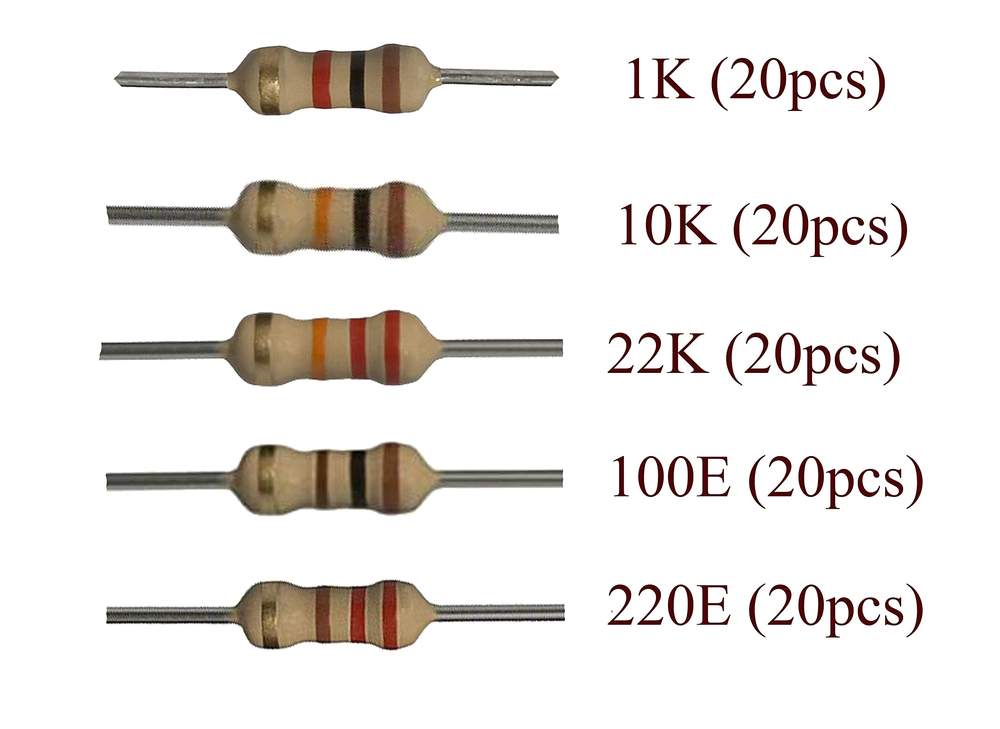

ຕົວຢ່າງການນຳໃຊ້
1. **220Ω + LED + Arduino**
- ຕໍ່ LED ຂະໜາດ 5mm ຜ່ານ 220Ω ເຂົ້າ pin Arduino
- ປ້ອງກັນກະແສເກີນ ທີ່ອາດເຮັດໃຫ້ LED ແຕກ
2. **1kΩ Pull-down Resistor**
- ຕໍ່ປຸ່ມກົດໃສ່ pin digital
- ປ້ອງກັນສັນຍານລອຍ (floating signal)
3. **10kΩ Voltage Divider**
- ຕໍ່ກັບ sensor ເຊັ່ນ LDR ຫຼື TMP36
- ປັບແຮງດັນໃຫ້ເໝາະກັບ input ຂອງ ADC

**11, Push Buttons (x4 with Lids )** ແມ່ນສະວິດທີ່ໃຊ້ກົດເພື່ອໃຫ້ກະແສໄຟຟ້າໄຫຼຜ່ານ ຫຼືຂັດຂວາງການໄຫຼ. ເມື່ອກົດປຸ່ມ ວົງຈອນຈະຖືກເຊື່ອມຕໍ່ (closed circuit), ແລະເມື່ອປ່ອຍອອກ ຈະຂາດການເຊື່ອມຕໍ່ (open circuit).
    ໃຊ້ສຳລັບຮັບຂໍ້ມູນຈາກຜູ້ໃຊ້ເຊັ່ນ: ເປີດ/ປິດ ຫຼື ກະຕຸ້ນການທຳງານ
- Normally Open (NO): ໂດຍປົກກະຕິແລ້ວສາຍຕໍ່ແມ່ນເປີດ (ບໍ່ມີກະແສໄຟຟ້າຜ່ານ). ເມື່ອກົດປຸ່ມ, ສາຍຕໍ່ຈະປິດ (ໃຫ້ກະແສໄຟຟ້າຜ່ານ).
- **Normally Closed (NC):** ໂດຍປົກກະຕິແລ້ວສາຍຕໍ່ແມ່ນປິດ (ໃຫ້ກະແສໄຟຟ້າຜ່ານ). ເມື່ອກົດປຸ່ມ, ສາຍຕໍ່ຈະເປີດ (ບໍ່ມີກະແສໄຟຟ້າຜ່ານ).
- **"with Lids" (ພ້ອມຝາປິດ):** ປົກກະຕິແລ້ວໝາຍເຖິງປຸ່ມກົດທີ່ມີໝວກສີ ຫຼື ຝາປິດຢູ່ເທິງກົນໄກຂອງປຸ່ມ, ເພື່ອຄວາມງາມ, ເພື່ອບອກເຖິງການໃຊ້ງານ (ເຊັ່ນ: ສີແດງສຳລັບ "ຢຸດ", ສີຂຽວສຳລັບ "ເລີ່ມຕົ້ນ"), ຫຼື ເພື່ອປ້ອງກັນຝຸ່ນ.
  
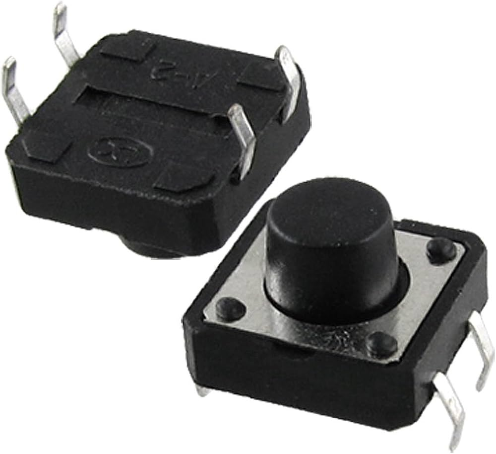

ຕົວຢ່າງການນຳໃຊ້:
ໃນໂຄງການໄມໂຄຣຄອນໂທຣນເລີ (ເຊັ່ນ: Arduino):
1. **ການປ້ອນຂໍ້ມູນ (Input):** ໃຊ້ເປັນປຸ່ມເພື່ອກໍານົດຄ່າ, ເລືອກເມນູ, ຫຼືໃຫ້ຄໍາສັ່ງແກ່ໂຄງການ.
    - **ປຸ່ມ 1, 2, 3, 4:** ອາດຈະໃຊ້ເປັນປຸ່ມ ຂຶ້ນ (Up), ລົງ (Down), ເລືອກ (Select), ແລະ ກັບຄືນ (Back) ໃນການໂຕ້ຕອບກັບຜູ້ໃຊ້.
2. ເກມ ຫຼື ໂຄງການຄວບຄຸມ: ໃຊ້ເປັນຕົວຄວບຄຸມສໍາລັບໂຄງການເກມງ່າຍໆ ຫຼື ເປັນປຸ່ມຄວບຄຸມທິດທາງ (ເຊັ່ນ: ໜ້າ, ຫຼັງ, ຊ້າຍ, ຂວາ).
3. **ການຄວບຄຸມອຸປະກອນ:** ປຸ່ມແຕ່ລະອັນອາດຈະຖືກໃຊ້ເພື່ອເປີດ/ປິດ ຫຼື ປ່ຽນຮູບແບບການເຮັດວຽກຂອງອຸປະກອນ ຫຼື ໂມດູນທີ່ແຕກຕ່າງກັນ.

**12, Potentiometer (5kΩ)** ແມ່ນຕົວຕ້ານທານທີ່ສາມາດປັບຄ່າໄດ້. ເປັນຕົວຕ້ານທານທີ່ມີສາມຂາ. ມັນເຮັດໜ້າທີ່ເປັນ **voltage divider (ຕົວແບ່ງແຮງດັນ)** ທີ່ສາມາດປັບຄ່າໄດ້.
    ໃຊ້ໃນການປັບຄ່າຕ່າງໆເຊັ່ນ: ປັບສຽງ, ການຄວບຄຸມຄວາມສະຫວ່າງ
    Potentiometer ມີສາມຂາ:
- ຂາ 1 (ປາຍ): ຕໍ່ກັບ GND (ພື້ນດິນ/0V).
- ຂາ 3 (ປາຍ): ຕໍ່ກັບ VCC (ແຮງດັນໄຟຟ້າສູງ, ເຊັ່ນ: 5V ຫຼື 3.3V ຈາກ Arduino).
- ຂາ 2 (ກາງ/Wiper): ເປັນຂາອອກຂອງແຮງດັນໄຟຟ້າທີ່ຖືກແບ່ງ. ແຮງດັນໄຟຟ້າອອກຈາກຂານີ້ຈະປ່ຽນແປງເມື່ອທ່ານໝູນ ຫຼື ເລື່ອນປຸ່ມຄວບຄຸມ.
  
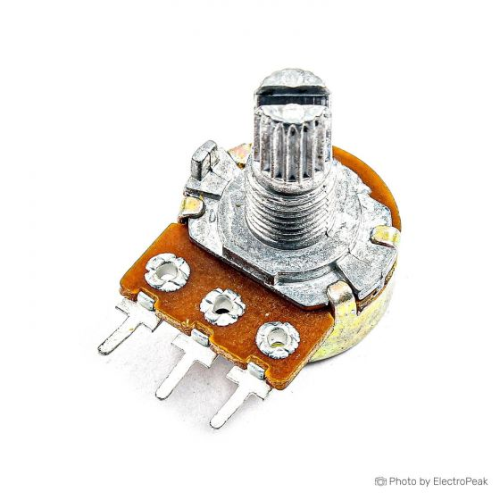

ຕົວຢ່າງການນຳໃຊ້:
- ການປັບຄວາມສະຫວ່າງຂອງ LED: ຕໍ່ຂາກາງຂອງ Potentiometer ເຂົ້າກັບ Analog Input ຂອງ Arduino. ອ່ານຄ່າຈາກ Potentiometer (0-1023) ແລ້ວໃຊ້ມັນເພື່ອຄວບຄຸມຄວາມສະຫວ່າງຂອງ LED ໂດຍໃຊ້ PWM (Pulse-Width Modulation).
- ການປັບຄວາມໄວ Motor: ໃຊ້ຄ່າທີ່ອ່ານໄດ້ຈາກ Potentiometer ເພື່ອຄວບຄຸມຄວາມໄວຂອງ DC Motor ຫຼື ຕຳແໜ່ງຂອງ Servo Motor.
- ການປ້ອນຄ່າໃນການໂຕ້ຕອບກັບຜູ້ໃຊ້ (User Input): ໃຊ້ເປັນປຸ່ມໝູນ (Knob) ເພື່ອກຳນົດຄ່າຕົວເລກ, ເລືອກທາງເລືອກ, ຫຼືປັບລະດັບສຽງ.

**13, Active Buzzer** (ບັສເຊີທີ່ມີການເຄື່ອນໄຫວ): ແມ່ນ buzzer ທີ່ ມີວົງຈອນກຳເນີດສັນຍານ (Oscillator) ສ້າງສຽງຢູ່ໃນຕົວ.
    ໃຊ້ໃນການໃຫ້ການຕອບສະໜອງດ້ວຍສຽງ ຫຼື ການແຈ້ງເຕືອນ
- ຫຼັກການເຮັດວຽກ: ມັນຕ້ອງການພຽງແຕ່ **ແຮງດັນໄຟຟ້າ DC ທີ່ສະໝໍ່າສະເໝີ (ເຊັ່ນ: 5V) ປ້ອນເຂົ້າໄປ. ເມື່ອແຮງດັນໄຟຟ້າເຂົ້າ, ວົງຈອນພາຍໃນຈະສ້າງສັນຍານຄວາມຖີ່ຄົງທີ່ເພື່ອສັ່ນສະເທືອນແຜ່ນ piezoelectric ແລະສ້າງສຽງອອກມາ (ປົກກະຕິແມ່ນສຽງ "ປີບ" ຄົງທີ່).
  
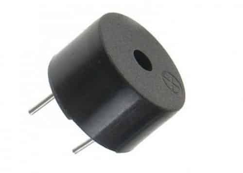

 ຕົວຢ່າງການຕໍ່ກັບ Arduino:
Active Buzzer ສ່ວນຫຼາຍມີສອງຂາ (ບາງໂມດູນມີສາມຂາ: VCC, GND, I/O):
1. **ຂາ $\mathbf{+ (VCC):** ຕໍ່ເຂົ້າກັບແຮງດັນໄຟຟ້າ 5V ຂອງ Arduino (ໃນບາງກໍລະນີອາດຈະຜ່ານ transistor ເພື່ອປ້ອງກັນ Arduino).
2. **ຂາ $\mathbf{- (GND):** ຕໍ່ເຂົ້າກັບ GND (ພື້ນດິນ) ຂອງ Arduino.
3. **ການຄວບຄຸມດ້ວຍ Arduino (Digital Pin):**
    - ເຊື່ອມຕໍ່ຂາບວກ $\mathbf{(+) ຂອງ Buzzer ເຂົ້າກັບຂາ Digital ໃດໜຶ່ງຂອງ Arduino (ເຊັ່ນ: Pin 8).
    - ເຊື່ອມຕໍ່ຂາລົບ $\mathbf{(-) ຂອງ Buzzer ເຂົ້າກັບ GND ຂອງ Arduino.
    - ການເຮັດວຽກ:
        - ເມື່ອຕັ້ງ Pin ໃຫ້ເປັນ HIGH (digitalWrite(8, HIGH)), ບັສເຊີຈະດັງ.
        - ເມື່ອຕັ້ງ Pin ໃຫ້ເປັນ LOW (digitalWrite(8, LOW)), ບັສເຊີຈະມິດ.

**14, Passive Buzzer** (ບັສເຊີທີ່ບໍ່ມີການເຄື່ອນໄຫວ): ໝາຍເຖິງ buzzer ທີ່ ບໍ່ມີວົງຈອນກຳເນີດສັນຍານ (Oscillator) ສ້າງສຽງຢູ່ໃນຕົວ.
    ໃຊ້ຄ້າຍກັບບັດເຊີ Active ແຕ່ຕ້ອງການສັນຍານຄວາມຖີ່ຈາກ Arduino
- ຕ້ອງການສັນຍານພາຍນອກ: ເພື່ອໃຫ້ Passive Buzzer ສ້າງສຽງ, ມັນຕ້ອງໄດ້ຮັບສັນຍານໄຟຟ້າທີ່ເປັນຄື້ນສີ່ຫຼ່ຽມ (Square Wave) ທີ່ມີການປ່ຽນແປງຄວາມຖີ່ (ເຊັ່ນ: PWM Signal) ຈາກໄມໂຄຣຄອນໂທຣນເລີ (ເຊັ່ນ: Arduino).
- ການຄວບຄຸມ Pitch: ຄວາມຖີ່ຂອງສັນຍານທີ່ປ້ອນເຂົ້າໄປຈະກຳນົດ **Pitch (ສຽງສູງ/ຕໍ່າ)** ຂອງສຽງທີ່ buzzer ສ້າງອອກມາ.
**ຂໍ້ໄດ້ປຽບ:**
- ສ້າງສຽງດົນຕີໄດ້: ຂໍ້ໄດ້ປຽບຫຼັກແມ່ນຄວາມສາມາດໃນການປ່ຽນແປງຄວາມຖີ່ຂອງສຽງ, ເຮັດໃຫ້ມັນສາມາດຫຼິ້ນ Melody (ເພງ) ຫຼື ສຽງທີ່ມີໂຕນທີ່ແຕກຕ່າງກັນໄດ້.
- ການຄວບຄຸມລະອຽດ: ເໝາະສຳລັບໂຄງການທີ່ຕ້ອງການສຽງທີ່ສັບສົນກວ່າສຽງ "ປີບ" ຄົງທີ່.
  
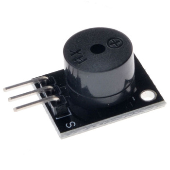

**ການຕໍ່ກັບ Arduino:**
ການນໍາໃຊ້ Passive Buzzer ກັບ Arduino ແມ່ນງ່າຍດາຍ, ແຕ່ຕ້ອງການການຄວບຄຸມໃນໂຄ໊ດ:
1. **ເຊື່ອມຕໍ່:**
    - **ຂາ $\mathbf{+ (Positive):** ຕໍ່ກັບຂາ Digital Pin ຂອງ Arduino (ເຊັ່ນ: Pin 8).
    - **ຂາ $\mathbf{- (Negative):** ຕໍ່ກັບ GND ຂອງ Arduino.
    - (ບາງຄັ້ງອາດຈະເພີ່ມ Resistor 100$\Omega$ ເຖິງ 220$\Omega$ ເຂົ້າໃນວົງຈອນເພື່ອຈຳກັດກະແສໄຟຟ້າ).
2. **ການຄວບຄຸມດ້ວຍໂຄ໊ດ (tone() function):**
    - Arduino ມີຟັງຊັນທີ່ຊື່ວ່າ **tone(pin, frequency, duration)** ເພື່ອສ້າງຄື້ນສີ່ຫຼ່ຽມທີ່ມີຄວາມຖີ່ທີ່ຕ້ອງການ:
        - `pin`: ຂາ Digital ທີ່ຕໍ່ກັບ buzzer (ເຊັ່ນ: 8).
        - `frequency`: ຄວາມຖີ່ຂອງສຽງທີ່ຕ້ອງການໃນ Hertz (Hz) (ເຊັ່ນ: 440 Hz ເພື່ອຫຼິ້ນສຽງໂນ໊ດ A4).
        - `duration`: ໄລຍະເວລາທີ່ສຽງຈະດັງໃນ Milliseconds (ms) (ເປັນທາງເລືອກ).
    - ໃຊ້ຟັງຊັນ **noTone(pin)** ເພື່ອຢຸດສຽງ.
    
# 📟 Displays & Output
**15, 16x2 LCD display** ແມ່ນຈໍສະແດງຜົນອັກສອນ 16ໂຕ ແລະ 2ບັນທັດ.
- **ຂະໜາດ:** ມັນສາມາດສະແດງຕົວອັກສອນໄດ້ທັງໝົດ 16 * 2 = 32 ຕົວອັກສອນພ້ອມກັນ.
- **ປະເພດ:** ມັນເປັນຈໍສະແດງຜົນແບບຕົວອັກສອນ (Character LCD) ເຊິ່ງແຕ່ລະຕົວອັກສອນແມ່ນປະກອບດ້ວຍ Dot Matrix ຂະໜາດ 5 * 8 ພິກເຊວ.
  ໃຊ້ສະແດງຂໍ້ມູນເປັນຂໍ້ຄວາມ
- ມັນຖືກນຳໃຊ້ຢ່າງກວ້າງຂວາງໃນໂຄງການ Arduino ແລະ ລະບົບຝັງຕົວ (Embedded Systems) ເພື່ອສະແດງຂໍ້ຄວາມ, ຂໍ້ມູນຈາກເຊັນເຊີ, ເວລາ, ຫຼື ເມນູງ່າຍໆ.
- **Controller:** ໂມດູນສ່ວນໃຫຍ່ມັກໃຊ້ຊິບ Controller ເຊັ່ນ **Hitachi HD44780** ຫຼື ຕົວທີ່ທຽບເທົ່າ.
  
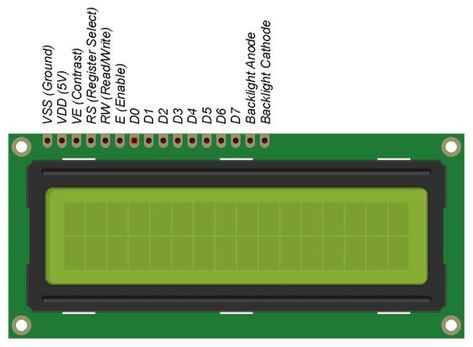

### ການເຊື່ອມຕໍ່ກັບ Arduino (ສອງປະເພດຫຼັກ)
ມີສອງວິທີຫຼັກໃນການເຊື່ອມຕໍ່ 16x2 LCD ກັບ Arduino, ຂຶ້ນກັບໂມດູນທີ່ທ່ານມີ:
#### 1. ການເຊື່ອມຕໍ່ແບບຂະໜານ (Standard Parallel Connection)
- ເປັນການເຊື່ອມຕໍ່ແບບດັ້ງເດີມທີ່ໃຊ້ຂາ I/O ຫຼາຍທີ່ສຸດ (ປົກກະຕິ 6 ຂາ Digital ຫຼື 11 ຂາ Digital).
- **ຂາທີ່ຕ້ອງການເຊື່ອມຕໍ່:** RS, E, D4, D5, D6, D7 (ສຳລັບ 4-bit mode) ພ້ອມດ້ວຍ VCC, GND, ແລະ Potentiometer ສຳລັບປັບຄ່າ Contrast (Vo).
- **Library ທີ່ໃຊ້:** **LiquidCrystal** Library ມາດຕະຖານຂອງ Arduino.

#### 2. ການເຊື່ອມຕໍ່ແບບ I2C (I2C Module)
- ເປັນວິທີທີ່ນິຍົມທີ່ສຸດໃນປະຈຸບັນ ເພາະມັນ **ຫຼຸດຜ່ອນຈຳນວນສາຍທີ່ໃຊ້** ຢ່າງຫຼວງຫຼາຍ.
- **ໂມດູນ:** ຕ້ອງມີ LCD 16x2 ທີ່ມີ I2C Adapter Board ຕິດຢູ່ທາງຫຼັງ (ມັກຈະມີ PCF8574 chip).
- **ຂາທີ່ຕ້ອງການເຊື່ອມຕໍ່ (ພຽງ 4 ສາຍ):**
    - **VCC** = 5V
    - **GND** = GND
    - **SDA** = Analog Pin A4 (ສຳລັບ Arduino Uno)
    - **SCL** = Analog Pin A5 (ສຳລັບ Arduino Uno)
- **Library ທີ່ໃຊ້:** ຕ້ອງໃຊ້ Library ເພີ່ມເຕີມ ເຊັ່ນ: LiquidCrystal_I2C Library.

**16, I2C Serial Adapter board module** ແມ່ນໂມດູນເຊື່ອມຕໍ່ 12C ໃຊ້ໃນການເຊື່ອມຕໍ່ອຸປະກອນ 12C. ມັນແມ່ນແຜງວົງຈອນຂະໜາດນ້ອຍທີ່ຖືກອອກແບບມາເພື່ອ attach (ຕິດ) ໃສ່ດ້ານຫຼັງຂອງ 16x2 ຫຼື 20x4 LCD Character Display.
    ໃຊ້ລົດຈຳນວນພິນທີ່ໃຊ້ໃນການເຊື່ອມຕໍ່ກັບອຸປະກອນ 12C ເຊັ່ນ LCD
- ມັນເຮັດໜ້າທີ່ເປັນ **I/O Expander** (ເຄື່ອງຂະຫຍາຍຂາ Input/Output) ໂດຍໃຊ້ຊິບເຊັ່ນ PCF8574. ຊິບນີ້ຈະແປຄຳສັ່ງທີ່ສົ່ງມາຕາມສັນຍານ I2C 2 ສາຍ ໃຫ້ເປັນສັນຍານແບບຂະໜານ (Parallel) ທີ່ຈໍ LCD ຕ້ອງການ.
  
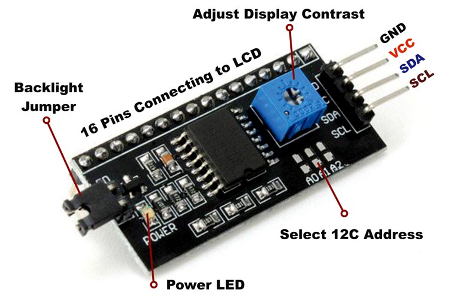

**17, 7-segment display (Common Cathode +)**  ແມ່ນອຸປະກອນສະແດງຜົນເອເລັກໂຕຣນິກທີ່ໃຊ້ເພື່ອສະແດງຕົວເລກເລກຖານສິບ (0-9) ແລະຕົວອັກສອນບາງຕົວ. ມັນປະກອບດ້ວຍ 7 ສ່ວນຍ່ອຍ (segments) ຂອງ LED (Light Emitting Diode) ທີ່ຖືກຈັດຮຽງຢູ່ໃນຮູບຊົງຂອງເລກ 8 (
    ໃຊ້ສະແດງໂຕເລກໃນໂປຣເຈັກຕ່າງໆ ເຊັ່ນ ໂມງດິຈີຕອນ
    ການເຮັດວຽກຂອງ 7-Segment Display (ປະເພດ CC) ກັບ Microcontroller (ເຊັ່ນ Arduino) ມີຂັ້ນຕອນດັ່ງນີ້:
#### 1. ຕາຕະລາງການເຮັດວຽກ (Logic Table)
ເພື່ອສະແດງຕົວເລກໃດໜຶ່ງ, ທ່ານຕ້ອງຮູ້ວ່າ Segment ໃດທີ່ຕ້ອງເປີດ (HIGH/1) ແລະ Segment ໃດທີ່ຕ້ອງປິດ (LOW/0).

|**ຕົວເລກທີ່ສະແດງ**|**a**|**b**|**c**|**d**|**e**|**f**|**g**|**DP**|
|---|---|---|---|---|---|---|---|---|
|**0**|1|1|1|1|1|1|0|0|
|**1**|0|1|1|0|0|0|0|0|
|**2**|1|1|0|1|1|0|1|0|
|**8**|1|1|1|1|1|1|1|0|

#### 2. ການຄວບຄຸມດ້ວຍ Microcontroller
1. **ການເຊື່ອມຕໍ່:** Segment Pin ທັງ 7 (ຫຼື 8) ຖືກເຊື່ອມຕໍ່ກັບ Digital Output Pin ຂອງ Arduino (ເຊັ່ນ: Pin 2 ຫາ Pin 9).
2. **ຕົວຕ້ານທານ (Resistor):** **ຕ້ອງ** ມີຕົວຕ້ານທານ ຕໍ່ອະນຸກົມໃສ່ Pin ຂອງແຕ່ລະ Segment ເພື່ອຈໍາກັດກະແສໄຟຟ້າ ແລະ ປ້ອງກັນ LED ບໍ່ໃຫ້ເສຍຫາຍ.
3. **ການສົ່ງສັນຍານ:** Microcontroller ຈະສົ່ງສັນຍານ HIGH ໄປຫາ Pin ທີ່ກົງກັບ Segment ທີ່ຕ້ອງການໃຫ້ສ່ອງແສງ, ແລະສົ່ງ LOW ໄປຫາ Segment ທີ່ຕ້ອງການໃຫ້ປິດ.

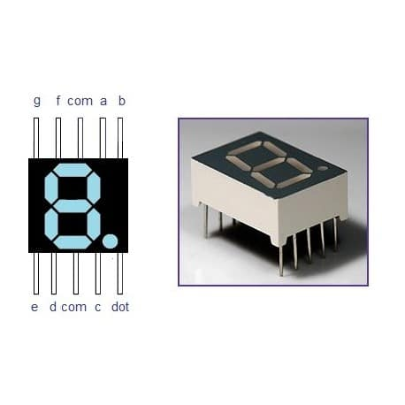

ຕົວຢ່າງການນຳໃຊ້ອຸປະກອນ
7-Segment Display ແມ່ນພົບເຫັນທົ່ວໄປໃນອຸປະກອນທີ່ສະແດງຜົນເປັນຕົວເລກ:

|**ຫົວຂໍ້ການນຳໃຊ້**|**ລາຍລະອຽດ**|
|---|---|
|**Digital Counter**|ການນັບຕົວເລກຂຶ້ນ/ລົງ (ເຊັ່ນ: 0 ຫາ 9). ນິຍົມໃຊ້ໃນເຄື່ອງຈັກ ຫຼື ເຄື່ອງນັບສະຕັອກ.|
|**Digital Clock/Timer**|ການສະແດງເວລາ (ຊົ່ວໂມງ, ນາທີ, ວິນາທີ) ຫຼື ການນັບຖອຍຫຼັງໃນໂມງປຸກ ຫຼື ໂມງຈັບເວລາ.|
|**Scoreboard**|ການນັບຄະແນນໃນເກມ ຫຼື ກິລາແບບງ່າຍດາຍ.|
|**Frequency Display**|ການສະແດງຄ່າຄວາມຖີ່ (ເຊັ່ນ: FM Radio) ຫຼື ຄ່າອື່ນໆຈາກເຊັນເຊີ (ເຊັ່ນ: ອຸນຫະພູມ).|
|**Traffic Light Timer**|ໂມງນັບຖອຍຫຼັງສຳລັບໄຟອຳນາດ.|

**18, 4-Digit 7-Segment Display** ແມ່ນອຸປະກອນສະແດງຜົນດິຈິຕອລທີ່ລວມເອົາ 7-Segment Display ໄວ້ 4 ຫຼັກໃນຊຸດດຽວ (ເຊິ່ງມັກຈະມີເຄື່ອງໝາຍ Colon} (:)$ ຢູ່ລະຫວ່າງຫຼັກ 2 ແລະ 3 ສຳລັບການສະແດງເວລາ).
- **ປະເພດ Common:** ເຊັ່ນດຽວກັບ 1-Digit, ມັນມີທັງແບບ Common Cathode (CC) ແລະ Common Anode (CA).
- ຄວາມແຕກຕ່າງສຳຄັນ: ການຫຼຸດ Pin
ຖ້າພວກເຮົາຕໍ່ 4-Digit ແບບທຳມະດາ, ມັນຈະຕ້ອງໃຊ້ 32 Pins (4 ຫຼັກ * 8 Segments) ເຊິ່ງມັນຫຼາຍເກີນໄປສຳລັບ Microcontroller ສ່ວນໃຫຍ່. ດັ່ງນັ້ນ, 4-Digit Display ສ່ວນຫຼາຍຈຶ່ງຖືກເຊື່ອມຕໍ່ແບບພິເສດເພື່ອ **ຫຼຸດຈຳນວນ Pin**.
    ໃຊ້ສະແດງໂຕເລກ 4 ຫຼັກ  ຫຼື ເວລາ
    ຫຼັກການ Multiplexing
- **ການເຊື່ອມຕໍ່ Segments ຮ່ວມກັນ:** Pin ຂອງ Segment ທີ່ຄ້າຍຄືກັນໃນທັງ 4 ຫຼັກ (ເຊັ່ນ: Segment 'a' ຂອງທຸກຫຼັກ) ແມ່ນຖືກເຊື່ອມຕໍ່ເຂົ້າກັນ. ນີ້ຫຼຸດ Pin ຄວບຄຸມ Segment ຈາກ 28 ເປັນພຽງ 8 Pins (a ຫາ g ແລະ DP).
- **Pin ຄວບຄຸມຫຼັກ (Digit Control Pins):** ແຕ່ລະຫຼັກມີ Pin Common ຂອງຕົນເອງ (ເຊັ່ນ: D1, D2, D3, D4) ທີ່ໃຊ້ເພື່ອເປີດ/ປິດໄຟໃຫ້ຫຼັກນັ້ນທັງໝົດ.
 - **Total Pins:** ດັ່ງນັ້ນ, ຈໍສະແດງຜົນຈະມີພຽງ 8 Segment Pins + 4 Digit Pins = 12 Pins (ບໍ່ລວມ Power/GND).
   
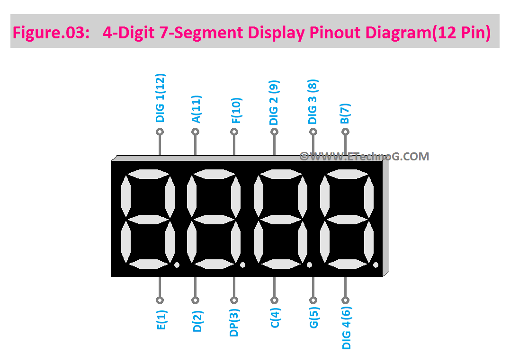

ຕົວຢ່າງການເຮັດວຽກ
Microcontroller (ເຊັ່ນ: Arduino) ຈະສະແດງຕົວເລກ 4 ຫຼັກ (D1, D2, D3, D4) ໂດຍການເຮັດຊ້ຳຂັ້ນຕອນຕໍ່ໄປນີ້ຢ່າງວ່ອງໄວ:

|**ຂັ້ນຕອນ**|**ການກະທຳ**|**ຜົນໄດ້ຮັບ**|
|---|---|---|
|**1.**|ສົ່ງ Logic ທີ່ຕ້ອງການສະແດງຕົວເລກໃນ **D1** ໄປຫາ Segment Pins ທັງ 8.|Segments ທັງໝົດຂອງທຸກຫຼັກພ້ອມທີ່ຈະສະແດງຄ່ານັ້ນ.|
|**2.**|ເປີດ Digit Control Pin ຂອງ **D1** (ປິດ D2, D3, D4).|ມີພຽງແຕ່ LED ຂອງຫຼັກ D1 ເທົ່ານັ້ນທີ່ສ່ອງແສງ.|
|**3.**|ປິດ D1 ຊົ່ວຄາວ.|ຫຼັກ D1 ປິດໄຟ.|
|**4.**|ສົ່ງ Logic ທີ່ຕ້ອງການສະແດງຕົວເລກໃນ **D2** ໄປຫາ Segment Pins.|Segments ທັງໝົດພ້ອມທີ່ຈະສະແດງຄ່າໃໝ່.|
|**5.**|ເປີດ Digit Control Pin ຂອງ **D2** (ປິດ D1, D3, D4).|ມີພຽງແຕ່ LED ຂອງຫຼັກ D2 ເທົ່ານັ້ນທີ່ສ່ອງແສງ.|
|**6.**|ເຮັດຊ້ຳສຳລັບ D3 ແລະ D4.|ຫຼັກ D3 ແລະ D4 ສະແດງຜົນຕາມລຳດັບ.|

**19, 8x8 Dot Matrix display** ແມ່ນອຸປະກອນສະແດງຜົນເອເລັກໂຕຣນິກທີ່ປະກອບດ້ວຍໄຟ LED ຂະໜາດນ້ອຍ 64 ດວງ (8 ແຖວ * 8 ຖັນ) ຈັດລຽງເປັນຮູບສີ່ຫຼ່ຽມມົນ.
    ໃຊ້ສະແດງຕົວອັກສອນ ຫຼື ກາບຟິກ
- ການສະແດງຮູບພາບ ຫຼື ຕົວອັກສອນເທິງ 8x8 Dot Matrix ແມ່ນໃຊ້ຫຼັກການທີ່ເອີ້ນວ່າ **Multiplexing** ເຊັ່ນດຽວກັບ 7-Segment Display, ແຕ່ເຮັດໃນຮູບແບບ Matrix (ແຖວ-ຖັນ).
#### ຫຼັກການ Multiplexing (ການສະແກນ)
ເນື່ອງຈາກແຖວ ແລະ ຖັນຖືກເຊື່ອມຕໍ່ເຂົ້າກັນ, ບໍ່ສາມາດເປີດ LED ແຕ່ລະດວງໄດ້ພ້ອມກັນໂດຍກົງ. ວິທີການເຮັດວຽກແມ່ນ:
1. **ເລືອກແຖວ (Row Select):** ເປີດໄຟພຽງແຕ່ 1 ແຖວເທົ່ານັ້ນໃນແຕ່ລະຄັ້ງ (ເຊັ່ນ: ແຖວ 1).
2. **ເລືອກຖັນ (Column Select):** ສົ່ງຂໍ້ມູນທີ່ຕ້ອງການສະແດງໄປຫາ 8 ຖັນພ້ອມກັນ.
    - **ຕົວຢ່າງ:** ຖ້າຕ້ອງການໃຫ້ LED ດວງທີ 3 ໃນແຖວ 1 ຕິດ, ຕ້ອງສົ່ງສັນຍານເພື່ອເປີດ Column 3 ແລະປິດ Columns ອື່ນໆ, ພ້ອມທັງເປີດ Row 1.
3. **ສະແກນ:** ຫຼັງຈາກນັ້ນ, ປິດແຖວ 1 ແລະ ຍ້າຍໄປເປີດແຖວ 2 ແລະສົ່ງຂໍ້ມູນຂອງແຖວ 2.
4. **ເຮັດຊໍ້າ:** ຂັ້ນຕອນນີ້ຈະຖືກເຮັດຊໍ້າຢ່າງວ່ອງໄວຈາກແຖວ 1 ຫາແຖວ 8 (ເຊັ່ນ: 100 ຄັ້ງຕໍ່ວິນາທີ).
#### ຜົນໄດ້ຮັບ: Persistence of Vision
ເນື່ອງຈາກການສະແກນເກີດຂຶ້ນໄວຫຼາຍ, ຕາຂອງມະນຸດຈະຮັບຮູ້ວ່າທຸກແຖວເປີດຢູ່ຕະຫຼອດເວລາ, ເຊິ່ງເຮັດໃຫ້ເຫັນພາບທີ່ສົມບູນ (ຕົວອັກສອນ ຫຼື ຮູບພາບ) ໂດຍບໍ່ມີການກະພິບ.

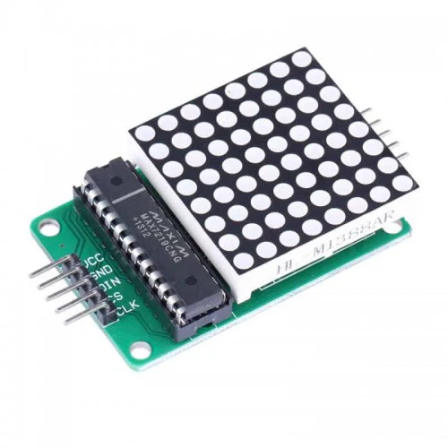

ຕົວຢ່າງການນຳໃຊ້ອຸປະກອນ
8x8 Dot Matrix Display ແມ່ນເໝາະສຳລັບໂຄງການທີ່ຕ້ອງການສະແດງຂໍ້ຄວາມ ແລະ ເຄື່ອນໄຫວຂະໜາດນ້ອຍ.

|**ຫົວຂໍ້ການນຳໃຊ້**|**ລາຍລະອຽດ**|
|---|---|
|**Scrolling Text Display**|ສະແດງຂໍ້ຄວາມຂະໜາດຍາວ (ເຊັ່ນ: ຂໍ້ຄວາມໂຄສະນາ ຫຼື ຊື່) ໂດຍການເລື່ອນ Pixel ໄປທາງຊ້າຍ ຫຼື ຂວາ.|
|**Simple Game Display**|ໃຊ້ເປັນຈໍສະແດງຜົນສຳລັບເກມຄລາສສິກງ່າຍໆ ເຊັ່ນ: ເກມ Snake ຫຼື Tetris ຂະໜາດນ້ອຍ.|
|**Animated Emojis/Icons**|ສະແດງພາບເຄື່ອນໄຫວງ່າຍໆ ເຊັ່ນ: ຮູບຫົວໃຈເຕັ້ນ, ໃບໜ້າສະແດງອາລົມ, ຫຼື ໄອຄອນແຈ້ງເຕືອນ.|
|**Digital VU Meter**|ສະແດງລະດັບຄວາມດັງຂອງສຽງໂດຍການຕິດໄຟ LED ຂຶ້ນລົງຄືກັບແຖບວັດແທກ.|
|**Clock with Temperature**|ໃຊ້ສະແດງເວລາ HH:MM ສະຫຼັບກັບການສະແດງອຸນຫະພູມທີ່ອ່ານໄດ້.|

# 📡 Sensors & Input Modules
20, Temperature and humidity sensor (DHT11) ແມ່ນເຊັນເຊີທີ່ໃຊ້ວັດອຸນຫະພູມ ແລະ ຄວາມຊື້ນຂອງສະພາບແວດລ້ອມ.
    ໃຊ້ໃນລະບົບກວດສອບສະພາບແວດລ້ອມ
 - **ການວັດແທກຄວາມຊື້ນ:** ໃຊ້ **Capacitive Humidity Sensor** ທີ່ປະກອບດ້ວຍແຜ່ນໂລຫະ 2 ແຜ່ນທີ່ມີ Substrate (ວັດສະດຸທີ່ສາມາດດູດຊຶມຄວາມຊື້ນໄດ້) ຢູ່ລະຫວ່າງກາງ. ເມື່ອຄວາມຊື້ນໃນອາກາດປ່ຽນ, ຄວາມສາມາດໃນການເກັບປະຈຸໄຟຟ້າ (Capacitance) ຂອງ Sensor ກໍ່ຈະປ່ຽນແປງໄປນໍາ.
- **ການວັດແທກອຸນຫະພູມ:** ໃຊ້ **NTC Thermistor** (Negative Temperature Coefficient). ຄວາມຕ້ານທານຂອງມັນຈະຫຼຸດລົງເມື່ອອຸນຫະພູມສູງຂຶ້ນ.
- **ການປ່ຽນເປັນດິຈິຕອລ:** Microcontroller ຂະໜາດນ້ອຍທີ່ຝັງຢູ່ໃນ DHT11 ຈະວັດແທກການປ່ຽນແປງຂອງຄ່າຄວາມສາມາດເກັບປະຈຸ ແລະ ຄວາມຕ້ານທານນີ້, ປະມວນຜົນດ້ວຍ Calibration Coefficients ທີ່ຖືກເກັບໄວ້, ແລະປ່ຽນເປັນຄ່າດິຈິຕອລທີ່ພ້ອມສົ່ງອອກ.
  
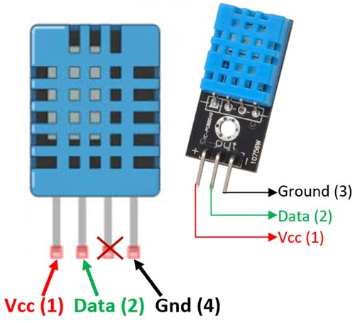

ຕົວຢ່າງການນຳໃຊ້ອຸປະກອນ
ເຊັນເຊີ DHT11 ຖືກນຳໃຊ້ຢ່າງກວ້າງຂວາງໃນໂຄງການ DIY ແລະ IoT ( Internet of Things) ພື້ນຖານ.

|**ຫົວຂໍ້ການນຳໃຊ້**|**ລາຍລະອຽດ**|
|---|---|
|**Smart Home Thermostat**|ລະບົບຄວບຄຸມເຄື່ອງປັບອາກາດ ຫຼື ພັດລົມອັດຕະໂນມັດ ໂດຍອີງໃສ່ອຸນຫະພູມທີ່ວັດໄດ້ ເພື່ອຮັກສາຄວາມເຢັນທີ່ກຳນົດໄວ້.|
|**Mini Weather Station**|ສ້າງສະຖານີວັດສະພາບອາກາດຂະໜາດນ້ອຍທີ່ສະແດງອຸນຫະພູມ ແລະ ຄວາມຊື້ນເທິງຈໍ LCD ຫຼືສົ່ງຂໍ້ມູນຂຶ້ນຄລາວ.|
|**Plant Watering Monitor**|ໃຊ້ໃນກະສິກໍາ ຫຼື ຟາມປູກພືດໃນເຮືອນກະຈົກ ເພື່ອກວດສອບຄວາມຊື້ນ ແລະ ອຸນຫະພູມເພື່ອຕັດສິນໃຈວ່າຄວນຫົດນ້ໍາຕົ້ນໄມ້ເມື່ອໃດ.|
|**Data Logger**|ບັນທຶກຄ່າອຸນຫະພູມ ແລະ ຄວາມຊື້ນຢ່າງຕໍ່ເນື່ອງໃນແຕ່ລະຊ່ວງເວລາ ລົງໃນ SD Card ຫຼື ຖານຂໍ້ມູນ ເພື່ອຕິດຕາມສະພາບແວດລ້ອມໃນໄລຍະຍາວ.|
|**Air Quality Monitor**|ລວມກັບເຊັນເຊີອື່ນໆ (ເຊັ່ນ: Dust Sensor) ເພື່ອສ້າງລະບົບຕິດຕາມຄຸນນະພາບອາກາດພາຍໃນເຮືອນ.|

**21, LM35 Temperature Sensor** ແມ່ນ Sensor ວັດອຸນຫະພູມແບບ Integrated Circuit (IC) ທີ່ມີຄວາມແມ່ນຍໍາສູງ, ຖືກອອກແບບມາເພື່ອໃຫ້ຜົນຜະລິດອອກມາເປັນ **ແຮງດັນໄຟຟ້າອະນາລັອກ (Analog Voltage)** ທີ່ສອດຄ່ອງໂດຍກົງກັບອຸນຫະພູມໃນຫົວໜ່ວຍ **ອົງສາເຊນຊຽສ (Celsius ຫຼື Centigrade)**.
    ໃຊ້ໃນການວັດອຸນຫະພູມ ແລະ ສົ່ງສັນຍານອານາລັອກ. LM35 ຖືກຈັດເປັນ Analog Sensor. ການເຮັດວຽກຂອງມັນແມ່ນອີງໃສ່ຫຼັກການປ່ຽນແປງຂອງແຮງດັນໄຟຟ້າຕາມອຸນຫະພູມ.

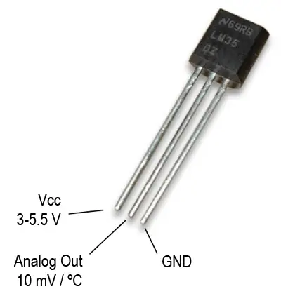

ຕົວຢ່າງການນຳໃຊ້ອຸປະກອນ
LM35 ເປັນເຊັນເຊີທີ່ນິຍົມໃຊ້ໃນໂຄງການພື້ນຖານເນື່ອງຈາກຄວາມງ່າຍ ແລະ ຄວາມແມ່ນຍໍາຂອງມັນໃນການວັດອຸນຫະພູມ:

|**ຫົວຂໍ້ການນຳໃຊ້**|**ລາຍລະອຽດ**|
|---|---|
|**Digital Thermometer**|ສ້າງເຄື່ອງວັດອຸນຫະພູມດິຈິຕອລທີ່ງ່າຍດາຍ ແລະ ແມ່ນຍໍາ, ສະແດງຄ່າເທິງຈໍ LCD ຫຼື 7-Segment Display.|
|**Temperature Controlled Fan**|ລະບົບຄວບຄຸມຄວາມຮ້ອນອັດຕະໂນມັດ: ຖ້າອຸນຫະພູມສູງກວ່າຄ່າທີ່ກຳນົດໄວ້, ຈະເປີດພັດລົມ (ຫຼືລະບົບຄວາມເຢັນ) ອັດຕະໂນມັດ.|
|**Overheat Protection System**|ໃຊ້ໃນການຕິດຕາມອຸນຫະພູມຂອງອຸປະກອນເອເລັກໂຕຣນິກ (ເຊັ່ນ: CPU ຫຼື ແບັດເຕີຣີ) ເພື່ອປິດລະບົບເມື່ອອຸນຫະພູມສູງເກີນໄປ.|
|**Fire Alarm System**|ໃຊ້ເປັນເຊັນເຊີກວດຈັບການເພີ່ມຂຶ້ນຂອງອຸນຫະພູມທີ່ໄວຜິດປົກກະຕິ ເຊິ່ງເປັນຕົວຊີ້ບອກເຖິງການເກີດໄຟໄໝ້.|
|**Temperature Logger**|ບັນທຶກອຸນຫະພູມໃນແຕ່ລະໄລຍະ ເພື່ອຕິດຕາມສະພາບແວດລ້ອມໃນການເກັບຮັກສາສິນຄ້າ ຫຼື ອາຫານ.|

**22, Tilt sensor (x2**) ແມ່ນເຊັນເຊີທີ່ໃຊ້ໃນການກວດຈັບການປ່ຽນແປງຂອງມຸມຂອງວັດຖຸທີ່ມັນຖືກຕິດຢູ່ ໂດຍທຽບກັບແຮງໂນ້ມຖ່ວງຂອງໂລກ.
    ໃຊ້ສໍາລັບກວດຈັບການອຽງ ຫຼື ການປ່ຽນແປງມຸມໃນໂປຣເຈັກ. ມັກຖືກໃຊ້ເປັນ **ສະວິດ (Switch)** ດິຈິຕອລແບບງ່າຍໆ ທີ່ປ່ຽນສະຖານະ (ON/OFF ຫຼື HIGH/LOW) ເມື່ອມັນອຽງກາຍມຸມທີ່ກຳນົດໄວ້.
    
ສຳລັບ Tilt Sensor ແບບ Ball-Type (ເຊັ່ນ: SW-520D), ການເຮັດວຽກຂອງມັນແມ່ນຄ້າຍຄືກັບສະວິດທຳມະດາ:
1. **ໂຄງສ້າງ:** ປະກອບມີກໍລະນີ (Case) ພາຍໃນມີລູກບານໂລຫະນ້ອຍໆ ແລະ ຂົ້ວຕໍ່ (Contacts) ທາງໄຟຟ້າ 2 ອັນ.
2. **ສະພາບປົກກະຕິ (Not Tilted):** ເມື່ອ Sensor ຕັ້ງຊື່ ຫຼື ຢູ່ໃນທິດທາງທີ່ຖືກຕ້ອງ, ລູກບານໂລຫະຈະ **ສຳຜັດ** ກັບຂົ້ວຕໍ່ທັງສອງ, ເຮັດໃຫ້ວົງຈອນ **ປິດ** (Closed Circuit ຫຼື Logic LOW/ON).
3. **ສະພາບອຽງ (Tilted):** ເມື່ອ Sensor ຖືກອຽງເກີນມຸມທີ່ກຳນົດໄວ້, ແຮງໂນ້ມຖ່ວງຈະດຶງລູກບານໂລຫະໃຫ້ **ເຄື່ອນທີ່ໜີ** ອອກຈາກຂົ້ວຕໍ່, ເຮັດໃຫ້ວົງຈອນ **ເປີດ** (Open Circuit ຫຼື Logic HIGH/OFF).
4. **ຜົນຜະລິດ:** ຜົນຜະລິດຂອງມັນເປັນ **ສັນຍານດິຈິຕອລ (Digital Output)** ທີ່ບອກພຽງແຕ່ 2 ສະຖານະຄື: "ອຽງ" ຫຼື "ບໍ່ອຽງ".
   
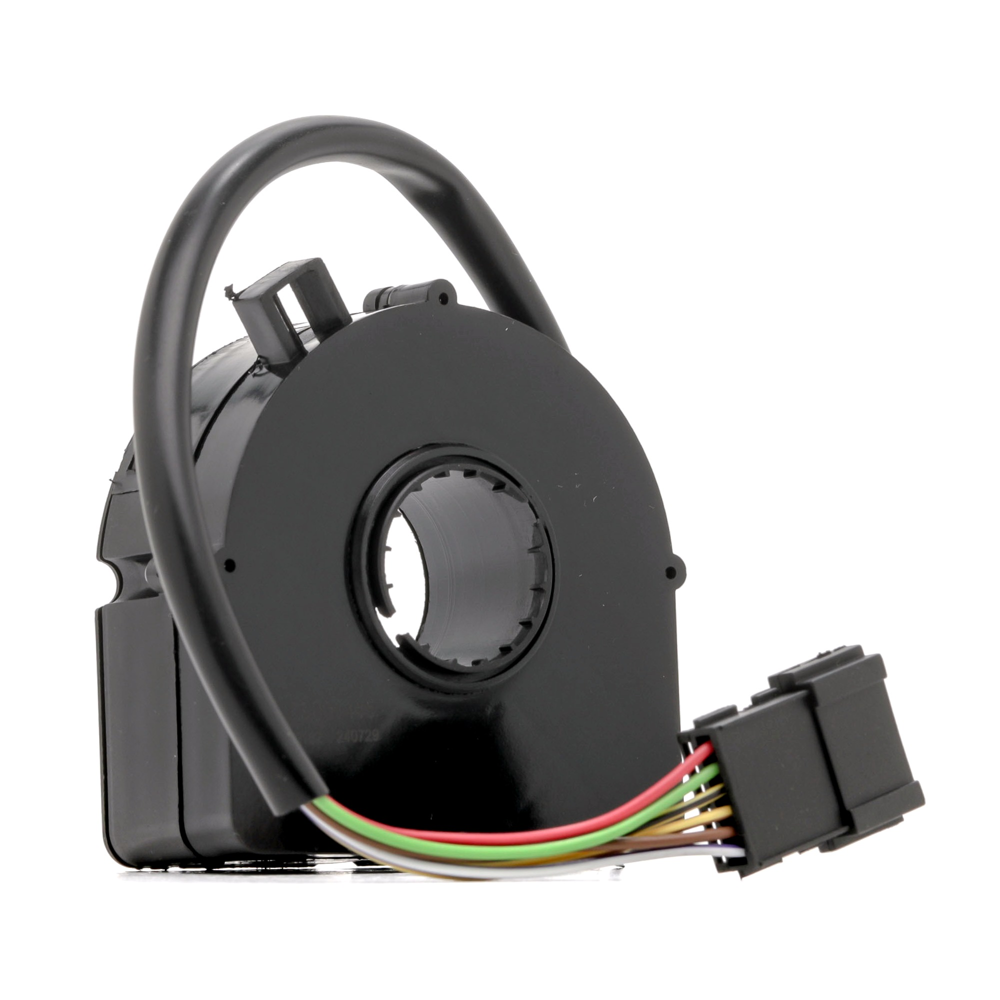

ຕົວຢ່າງການນຳໃຊ້ອຸປະກອນ
Tilt Sensor ຖືກໃຊ້ໃນວຽກທີ່ຕ້ອງການກວດຈັບການປ່ຽນແປງທິດທາງ ຫຼື ການເຄື່ອນໄຫວທີ່ເກີນຂອບເຂດ:

|**ຫົວຂໍ້ການນຳໃຊ້**|**ລາຍລະອຽດ**|
|---|---|
|**Anti-Theft Alarm**|ລະບົບປ້ອງກັນການລັກ: ຕິດຕັ້ງໃສ່ລົດຖີບ, ກ່ອງເຄື່ອງ, ຫຼື ຕູ້ ເພື່ອສົ່ງສັນຍານເຕືອນ (Alarm) ເມື່ອວັດຖຸດັ່ງກ່າວຖືກຍົກ ຫຼື ອຽງ.|
|**Smart Lighting**|ໄຟອັດຕະໂນມັດ: ໃຊ້ໃນໂຄມໄຟຕັ້ງໂຕະ ເພື່ອປິດໄຟອັດຕະໂນມັດ ເມື່ອໂຄມໄຟລົ້ມລົງ ເພື່ອປ້ອງກັນອັນຕະລາຍ.|
|**Toy and Gaming Controller**|ຄວບຄຸມຂອງຫຼິ້ນ ຫຼື ເກມ: ໃຊ້ໃນການຄວບຄຸມທິດທາງຂອງຕົວລະຄອນໃນເກມ ໂດຍການອຽງອຸປະກອນ (Controller).|
|**Safety Switch for Machinery**|ສະວິດຄວາມປອດໄພຂອງເຄື່ອງຈັກ: ປິດການເຮັດວຽກຂອງເຄື່ອງຈັກອັດຕະໂນມັດ (ເຊັ່ນ: ເຄື່ອງຕັດຫຍ້າ) ເມື່ອເຄື່ອງຈັກລົ້ມລົງ ຫຼື ອຽງເກີນມຸມອັນຕະລາຍ.|
|**Automatic Screen Rotation**|ການໝູນຈໍອັດຕະໂນມັດ: ແບບງ່າຍດາຍສຳລັບໂຄງການ DIY ເພື່ອກວດຈັບວ່າໜ້າຈໍຄວນສະແດງຢູ່ໃນທ່າຕັ້ງ (Portrait) ຫຼື ທ່າຂວາງ (Landscape).|

**23, Photoresistor (LDRs x3)** ແມ່ນຕົວຕ້ານທານທີ່ຂຶ້ນຢູ່ກັບແສງ ຊຶ່ງຄ່າຂອງມັນຈະປ່ຽນແປງຕາມການສຳຜັດແສງ.
    ໃຊ້ໃນວົງຈອນທີ່ໄວຕໍ່ແສງເຊັ່ນ: ລະບົບໄຟອັດຕະໂນມັດ ຫຼື ມິເຕີວັດແສງ
#### ຫຼັກການພື້ນຖານ: ຄວາມຕ້ານທານປ່ຽນໄປຕາມແສງ
1. **ເມື່ອຢູ່ໃນຄວາມມືດ (ແສງໜ້ອຍ):**
    - ບໍ່ມີ Photon ພຽງພໍທີ່ຈະກະຕຸ້ນ Electron ໃຫ້ເຄື່ອນທີ່ໄດ້ຢ່າງເສລີ.
    - ສະນັ້ນ, LDR ຈະມີ **ຄວາມຕ້ານທານສູງຫຼາຍ** (ອາດຈະສູງເຖິງຫຼາຍ Megaohms).
2. **ເມື່ອຢູ່ໃນແສງສະຫວ່າງ (ແສງຫຼາຍ):**
    - ແສງທີ່ຕົກໃສ່ວັດສະດຸ Semiconductor ຈະປ່ອຍພະລັງງານໃຫ້ແກ່ Electron.
    - Electronທີ່ຖືກກະຕຸ້ນຈະກາຍເປັນ Charge Carriers ທີ່ເຄື່ອນທີ່ຢ່າງເສລີ, ເພີ່ມຄວາມສາມາດໃນການນໍາໄຟຟ້າ.
    - ສະນັ້ນ, LDR ຈະມີ **ຄວາມຕ້ານທານຕໍ່າລົງ** (ອາດຈະຕໍ່າລົງເຖິງສອງສາມຮ້ອຍ Ohms).
    - 
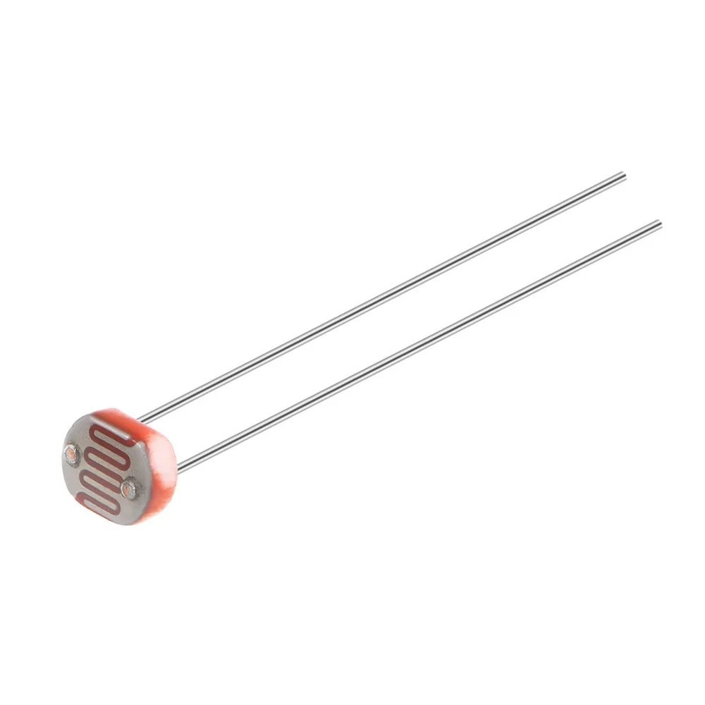

ຕົວຢ່າງການນຳໃຊ້ອຸປະກອນ
LDR ແມ່ນເປັນທີ່ນິຍົມເນື່ອງຈາກລາຄາຖືກ ແລະ ໃຊ້ງ່າຍໃນການສ້າງ Sensor ແສງພື້ນຖານ:

| **ຫົວຂໍ້ການນຳໃຊ້**                  | **ລາຍລະອຽດ**                                                                                                                                                                                        |
| ----------------------------------- | --------------------------------------------------------------------------------------------------------------------------------------------------------------------------------------------------- |
| **Automatic Street Light**          | ໄຟຖະໜົນອັດຕະໂນມັດ: ເປີດໄຟໃນຕອນແລງເມື່ອແສງມືດລົງ (ຄວາມຕ້ານທານສູງ) ແລະ ປິດໄຟໃນຕອນເຊົ້າເມື່ອແສງແຈ້ງຂຶ້ນ (ຄວາມຕ້ານທານຕໍ່າ).                                                                             |
| **Light Meter / Luxmeter** | ເຄື່ອງວັດແສງ: ວັດແທກແລະສະແດງລະດັບຄວາມເຂັ້ມຂອງແສງໃນສະພາບແວດລ້ອມ, ເຊັ່ນ: ວັດຄວາມແຈ້ງໃນຫ້ອງ.                                                                                                           |
| **Solar Tracker**                   | ລະບົບຕິດຕາມແສງຕາເວັນ: ໃຊ້ LDR ສອງໂຕ (x2) ຕິດຕັ້ງຢູ່ສອງຂ້າງຂອງແຜງ Solar Cell. ຖ້າແສງຕົກໃສ່ LDR ເບື້ອງໃດຫຼາຍກວ່າ, ມໍເຕີຈະໝູນແຜງໄປທາງນັ້ນ ເພື່ອໃຫ້ໄດ້ຮັບແສງສູງສຸດ. |
| **Security Alarm**                  | ສັນຍານເຕືອນຄວາມປອດໄພທີ່ໃຊ້ແສງ: ຕິດຕັ້ງ LDR ເພື່ອກວດຈັບການຂັດຂວາງຂອງລໍາແສງ (ເຊັ່ນ: ແສງເລເຊີ) ເຊິ່ງຈະເຮັດໃຫ້ຄວາມຕ້ານທານປ່ຽນແປງຢ່າງກະທັນຫັນ ເມື່ອມີຄົນຍ່າງຜ່ານ.                               |
| **Light-Sensitive Toys**            | ຂອງຫຼິ້ນທີ່ເຮັດວຽກດ້ວຍແສງ: ເປີດສຽງຫຼືແສງໄຟເມື່ອຖືກແສງສະຫວ່າງ ຫຼື ຖືກມືອັດແສງ.                                                                                                                       |
|                                     |                                                                                                                                                                                                     |

**24, PIR sensor**: PIR ຫຍໍ້ມາຈາກ **Passive Infrared** (ອິນຟຣາເຣດແບບ Passive). ມັນແມ່ນເຊັນເຊີທີ່ໃຊ້ສຳລັບ ກວດຈັບການເຄື່ອນໄຫວ ໂດຍການວັດແທກການປ່ຽນແປງຂອງລະດັບ ລັງສີອິນຟຣາເຣດ (Infrared, IR)**.
    ໃຊ້ໃນລະບົບກວດຈັບການເຄື່ອນໄຫວ ແລະ ສັນຍານເຕືອນໄພ
    1. **ອົງປະກອບຮັບແສງ (Pyroelectric Sensor):**
    - ພາຍໃນ PIR Sensor ມີວັດສະດຸ Pyroelectric ທີ່ສາມາດສ້າງແຮງດັນໄຟຟ້າໄດ້ ເມື່ອມັນຖືກສໍາຜັດກັບຄວາມຮ້ອນ (IR Radiation).
    - ເຊັນເຊີນີ້ຖືກແບ່ງອອກເປັນສອງສ່ວນທີ່ເຮັດວຽກກົງກັນຂ້າມ (Differential): ສ່ວນໜຶ່ງມີຂົ້ວບວກ (+) ແລະ ອີກສ່ວນໜຶ່ງມີຂົ້ວລົບ (-).
2. **ສະພາບປົກກະຕິ (ບໍ່ມີການເຄື່ອນໄຫວ):**
    - ເມື່ອບໍ່ມີສິ່ງໃດເຄື່ອນທີ່, ທັງສອງສ່ວນຂອງ Pyroelectric Sensor ຈະໄດ້ຮັບລັງສີ IR ໃນລະດັບທີ່ຄົງທີ່ຈາກສະພາບແວດລ້ອມອ້ອມຂ້າງ.
    - ແຮງດັນໄຟຟ້າທີ່ສ້າງຂຶ້ນຈະ **ຍົກເລີກກັນ**, ເຮັດໃຫ້ຜົນຜະລິດອອກມາເປັນ **ສູນ** (ຫຼື Logic LOW).
3. **ເມື່ອມີການເຄື່ອນໄຫວ (Motion Detected):**
    - ເມື່ອຄົນ ຫຼື ສັດທີ່ມີຄວາມຮ້ອນຜ່ານພື້ນທີ່ກວດຈັບ, ລັງສີ IR ຂອງສິ່ງນັ້ນຈະ **ຕົກໃສ່ເຊັນເຊີສ່ວນໜຶ່ງກ່ອນ**, ແລະຈາກນັ້ນຈຶ່ງໄປຕົກໃສ່ອີກສ່ວນໜຶ່ງ.
    - ການປ່ຽນແປງຂອງ IR ທີ່ບໍ່ສະໝໍ່າສະເໝີນີ້ຈະສ້າງຄວາມແຕກຕ່າງຂອງແຮງດັນໄຟຟ້າຂຶ້ນ.
    - ວົງຈອນພາຍໃນຈະປ່ຽນຄວາມແຕກຕ່າງນີ້ໃຫ້ເປັນ **ສັນຍານ HIGH (ON)**, ໂດຍບົ່ງບອກວ່າ **"ມີການເຄື່ອນໄຫວ"**.
4. **ເລນ Fresnel (ຝາປິດພລາສຕິກ):**
    - ແມ່ນຝາປິດຮູບເຄິ່ງວົງມົນທີ່ມີລາຍທາງທີ່ຊັບຊ້ອນຢູ່ດ້ານນອກຂອງເຊັນເຊີ.
    - ມັນເຮັດໜ້າທີ່ **ລວມແສງ** IR ທີ່ເຂົ້າມາໃຫ້ຕົກໃສ່ສອງສ່ວນຂອງ Pyroelectric Sensor ຕາມລໍາດັບ, ເຊິ່ງຊ່ວຍເພີ່ມຄວາມລະອຽດອ່ອນ ແລະ ເພີ່ມພື້ນທີ່ກວດຈັບໃຫ້ກວ້າງຂຶ້ນ.
    
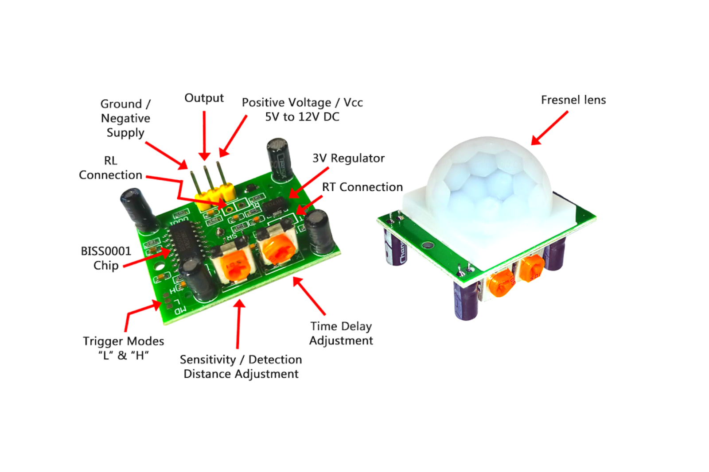

ຕົວຢ່າງການນຳໃຊ້ອຸປະກອນ
PIR Sensor ແມ່ນຖືກນຳໃຊ້ຢ່າງກວ້າງຂວາງໃນລະບົບທີ່ຕ້ອງກວດຈັບການປະກົດຕົວຂອງຄົນ ຫຼື ການເຄື່ອນໄຫວໃນພື້ນທີ່.

|**ຫົວຂໍ້ການນຳໃຊ້**|**ລາຍລະອຽດ**|
|---|---|
|**Motion-Activated Lighting**|ໄຟເປີດອັດຕະໂນມັດ: ໃຊ້ໃນຫ້ອງນໍ້າ, ໂຖງທາງຍ່າງ, ຫຼື ເດີ່ນບ້ານ ເພື່ອເປີດໄຟເມື່ອມີຄົນຍ່າງເຂົ້າມາ ແລະ ປິດໄຟເມື່ອຄົນອອກໄປ.|
|**Home Security Alarm**|ລະບົບເຕືອນໄພບ້ານ: ຕິດຕັ້ງຢູ່ປະຕູ ຫຼື ປ່ອງຢ້ຽມ ເພື່ອສົ່ງສັນຍານເຕືອນ (Alarm ຫຼື ສົ່ງແຈ້ງເຕືອນ) ເມື່ອກວດພົບການເຄື່ອນໄຫວທີ່ບໍ່ຕ້ອງການ.|
|**Visitor Counter**|ເຄື່ອງນັບຈຳນວນຄົນ: ຕິດຕັ້ງຢູ່ປະຕູທາງເຂົ້າ ເພື່ອນັບຈຳນວນຄົນທີ່ຍ່າງເຂົ້າ-ອອກ ຮ້ານຄ້າ ຫຼື ອາຄານ.|
|**Energy Saving Systems**|ລະບົບປະຢັດພະລັງງານ: ຕັດການເຊື່ອມຕໍ່ ຫຼື ປິດອຸປະກອນໄຟຟ້າ (ເຊັ່ນ: ເຄື່ອງປັບອາກາດ ຫຼື ພັດລົມ) ໃນຫ້ອງການ ຫຼື ຫ້ອງຮຽນ ເມື່ອບໍ່ມີຄົນຢູ່ພາຍໃນໄລຍະເວລາໜຶ່ງ.|
|**Automatic Door Opener**|ລະບົບເປີດປະຕູອັດຕະໂນມັດ: ຕິດຕັ້ງຢູ່ໜ້າປະຕູ ເພື່ອກວດຈັບວ່າຄວນເປີດປະຕູໃຫ້ຄົນທີ່ຍ່າງເຂົ້າມາ.|

**25, Ultrasonic module** ແມ່ນເຊັນເຊີທີ່ໃຊ້ສຳລັບ **ວັດແທກໄລຍະຫ່າງ** ໄປຫາວັດຖຸໂດຍໃຊ້ **ຄື້ນສຽງຄວາມຖີ່ສູງ (Ultrasound)** ເຊິ່ງບໍ່ສາມາດໄດ້ຍິນດ້ວຍຫູຂອງຄົນ.
    ໃຊ້ໃນການຫຼີກເວັ້ນອຸປະສັກ ຫຼື ການວັດລະຍະທາງ
#### ຫຼັກການຄິດໄລ່ໄລຍະທາງ (Distance Calculation)
1. **ການສົ່ງສັນຍານ (Trigger):**
    - Microcontroller (ເຊັ່ນ: Arduino) ຈະສົ່ງສັນຍານ Pulse ດິຈິຕອລສັ້ນໆ (ເຊັ່ນ: 10 $\mu\text{s ຄວາມສູງ) ໄປຫາ Pin TRIG ຂອງ Ultrasonic Module.
    - ເມື່ອໄດ້ຮັບສັນຍານ Pulse ນີ້, Transmitter ຈະປ່ອຍຄື້ນສຽງ Ultrasound ອອກມາເປັນ 8 ລູກຕໍ່ເນື່ອງ.
2. **ການຮັບສັນຍານ (Echo):**
    - ເມື່ອຄື້ນສຽງນີ້ໄປຖືກວັດຖຸ, ມັນຈະສະທ້ອນກັບຄືນມາ.
    - Receiver ຈະຮັບຄື້ນທີ່ສະທ້ອນຄືນ, ແລະ Module ຈະປ່ອຍສັນຍານ Pulse ດິຈິຕອລອອກທາງ Pin ECHO.
3. **ການວັດແທກເວລາ:**
    - ຄວາມຍາວຂອງ Pulse ທີ່ປ່ອຍອອກຈາກ Pin ECHO ແມ່ນເທົ່າກັບ **ເວລາທີ່ຄື້ນສຽງໃຊ້ໃນການເດີນທາງໄປແລະກັບ**.
    - Microcontroller ຈະໃຊ້ຟັງຊັນພິເສດ (ເຊັ່ນ: pulseIn() ໃນ Arduino) ເພື່ອວັດແທກໄລຍະເວລາ Time ນີ້ໃນໜ່ວຍ $\mu\text{s.
      
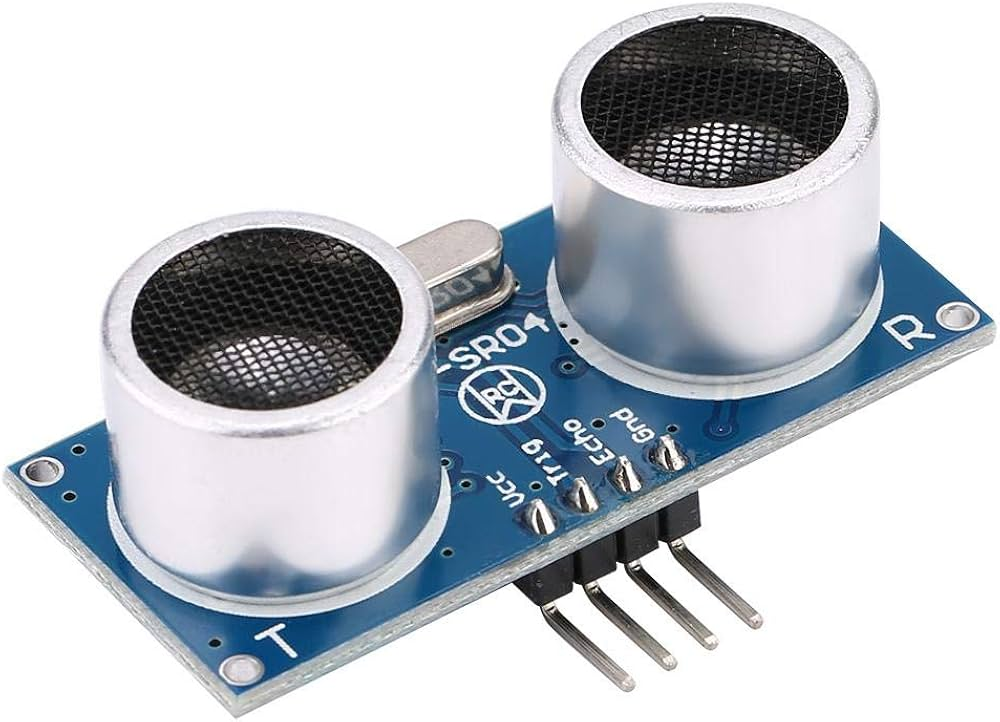

ຕົວຢ່າງການນຳໃຊ້ອຸປະກອນ
Ultrasonic Module ແມ່ນມີປະສິດທິພາບສູງໃນການວັດແທກໄລຍະທາງ ແລະ ການກວດຈັບວັດຖຸໃນໄລຍະສັ້ນເຖິງກາງ.

|**ຫົວຂໍ້ການນຳໃຊ້**|**ລາຍລະອຽດ**|
|---|---|
|**Obstacle Avoiding Robot**|ຫຸ່ນຍົນຫຼົບຫຼີກສິ່ງກີດຂວາງ: ຕິດຕັ້ງຢູ່ດ້ານໜ້າຂອງຫຸ່ນຍົນ ເພື່ອກວດຈັບໄລຍະຫ່າງໄປຫາສິ່ງກີດຂວາງ ແລະ ປ່ຽນທິດທາງໂດຍອັດຕະໂນມັດ.|
|**Smart Parking Sensor**|ເຊັນເຊີຈອດລົດ: ຕິດຕັ້ງຢູ່ທາງເຂົ້າຈອດ ຫຼື ດ້ານຫຼັງຂອງລົດ ເພື່ອວັດແທກໄລຍະຫ່າງໄປຫາຝາ ເພື່ອຊ່ວຍໃຫ້ຜູ້ຂັບຂີ່ຈອດລົດໄດ້ຢ່າງປອດໄພ.|
|**Digital Measuring Tape**|ສາຍວັດແທກໄລຍະທາງແບບດີຈິຕອລ: ສ້າງເຄື່ອງມືວັດແທກໄລຍະທາງແບບເອເລັກໂຕຣນິກທີ່ສະແດງຄ່າເປັນຕົວເລກ.|
|**Water/Liquid Level Meter**|ເຄື່ອງວັດລະດັບນໍ້າໃນຖັງ: ວາງເຊັນເຊີໄວ້ດ້ານເທິງຂອງຖັງ ເພື່ອວັດແທກໄລຍະຫ່າງໄປຫາຜິວນໍ້າ, ເຊິ່ງສາມາດຄິດໄລ່ປ່ຽນເປັນລະດັບຄວາມສູງຂອງນໍ້າໄດ້.|
|**Human-Sensing Alarm**|ລະບົບເຕືອນໄພການເຂົ້າໃກ້: ສົ່ງສຽງເຕືອນ ຫຼື ເປີດໄຟ ເມື່ອມີຄົນເຂົ້າໃກ້ໃນໄລຍະທີ່ກຳນົດໄວ້.|

**26, Sound sensor** ແມ່ນເຊັນເຊີທີ່ຖືກອອກແບບມາເພື່ອ **ກວດຈັບການມີຢູ່ ແລະ ຄວາມເຂັ້ມຂອງສຽງ** ໃນສະພາບແວດລ້ອມ. ມັນປ່ຽນຄື້ນສຽງ (ການສັ່ນສະເທືອນທາງກົນຈັກໃນອາກາດ) ໃຫ້ເປັນ **ສັນຍານໄຟຟ້າ**.
    ໃຊ້ໃນໂປຣເຈັກທີ່ເປີດໃຊ້ງານຕາມສຽງ ຫຼື ການກວດຈັບລະດັບສຽງ
    #### ຫຼັກການປ່ຽນຄື້ນສຽງເປັນສັນຍານໄຟຟ້າ:
1. **ການຮັບຄື້ນສຽງ:**
    - ເມື່ອຄື້ນສຽງ (ເຊັ່ນ: ການຕົບມື, ສຽງເວົ້າ) ມາຮອດໄມໂຄຣໂຟນ (ປົກກະຕິແມ່ນໄມໂຄຣໂຟນ Condenser ຫຼື Electret).
    - ຄື້ນສຽງຈະເຮັດໃຫ້ **ແຜ່ນໄດອາຟຣາມ (Diaphragm)** ພາຍໃນໄມໂຄຣໂຟນ **ສັ່ນສະເທືອນ**.
2. **ການສ້າງສັນຍານໄຟຟ້າ:**
    - ການສັ່ນສະເທືອນຂອງ Diaphragm ຈະເຮັດໃຫ້ເກີດການປ່ຽນແປງຂອງແຮງດັນໄຟຟ້າຂຶ້ນ. ແຮງດັນໄຟຟ້ານີ້ແມ່ນອ່ອນຫຼາຍ ແລະ ເປັນສັນຍານ Analog ທີ່ສະທ້ອນເຖິງຄື້ນສຽງທີ່ໄດ້ຍິນ.
3. **ການປຸງແຕ່ງສັນຍານ:**
    - **ຂະຫຍາຍສັນຍານ:** ສັນຍານ Analog ທີ່ອ່ອນແອນີ້ຈະຖືກສົ່ງຜ່ານ Amplifier ເພື່ອຂະຫຍາຍໃຫ້ມັນແຂງແຮງພໍທີ່ຈະນໍາໃຊ້ໄດ້.
    - **ການປຽບທຽບ (ສຳລັບ Digital Output):**
        - ວົງຈອນ Comparator ຈະປຽບທຽບຄວາມເຂັ້ມຂອງສັນຍານ Analog ທີ່ຖືກຂະຫຍາຍແລ້ວ ກັບ **ຂີດຈຳກັດ (Threshold)** ທີ່ຖືກຕັ້ງໄວ້ໂດຍປຸ່ມປັບ Potentiometer.
        - ຖ້າສຽງດັງ **ເກີນ** ຂີດຈຳກັດ, Pin DO ຈະປ່ອຍສັນຍານອອກ (ເຊັ່ນ: LOW).
        - ຖ້າສຽງດັງ **ບໍ່ເກີນ** ຂີດຈຳກັດ, Pin DO ຈະຢູ່ໃນສະພາບປົກກະຕິ (ເຊັ່ນ: HIGH).
          
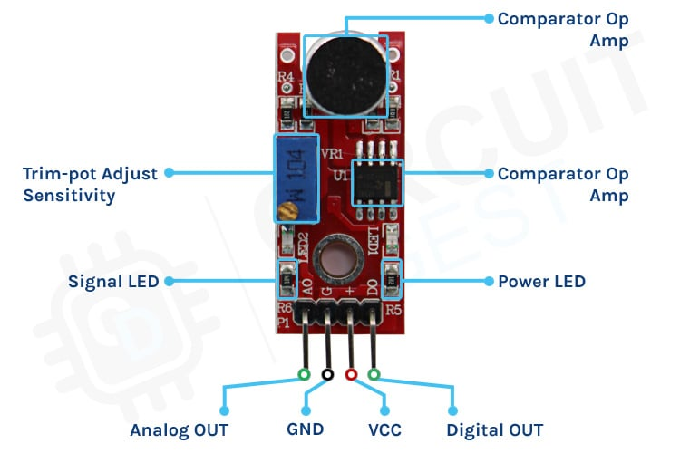

ຕົວຢ່າງການນຳໃຊ້ອຸປະກອນ
Sound Sensor ເປັນປະໂຫຍດໃນໂຄງການທີ່ຕ້ອງການຄວບຄຸມອຸປະກອນໂດຍອີງໃສ່ສຽງ ຫຼື ລະດັບຄວາມດັງ.

|**ຫົວຂໍ້ການນຳໃຊ້**|**ລາຍລະອຽດ**|
|---|---|
|**Clap Switch / Clap Light**|ສະວິດຄວບຄຸມດ້ວຍການຕົບມື: ໃຊ້ສຽງຕົບມືເປັນຕົວກະຕຸ້ນ (ເຊັ່ນ: ຕົບມືໜຶ່ງຄັ້ງເພື່ອເປີດໄຟ, ຕົບມືອີກຄັ້ງເພື່ອປິດ).|
|**Sound Activated Alarm**|ລະບົບເຕືອນໄພສຽງດັງ: ຕິດຕັ້ງຢູ່ໃນເຮືອນ ຫຼື ຫ້ອງ ເພື່ອກວດຈັບສຽງດັງທີ່ຜິດປົກກະຕິ (ເຊັ່ນ: ສຽງແກ້ວແຕກ, ສຽງປືນ) ແລະ ກະຕຸ້ນສັນຍານເຕືອນ.|
|**Voice Controlled Robot**|ຫຸ່ນຍົນຄວບຄຸມດ້ວຍສຽງ (ແບບງ່າຍດາຍ): ໃຊ້ສຽງທີ່ດັງໃນລະດັບຕ່າງໆ ເພື່ອສັ່ງໃຫ້ຫຸ່ນຍົນເຄື່ອນທີ່ ຫຼື ຢຸດ (ແຕກຕ່າງຈາກການຮັບຮູ້ສຽງເວົ້າທີ່ຊັບຊ້ອນ).|
|**Noise Level Monitoring**|ຕິດຕາມກວດກາລະດັບສຽງ: ໃຊ້ຜົນຜະລິດ Analog ເພື່ອວັດແທກແລະບັນທຶກຄວາມດັງຂອງສຽງໃນຫ້ອງສະໝຸດ, ໂຮງງານ, ຫຼື ສະພາບແວດລ້ອມ.|
|**VU Meter (Visual Sound Indicator)**|ຕົວຊີ້ບອກສຽງແບບເຫັນພາບ: ໃຊ້ LED ຫຼື ໜ້າຈໍສະແດງຜົນ ເພື່ອສະແດງຄວາມເຂັ້ມຂອງສຽງທີ່ກໍາລັງຫຼິ້ນ (ຄືກັບແຖບ Equalizer ໃນເຄື່ອງສຽງ).|

**27, Water sensor** ແມ່ນເຊັນເຊີກວດຈັບການມີຢູ່ຂອງນໍ້າ ຫຼື ວັດແທກລະດັບຄວາມສູງຂອງນໍ້າ (ຫຼື ຂອງແຫຼວອື່ນໆ). ມັນມີຫຼາຍປະເພດ, ເຊິ່ງແຕ່ລະປະເພດກໍມີໜ້າທີ່ ແລະ ຫຼັກການເຮັດວຽກທີ່ແຕກຕ່າງກັນ.
#### ປະເພດທົ່ວໄປຂອງ Water Sensor:
1. **Water Level Sensor (ເຊັນເຊີວັດລະດັບນໍ້າ):**
    - **ໜ້າທີ່:** ວັດແທກວ່າລະດັບນໍ້າໃນຖັງ, ອ່າງ, ຫຼື ແມ່ນໍ້າສູງເທົ່າໃດ.
    - **ຕົວຢ່າງ:**
        - Submersible Pressure Sensor
        - Ultrasonic Sensor (ໃຊ້ວັດແທກໄລຍະຫ່າງຈາກຜິວນໍ້າ)
        - Float Sensor (ໃຊ້ລູກລອຍ)
        - Capacitive/Resistive Water Level Sensor (ໃຊ້ສາຍລວດ ຫຼື ແຜ່ນ PCB ເພື່ອວັດແທກ)
2. **Water Detection/Rain Sensor (ເຊັນເຊີກວດຈັບນໍ້າ/ຝົນ):**
    - **ໜ້າທີ່:** ພຽງແຕ່ກວດຈັບວ່າພື້ນຜິວຂອງເຊັນເຊີມີນໍ້າຢູ່ ຫຼື ບໍ່ (ໃຊ້ສຳລັບກວດຈັບນໍ້າຮົ່ວ ຫຼື ຝົນ).
    - **ຕົວຢ່າງ:** Resistive Rain Sensor Module (ເຊິ່ງມີແຜ່ນ PCB ທີ່ມີລາຍເສັ້ນ)
ໃນການຕອບຄຳຖາມນີ້, ຂ້າພະເຈົ້າຈະເນັ້ນໃສ່ **Resistive Water Detection Sensor** (ເຊັນເຊີກວດຈັບນໍ້າຮົ່ວ) ເນື່ອງຈາກມັນນິຍົມໃຊ້ໃນໂຄງການ DIY ງ່າຍດາຍ.
    ໃຊ້ໃນໂປຣເຈັກກວດສອບລະດັບນໍ້າ ຫຼື ການກວດຈັບການຮົ່ວໄຫຼ
    
    #### ຫຼັກການເຮັດວຽກຂອງ Resistive Water Sensoor(ເຊັນເຊີລາຍເສັ້ນ PCB):
1. **ອົງປະກອບຫຼັກ:** ປະກອບດ້ວຍແຜ່ນ PCB ທີ່ມີເສັ້ນ Conductor (ຕົວນໍາໄຟຟ້າ) ຫຼາຍເສັ້ນວາງຄູ່ກັນ. ເສັ້ນເຫຼົ່ານີ້ຈະຕໍ່ກັບສັນຍານ VCC ແລະ GND (ຫຼື Analog Pin) ຂອງ Microcontroller.
2. **ສະພາບແຫ້ງ (Dry State):**
    - ເມື່ອແຜ່ນ PCB ແຫ້ງ, ເສັ້ນ Conductor ຈະບໍ່ເຊື່ອມຕໍ່ກັນ.
    - ຄວາມຕ້ານທານໄຟຟ້າ (Resistance) ລະຫວ່າງສອງເສັ້ນແມ່ນ **ສູງທີ່ສຸດ** (ຄືກັບວົງຈອນເປີດ).
    - ຜົນຜະລິດທີ່ໄດ້ແມ່ນຄ່າ LOW ຫຼື ຄ່າ Analog ທີ່ຕໍ່າ.
3. **ສະພາບປຽກ (Wet State):**
    - ເມື່ອນໍ້າ (ເຊິ່ງມີສານລະລາຍ ແລະ ນໍາໄຟຟ້າໄດ້) ມາຖືກພື້ນຜິວຂອງເຊັນເຊີ, ນໍ້າຈະເຮັດໜ້າທີ່ເປັນ **ຂົວເຊື່ອມຕໍ່ໄຟຟ້າ** ລະຫວ່າງເສັ້ນ Conductor ຕ່າງໆ.
    - ການເຊື່ອມຕໍ່ນີ້ເຮັດໃຫ້ຄວາມຕ້ານທານລະຫວ່າງເສັ້ນຫຼຸດລົງ ແລະ ອະນຸຍາດໃຫ້ກະແສໄຟຟ້າ A small current ໄຫຼຜ່ານ.
4. **ຜົນຜະລິດ (Output):**
    - **Digital Output:** ຖ້ານໍ້າມາຖືກພື້ນຜິວ (ເກີນຂີດຈຳກັດທີ່ກຳນົດໄວ້), ຜົນຜະລິດຈະປ່ຽນຈາກ LOW ເປັນ HIGH.
    - **Analog Output:** ຖ້າໃຊ້ Analog Pin, ຄ່ານໍ້າທີ່ກວດຈັບໄດ້ຈະເປັນຄ່າ Analog ທີ່ **ເພີ່ມຂຶ້ນ** ຕາມປະລິມານຂອງເສັ້ນທີ່ຖືກປຽກນໍ້າ (ໃຊ້ສຳລັບວັດແທກລະດັບນໍ້າແບບງ່າຍດາຍ).
> **Note:** ປະລິມານການນຳໄຟຟ້າຂອງນໍ້າແມ່ນຂຶ້ນກັບຄວາມບໍລິສຸດຂອງນໍ້າ. ນໍ້າບໍລິສຸດ (Distilled water) ນຳໄຟຟ້າໄດ້ບໍ່ດີ, ແຕ່ _ນໍ້າປະປາ_ ຫຼື _ນໍ້າຝົນ_ ສາມາດນໍາໄຟຟ້າໄດ້ດີ.

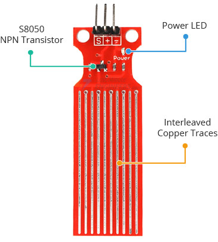

ຕົວຢ່າງການນຳໃຊ້ອຸປະກອນ
Water Sensor ຖືກໃຊ້ຢ່າງກວ້າງຂວາງໃນການປົກປ້ອງຊັບສິນ, ການຄວບຄຸມການກະສິກຳ ແລະ ລະບົບນໍ້າອັດຕະໂນມັດ.

|**ຫົວຂໍ້ການນຳໃຊ້**|**ປະເພດເຊັນເຊີ ແລະ ລາຍລະອຽດ**|
|---|---|
|**Automatic Water Level Indicator**|**Resistive/Ultrasonic Sensor:** ໃຊ້ວັດແທກລະດັບນໍ້າໃນຖັງ. ຕັ້ງ LED ຕ່າງໆ ເພື່ອສະແດງລະດັບນໍ້າ: Low, Medium, Full, ແລະ ມີສຽງເຕືອນເມື່ອນໍ້າເຕັມ.|
|**Smart Water Leak Detector Alarm**|**Water Detection Sensor:** ວາງໄວ້ໃກ້ກັບເຄື່ອງຊັກຜ້າ, ອ່າງລ້າງໜ້າ, ຫຼື ພື້ນຫ້ອງໃຕ້ດິນ. ເມື່ອກວດພົບນໍ້າຮົ່ວ, ໃຫ້ສົ່ງສັນຍານເຕືອນ (Buzzer) ແລະ ແຈ້ງເຕືອນຜ່ານ Wi-Fi (IoT).|
|**Rain Detection/Automated Irrigation**|**Rain Sensor:** ໃຊ້ກວດຈັບຝົນ. ເມື່ອກວດພົບຝົນຕົກ, ໃຫ້ຢຸດລະບົບຫົດນໍ້າອັດຕະໂນມັດ ເພື່ອປະຢັດນໍ້າ.|
|**Automatic Pump Controller**|**Float/Ultrasonic Sensor:** ໃຊ້ຄວບຄຸມປໍ້ານໍ້າ. ເມື່ອລະດັບນໍ້າໃນຖັງຕໍ່າກວ່າຈຸດທີ່ກຳນົດ, ໃຫ້ເປີດປໍ້ານໍ້າອັດຕະໂນມັດ; ເມື່ອນໍ້າເຕັມ, ໃຫ້ປິດປໍ້າ.|

**28, Flame sensor** ແມ່ນອຸປະກອນທີ່ຖືກອອກແບບມາເພື່ອ ກວດຈັບແປວໄຟ ຫຼື ແຫຼ່ງແສງອື່ນໆ ທີ່ມີລັກສະນະຄ້າຍຄືແປວໄຟ. ມັນຖືກນໍາໃຊ້ເປັນອົງປະກອບຫຼັກໃນລະບົບເຕືອນໄພອັກຄີໄພ.
    ໃຊ້ໃນລະບົບກວດຈັບໄຟ ຫຼື ການກວດສອບເປວໄຟ. Flame Sensor ສ່ວນໃຫຍ່ທີ່ໃຊ້ໃນໂຄງການ DIY ແມ່ນໃຊ້ **IR Photo Diode** (Infrared - ແສງອິນຟາເຣດ) ເພື່ອກວດຈັບລັງສີອິນຟາເຣດທີ່ປ່ອຍອອກມາຈາກແປວໄຟ ຫຼື ວັດຖຸທີ່ຮ້ອນຈັດ.
    
    ຫຼັກການເຮັດວຽກຂອງ Flame Sensor ທີ່ອີງໃສ່ IR ແມ່ນຂ້ອນຂ້າງກົງໄປກົງມາ:
1. **ການຮັບລັງສີ IR:**
    - ເມື່ອມີແປວໄຟ ຫຼື ແຫຼ່ງຄວາມຮ້ອນໃກ້ຄຽງ, ມັນຈະປ່ອຍ **ລັງສີ Infrared** ອອກມາ.
    - IR Photo Diode/Transistor ທີ່ຢູ່ເທິງເຊັນເຊີຈະ **ຮັບເອົາ** ລັງສີ IR ນີ້.
2. **ການປ່ຽນເປັນສັນຍານໄຟຟ້າ:**
    - ເມື່ອ IR Photo Diode ໄດ້ຮັບລັງສີ IR ຈາກແປວໄຟ, ຄວາມຕ້ານທານພາຍໃນຂອງມັນຈະ **ຫຼຸດລົງ** ຢ່າງໄວວາ, ເຊິ່ງກໍ່ໃຫ້ເກີດການປ່ຽນແປງຂອງແຮງດັນໄຟຟ້າ (ສັນຍານ Analog).
3. **ການປຸງແຕ່ງສັນຍານ (Digital Output):**
    - Flame Sensor Module ສ່ວນຫຼາຍມີ **Comparator IC** (LM393) ແລະ **ປຸ່ມປັບ Potentiometer** ຢູ່ເທິງແຜ່ນ.
    - ປຸ່ມປັບແມ່ນໃຊ້ເພື່ອກຳນົດ **ຂີດຈຳກັດ (Threshold)** ຄວາມເຂັ້ມຂອງ IR ທີ່ຕ້ອງການກວດຈັບ.
    - ເມື່ອຄວາມເຂັ້ມຂອງ IR ທີ່ກວດຈັບໄດ້ **ເກີນ** ຂີດຈຳກັດທີ່ກຳນົດ, Comparator ຈະປ່ຽນ **Digital Output (DO)** ຈາກ HIGH ເປັນ LOW (ຫຼື ປ່ຽນຕາມການອອກແບບຂອງວົງຈອນ), ເຊິ່ງເປັນສັນຍານແຈ້ງເຕືອນວ່າ "ມີແປວໄຟຖືກກວດພົບ".
4. **ຜົນຜະລິດ Analog (AO):**
    - Pin AO ຈະໃຫ້ສັນຍານແຮງດັນໄຟຟ້າທີ່ປ່ຽນແປງຕາມ **ຄວາມເຂັ້ມຂອງແປວໄຟ** ທີ່ໄດ້ຮັບ, ເຊິ່ງສາມາດນໍາໃຊ້ກັບ Microcontroller ເພື່ອວັດແທກໄລຍະຫ່າງ ຫຼື ຄວາມໃຫຍ່ຂອງແປວໄຟ.
      
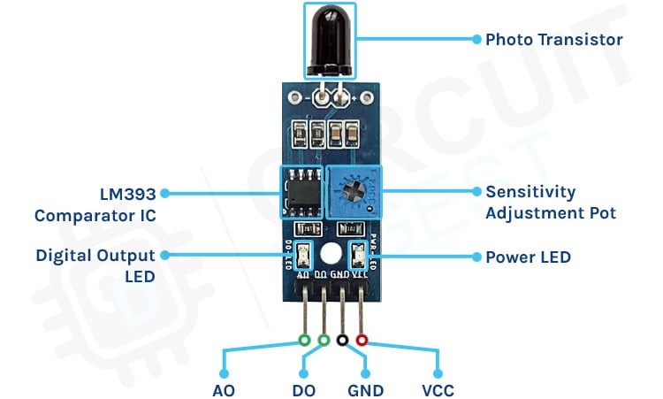

ຕົວຢ່າງການນຳໃຊ້ອຸປະກອນ
Flame Sensor ແມ່ນມີຄວາມສໍາຄັນຫຼາຍໃນດ້ານຄວາມປອດໄພ ແລະ ລະບົບອັດຕະໂນມັດທີ່ກ່ຽວຂ້ອງກັບຄວາມຮ້ອນ.

|**ຫົວຂໍ້ການນຳໃຊ້**|**ລາຍລະອຽດ**|
|---|---|
|**Simple Fire Alarm System**|**ລະບົບເຕືອນໄພອັກຄີໄພແບບງ່າຍດາຍ:** ເມື່ອ Flame Sensor ກວດພົບແປວໄຟ, Microcontroller ຈະເປີດສຽງ Buzzer (ສຽງເຕືອນ) ແລະ ເປີດໄຟ LED ເພື່ອແຈ້ງເຕືອນ.|
|**Fire Fighting Robot**|**ຫຸ່ນຍົນດັບເພີງ:** ໃຊ້ Flame Sensor ເປັນຕາໃນການຊອກຫາແຫຼ່ງແປວໄຟ. ເມື່ອຫຸ່ນຍົນກວດພົບແປວໄຟ, ມັນຈະເຄື່ອນທີ່ເຂົ້າຫາ ແລະ ໃຊ້ປໍ້ານໍ້າ ຫຼື ພັດລົມຂະໜາດນ້ອຍເພື່ອດັບແປວໄຟ.|
|**Industrial Boiler Monitoring**|**ການຕິດຕາມເຕົາອົບອຸດສາຫະກຳ:** ຕິດຕັ້ງຢູ່ໃນເຕົາອົບຂະໜາດໃຫຍ່ ເພື່ອຢືນຢັນວ່າໄຟໄດ້ລຸກໄໝ້ຢ່າງຖືກຕ້ອງ (ເຊັ່ນ: ກວດສອບຄວາມສອດຄ່ອງຂອງແປວໄຟ) ເພື່ອປ້ອງກັນອຸບັດຕິເຫດ.|
|**Smart IoT Fire Notification**|**ລະບົບແຈ້ງເຕືອນໄຟໄໝ້ຜ່ານ Internet:** ເມື່ອເຊັນເຊີກວດພົບແປວໄຟ, ມັນຈະສົ່ງສັນຍານເຕືອນໄປຫາຜູ້ໃຊ້ຜ່ານທາງ Mobile Application ຫຼື ອີເມວ ຜ່ານລະບົບ Wi-Fi (IoT).|

**29, RFID module** ແມ່ນອຸປະກອນທີ່ໃຊ້ເພື່ອ ອ່ານ ຂໍ້ມູນທີ່ເກັບໄວ້ໃນ RFID Tag (ບັດ ຫຼື Sticker) ໂດຍນໍາໃຊ້ ຄື້ນວິທະຍຸ (Radio Waves)**.
    ໃຊ້ໃນລະບົບຮັກສາຄວາມປອດໄພ, ການຄວບຄຸມການເຂົ້າອອກ, ຫຼື ລະບົບຈັດການຄັງສິນຄ້າ
#### ຫຼັກການເຮັດວຽກຂອງ Passive RFID:
1. **ການປ່ອຍພະລັງງານ:**
    - RFID Reader (ເຊັ່ນ: ໂມດູນ RC522) ຈະປ່ອຍ **ຄື້ນວິທະຍຸ** ດ້ວຍຄວາມຖີ່ທີ່ສະເພາະ (ເຊັ່ນ: 13.56 MHz) ຜ່ານເສົາອາກາດຂອງມັນ, ເຊິ່ງກໍ່ໃຫ້ເກີດ **ສະໜາມແມ່ເຫຼັກໄຟຟ້າ (Electromagnetic Field)** ອ້ອມຮອບເຄື່ອງອ່ານ.
2. **ການສາກໄຟ Tag:**
    - ເມື່ອ RFID Tag ເຄື່ອນທີ່ເຂົ້າມາໃນເຂດສະໜາມແມ່ເຫຼັກໄຟຟ້າ, **ເສົາອາກາດ** ທີ່ຢູ່ພາຍໃນ Tag ຈະ **ຮັບເອົາ** ພະລັງງານຄື້ນວິທະຍຸ ແລະ ປ່ຽນເປັນ **ກະແສໄຟຟ້າ** ຂະໜາດນ້ອຍ.
    - ກະແສໄຟຟ້ານີ້ແມ່ນພຽງພໍທີ່ຈະ **ເປີດໃຊ້ງານ** ຊິບ Microchip ພາຍໃນ Tag (ເພາະ Passive Tag ບໍ່ມີແບັດເຕີຣີ).
3. **ການສົ່ງຂໍ້ມູນ:**
    - ຫຼັງຈາກໄດ້ຮັບພະລັງງານ, ຊິບ Microchip ຈະສົ່ງ **ຂໍ້ມູນ ID ສະເພາະ** ທີ່ຖືກເກັບໄວ້ອອກໄປທາງເສົາອາກາດຂອງ Tag ໂດຍການປ່ຽນແປງຄຸນສົມບັດຂອງຄື້ນວິທະຍຸທີ່ສົ່ງມາຈາກ Reader (Modulation).
4. **ການອ່ານແລະປຸງແຕ່ງຂໍ້ມູນ:**
    - RFID Reader ຈະ **ຮັບ** ສັນຍານຕອບກັບທີ່ຖືກປັບປ່ຽນນັ້ນ, **ຖອດລະຫັດ** ມັນອອກມາເປັນຂໍ້ມູນ ID ດິຈິຕອລ (ຕົວເລກສະເພາະ), ແລະສົ່ງຕໍ່ໄປຫາ Microcontroller (ເຊັ່ນ: Arduino) ເພື່ອປະມວນຜົນຕໍ່ໄປ (ເຊັ່ນ: ກວດສອບຄວາມຖືກຕ້ອງ).
      
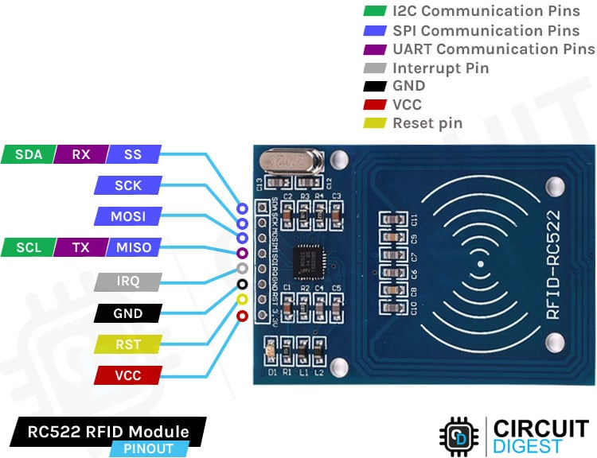

ຕົວຢ່າງການນຳໃຊ້ອຸປະກອນ
RFID ແມ່ນເຕັກໂນໂລຊີທີ່ຖືກນໍາໃຊ້ຢ່າງກວ້າງຂວາງໃນຫຼາຍຂະແໜງການ ເນື່ອງຈາກຄວາມສາມາດໃນການລະບຸຕົວຕົນແບບບໍ່ຕ້ອງສຳຜັດ.

|**ຫົວຂໍ້ການນຳໃຊ້**|**ລາຍລະອຽດ**|
|---|---|
|**Smart Door Lock System**|**ລະບົບລັອກປະຕູອັດສະລິຍະ:** ໃຊ້ RFID Tag (ບັດ ຫຼື Key Fob) ແທນລູກກະແຈ. ມີພຽງ Tag ທີ່ໄດ້ຮັບອະນຸຍາດເທົ່ານັ້ນທີ່ສາມາດສະແກນເພື່ອປົດລັອກປະຕູໄດ້ (ໂດຍໃຊ້ Servo ຫຼື Solenoid ເປັນຕົວລັອກ).|
|**Attendance System**|**ລະບົບກວດສອບການເຂົ້າຮຽນ/ເຮັດວຽກ:** ພະນັກງານ/ນັກຮຽນ ສະແກນບັດ RFID ເມື່ອເຂົ້າ-ອອກ. ລະບົບຈະບັນທຶກ ID ບັດ ແລະ ເວລາລົງໃນຖານຂໍ້ມູນ (ເຊັ່ນ: SD Card ຫຼື ສົ່ງໄປ Cloud).|
|**Inventory/Asset Tracking**|**ການຕິດຕາມສິນຄ້າ/ຊັບສິນ:** ຕິດ RFID Tag ໃສ່ສິນຄ້າ ຫຼື ເຄື່ອງມື. ສາມາດໃຊ້ Reader ແບບເຄື່ອນທີ່ເພື່ອກວດສອບສິນຄ້າໄດ້ຢ່າງວ່ອງໄວ ແລະ ຖືກຕ້ອງໂດຍບໍ່ຕ້ອງມີການເບິ່ງເຫັນໂດຍກົງ (Line-of-Sight).|
|**Automated Vending Machine**|**ຕູ້ຂາຍເຄື່ອງອັດຕະໂນມັດ:** ໃຊ້ RFID Tag ເພື່ອເປັນລະບົບການຊຳລະເງິນ ຫຼື ການອະນຸຍາດຜູ້ໃຊ້ງານສະເພາະ ເພື່ອຮັບສິນຄ້າ.|

**30, RFID tag** ແມ່ນອຸປະກອນຂະໜາດນ້ອຍທີ່ສາມາດຕິດຢູ່ກັບວັດຖຸ, ສັດ, ຫຼື ຄົນ, ເຊິ່ງໃຊ້ເພື່ອ **ເກັບຮັກສາຂໍ້ມູນ** ແລະ **ສົ່ງຂໍ້ມູນ** ນັ້ນໄປຫາ RFID Reader (ເຄື່ອງອ່ານ) ຜ່ານ **ຄື້ນວິທະຍຸ** ແບບບໍ່ຈໍາເປັນຕ້ອງມີການສຳຜັດ ຫຼື ເຫັນໂດຍກົງ (Line-of-Sight).
### ປະເພດແລະຫຼັກການເຮັດວຽກຂອງ RFID Tag
RFID Tag ສາມາດແບ່ງອອກເປັນ 3 ປະເພດຫຼັກ, ເຊິ່ງແຕ່ລະປະເພດມີຫຼັກການເຮັດວຽກທີ່ແຕກຕ່າງກັນ:
#### 1. Passive RFID Tags (ບໍ່ມີແບັດເຕີຣີ)
- **ຫຼັກການເຮັດວຽກ:** ແທັກປະເພດນີ້ບໍ່ມີແຫຼ່ງພະລັງງານຂອງຕົນເອງ. ມັນໄດ້ຮັບພະລັງງານທັງໝົດຈາກ **ຄື້ນວິທະຍຸ** ທີ່ສົ່ງອອກມາຈາກ RFID Reader ຜ່ານຫຼັກການ Electromagnetic Induction. ເມື່ອມີພະລັງງານແລ້ວ, ມັນຈຶ່ງສາມາດສົ່ງຂໍ້ມູນ ID ຂອງມັນກັບຄືນໄປຫາ Reader ໄດ້.
- **ຂໍ້ດີ:** ລາຄາຖືກ, ຂະໜາດນ້ອຍ, ອາຍຸຍືນ (ບໍ່ມີແບັດເຕີຣີ).
- **ຂໍ້ເສຍ:** ໄລຍະການອ່ານສັ້ນ (ສອງສາມຊັງຕີແມັດ ຫາ ສອງສາມແມັດ).
#### 2. Active RFID Tags (ມີແບັດເຕີຣີ)
- **ຫຼັກການເຮັດວຽກ:** ແທັກປະເພດນີ້ມີ **ແບັດເຕີຣີ** ຂອງຕົນເອງເພື່ອໃຫ້ພະລັງງານແກ່ຊິບ IC ແລະ ໃຊ້ສົ່ງສັນຍານຄື້ນວິທະຍຸອອກໄປດ້ວຍຕົວມັນເອງ.
- **ຂໍ້ດີ:** ໄລຍະການອ່ານຍາວໄກ (ເຖິງຫຼາຍຮ້ອຍແມັດ), ມີຄວາມໜ້າເຊື່ອຖືສູງ, ສາມາດສົ່ງຂໍ້ມູນໄດ້ເລື້ອຍໆ.
- **ຂໍ້ເສຍ:** ລາຄາແພງກວ່າ, ຂະໜາດໃຫຍ່ກວ່າ, ຕ້ອງມີການປ່ຽນແບັດເຕີຣີ.
#### 3. Semi-Passive (Battery-Assisted Passive) Tags
- **ຫຼັກການເຮັດວຽກ:** ມີແບັດເຕີຣີເພື່ອໃຫ້ພະລັງງານແກ່ຊິບ IC ພາຍໃນເທົ່ານັ້ນ, ແຕ່ຍັງຕ້ອງອີງໃສ່ **ຄື້ນວິທະຍຸ** ຈາກ Reader ເພື່ອ **ກະຕຸ້ນ** ໃຫ້ສົ່ງຂໍ້ມູນອອກໄປ.
- **ຂໍ້ດີ:** ປະສິດທິພາບດີກວ່າ Passive (ໂດຍສະເພາະໃນການອ່ານ), ໃຊ້ແບັດເຕີຣີໄດ້ດົນກວ່າ Active.
  
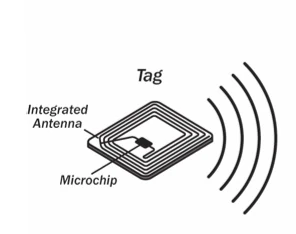

### ຫົວຂໍ້ຕົວຢ່າງການນຳໃຊ້ອຸປະກອນ
RFID Tag ຖືກນຳໃຊ້ຢ່າງແຜ່ຫຼາຍໃນຫຼາຍອຸດສາຫະກຳ ເພື່ອເພີ່ມຄວາມໄວ, ຄວາມຖືກຕ້ອງ ແລະ ຄວາມປອດໄພ:

|**ຫົວຂໍ້ການນຳໃຊ້**|**ລາຍລະອຽດ**|**ປະເພດ Tag ທີ່ນິຍົມໃຊ້**|
|---|---|---|
|**Retail & Inventory Management**|**ການຄຸ້ມຄອງສິນຄ້າຄົງຄັງ:** ຕິດ Tag ໃສ່ຜະລິດຕະພັນທຸກລາຍການ (ເຊັ່ນ: ເສື້ອຜ້າ, ສິນຄ້າ). ເຮັດໃຫ້ສາມາດນັບສິນຄ້າຄົງຄັງໄດ້ພ້ອມກັນຫຼາຍຮ້ອຍຊິ້ນຢ່າງວ່ອງໄວ.|Passive|
|**Access Control (ບັດເຂົ້າອອກ)**|**ລະບົບຄວບຄຸມການເຂົ້າອອກ:** ໃຊ້ RFID Card ຫຼື Key Fob ເພື່ອເຂົ້າອາຄານ, ຫ້ອງການ, ຫຼື ຫ້ອງພັກໃນໂຮງແຮມ.|Passive|
|**Asset Tracking (ການຕິດຕາມຊັບສິນ)**|**ຕິດຕາມອຸປະກອນລາຄາແພງ/ພາຫະນະ:** ຕິດ Tag ໃສ່ພາຫະນະ ຫຼື ເຄື່ອງມືໃນໂຮງງານ ເພື່ອຕິດຕາມສະຖານທີ່ແລະສະຖານະຢ່າງຕໍ່ເນື່ອງ.|Active ຫຼື Semi-Passive|
|**Animal Identification**|**ການລະບຸຕົວຕົນຂອງສັດ:** ໃຊ້ Microchip ທີ່ຝັງໄວ້ໃຕ້ຜິວໜັງຂອງສັດລ້ຽງ ເພື່ອເປັນ ID ທີ່ບໍ່ສາມາດປອມແປງໄດ້.|Passive|
|**Toll Collection System**|**ລະບົບເກັບຄ່າທາງດ່ວນອັດຕະໂນມັດ:** ຕິດ Tag ໃສ່ໜ້າລົດ ເພື່ອໃຫ້ລະບົບສາມາດອ່ານຂໍ້ມູນ ແລະ ຕັດຍອດເງິນຄ່າທາງໄດ້ໂດຍທີ່ລົດບໍ່ຕ້ອງຢຸດ.|Passive ຫຼື Semi-Passive|

31, Infrared receiver ແມ່ນອຸປະກອນອີເລັກໂທຣນິກທີ່ຖືກອອກແບບມາເພື່ອ **ກວດຈັບ** ແລະ **ຮັບ** ສັນຍານທີ່ປ່ອຍອອກມາໃນຮູບແບບຂອງ **ແສງ Infrared (ຄື້ນຄວາມຮ້ອນ)**.
#### ກ. ການເຮັດວຽກໃນໂໝດການສື່ສານ (Remote Control)
ອັນນີ້ແມ່ນຫຼັກການທີ່ໃຊ້ໃນການຄວບຄຸມໂທລະພາບ ຫຼື ເຄື່ອງປັບອາກາດ:
1. **ການສົ່ງສັນຍານ (IR Transmitter):** ເມື່ອກົດປຸ່ມເທິງຣີໂມດ, ຊິບໃນຣີໂມດຈະປ່ຽນລະຫັດຄໍາສັ່ງດິຈິຕອລ (ເຊັ່ນ: ເປີດ/ປິດ) ໃຫ້ເປັນ **ສັນຍານແສງ IR ທີ່ຖືກປັບສັນຍານ (Modulated Signal)** ດ້ວຍຄວາມຖີ່ຂອງຄື້ນພາຫະນະ (Carrier Frequency) ສະເພາະ (ເຊັ່ນ: 38 kHz).
2. **ການຮັບສັນຍານ (IR Receiver):**
    - IR Receiver ຈະຮັບເອົາແສງ IR ເຫຼົ່ານີ້.
    - ມັນຈະກວດຈັບສະເພາະແສງ IR ທີ່ຖືກປັບສັນຍານດ້ວຍຄວາມຖີ່ທີ່ກຳນົດໄວ້ເທົ່ານັ້ນ, ເຊິ່ງຊ່ວຍ **ກັ່ນຕອງສິ່ງລົບກວນ** ຈາກແສງ IR ທຳມະຊາດ (ເຊັ່ນ: ແສງຕາເວັນ ຫຼື ໄຟທຽນ).
    - ຈາກນັ້ນ, ມັນຈະ **ຖອດລະຫັດ (Demodulate)** ສັນຍານອອກ ເພື່ອໃຫ້ໄດ້ **ລະຫັດດິຈິຕອລ** ຕົ້ນສະບັບ (ຄືຄຳສັ່ງ: ເປີດ/ປິດ).
3. **ການປະມວນຜົນ:** ລະຫັດດິຈິຕອລນີ້ຈະຖືກສົ່ງໄປຫາ Microcontroller ຂອງອຸປະກອນ (ເຊັ່ນ: ໂທລະພາບ) ເພື່ອປະຕິບັດຕາມຄຳສັ່ງ.

#### ຂ. ການເຮັດວຽກໃນໂໝດເຊັນເຊີກວດຈັບວັດຖຸ (IR Proximity Sensor)
- **ລະບົບຄູ່:** ເຊັນເຊີປະເພດນີ້ຈະມີອົງປະກອບ 2 ສ່ວນຄື: IR LED (ຕົວສົ່ງແສງ) ແລະ Photodiode (ຕົວຮັບແສງ).
- **ການກວດຈັບ:**
    - IR LED ຈະ **ສົ່ງແສງ IR** ອອກໄປຢ່າງຕໍ່ເນື່ອງ.
    - ຖ້າ **ບໍ່ມີວັດຖຸ** ຢູ່ຕໍ່ໜ້າ, ແສງ IR ຈະກະຈາຍໄປ ແລະ ບໍ່ມີແສງກັບຄືນມາຫາ Photodiode.
    - ຖ້າມີ **ວັດຖຸ** ມາຢູ່ຕໍ່ໜ້າ, ແສງ IR ຈະ **ສະທ້ອນ** ກັບມາຫາ Photodiode (ເຄື່ອງຮັບ).
    - ເມື່ອ Photodiode ໄດ້ຮັບແສງສະທ້ອນ, ວົງຈອນຈະປ່ຽນແປງຄ່າໄຟຟ້າ, ເຮັດໃຫ້ຮູ້ວ່າ **ມີວັດຖຸ** ຢູ່ໃກ້.
      
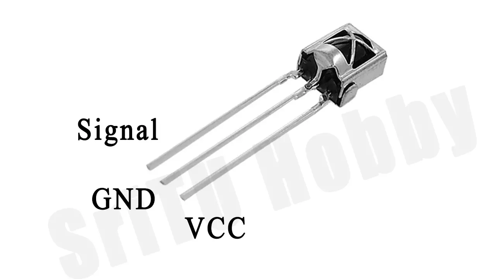

ຕົວຢ່າງການນຳໃຊ້ອຸປະກອນ
Infrared Receiver ແມ່ນເຕັກໂນໂລຊີພື້ນຖານທີ່ມີການນຳໃຊ້ຢ່າງຫຼາກຫຼາຍ:

|**ຫົວຂໍ້ການນຳໃຊ້**|**ລາຍລະອຽດ**|
|---|---|
|**Home Appliance Control**|**ການຄວບຄຸມເຄື່ອງໃຊ້ໃນເຮືອນ:** ຣີໂມດໂທລະພາບ, ເຄື່ອງຫຼິ້ນ DVD, ໂຄມໄຟ, ແລະ ເຄື່ອງປັບອາກາດລ້ວນແຕ່ໃຊ້ IR Receiver ເພື່ອຮັບຄຳສັ່ງຈາກຣີໂມດ.|
|**DIY Remote Control Projects**|**ໂຄງການຄວບຄຸມດ້ວຍຣີໂມດ (DIY):** ໃຊ້ IR Receiver ເພື່ອຄວບຄຸມ Arduino ໃຫ້ເປີດ/ປິດໄຟ, ປັບລະດັບສຽງ, ຫຼື ຄວບຄຸມຫຸ່ນຍົນດ້ວຍຣີໂມດເກົ່າ.|
|**Obstacle Avoidance Robot**|**ຫຸ່ນຍົນຫຼີກລ້ຽງສິ່ງກີດຂວາງ:** ໃຊ້ເຊັນເຊີ IR Proximity (ຕົວສົ່ງແລະຕົວຮັບຄູ່ກັນ) ເພື່ອກວດຈັບວັດຖຸທີ່ຢູ່ທາງໜ້າ ເພື່ອບໍ່ໃຫ້ຫຸ່ນຍົນຕຳ.|
|**Line Follower Robot**|**ຫຸ່ນຍົນຕິດຕາມເສັ້ນ:** ໃຊ້ເຊັນເຊີ IR Proximity ຫຼາຍຕົວເພື່ອແຍກແຍະລະຫວ່າງພື້ນຜິວທີ່ສະທ້ອນແສງ (ເຊັ່ນ: ສີຂາວ) ກັບພື້ນຜິວທີ່ດູດຊຶມແສງ (ເຊັ່ນ: ສີດຳ) ເພື່ອຕິດຕາມເສັ້ນທາງທີ່ຖືກກຳນົດໄວ້.|
|**Motion/Security Sensor**|**ເຊັນເຊີກວດຈັບການເຄື່ອນໄຫວ (PIR):** ເຖິງແມ່ນວ່າຈະເປັນ Passive IR, ແຕ່ມັນຍັງໃຊ້ຄື້ນ IR. ມັນກວດຈັບການປ່ຽນແປງຂອງຄວາມຮ້ອນ (ແສງ IR) ທີ່ປ່ອຍອອກມາຈາກຮ່າງກາຍຂອງຄົນ, ໃຊ້ໃນລະບົບປຸກ ແລະ ໄຟເປີດອັດຕະໂນມັດ.|

# 🎮 Remote & Control
**32, Infrared remote control** ແມ່ນອຸປະກອນໄຮ້ສາຍຂະໜາດນ້ອຍທີ່ໃຊ້ໃນການຄວບຄຸມເຄື່ອງໃຊ້ໄຟຟ້າຈາກໄລຍະໄກ. ມັນເຮັດວຽກໂດຍການສົ່ງຄຳສັ່ງໃນຮູບແບບຂອງ **ແສງ Infrared** (ແສງທີ່ມະນຸດເບິ່ງບໍ່ເຫັນ) ໄປຫາເຄື່ອງຮັບ IR ທີ່ຕິດຢູ່ກັບອຸປະກອນເປົ້າໝາຍ (ເຊັ່ນ: ໂທລະພາບ, ເຄື່ອງປັບອາກາດ).
    ໃຊ້ໃນການຄວບຄຸບອຸປະກອນ ຫຼື ລະບົບໄລຍະໄກ
    ຂະບວນການສົ່ງຄໍາສັ່ງຈາກຣີໂມດໄປຫາອຸປະກອນຈະເກີດຂຶ້ນໃນ 3 ຂັ້ນຕອນຫຼັກ:
#### ກ. ການປ່ຽນລະຫັດ (Encoding)
1. **ກົດປຸ່ມ:** ເມື່ອກົດປຸ່ມໃດໜຶ່ງເທິງຣີໂມດ (ເຊັ່ນ: ປຸ່ມ "Channel Up"), ວົງຈອນພາຍໃນຈະກວດຈັບການເຊື່ອມຕໍ່ໄຟຟ້າ.
2. **ສ້າງລະຫັດ Binary:** IC ພາຍໃນຣີໂມດຈະປ່ຽນການກົດປຸ່ມນັ້ນໃຫ້ເປັນ **ລະຫັດດິຈິຕອລສະເພາະ** (ເຊັ່ນ: 01011001) ທີ່ເປັນເອກະລັກສະເພາະສຳລັບຄຳສັ່ງນັ້ນ ແລະ ສຳລັບອຸປະກອນນັ້ນ (Address Code).
3. **ປັບສັນຍານ (Modulation):** ເພື່ອໃຫ້ເຄື່ອງຮັບສາມາດແຍກສັນຍານຈາກຣີໂມດອອກຈາກແສງ IR ທຳມະຊາດ (ເຊັ່ນ: ແສງແດດ), ລະຫັດ Binary ຈະຖືກໃຊ້ເພື່ອເປີດ-ປິດ IR LED ດ້ວຍຄວາມຖີ່ຂອງຄື້ນພາຫະນະທີ່ສູງ (ປົກກະຕິແມ່ນ 38 kHz). ນີ້ແມ່ນການສົ່ງຄໍາສັ່ງຜ່ານກຳມະຈອນແສງ IR.
#### ຂ. ການສົ່ງແລະຮັບສັນຍານ (Transmission)
1. **ການສົ່ງ:** IR LED ຈະປ່ອຍກຳມະຈອນແສງ IR ອອກໄປສູ່ອາກາດ.
2. **ເງື່ອນໄຂສຳຄັນ:** ການສົ່ງສັນຍານ IR **ຕ້ອງການ Line-of-Sight (ຕ້ອງເຫັນກັນໂດຍກົງ)** ລະຫວ່າງຣີໂມດກັບເຄື່ອງຮັບ. ແສງ IR ບໍ່ສາມາດຜ່ານຝາ ຫຼື ສິ່ງກີດຂວາງໄດ້ (ແຕ່ມັນສາມາດສະທ້ອນກັບຝາ ຫຼື ເພດານໄດ້).
#### ຄ. ການຖອດລະຫັດແລະປະຕິບັດ (Decoding)
1. **ການຮັບ:** IR Receiver ທີ່ຢູ່ໃນອຸປະກອນ (ເຊັ່ນ: ໂທລະພາບ) ຈະກວດຈັບກຳມະຈອນແສງ IR ເຫຼົ່ານັ້ນ.
2. **ການກັ່ນຕອງແລະຖອດລະຫັດ:** ເຄື່ອງຮັບຈະກັ່ນຕອງເອົາສະເພາະຄວາມຖີ່ຂອງຄື້ນພາຫະນະທີ່ມັນຖືກອອກແບບມາໃຫ້ຮັບ (38 kHz) ແລະ ຖອດລະຫັດອອກມາເປັນລະຫັດ Binary ດິຈິຕອລຕົ້ນສະບັບ.
3. **ປະຕິບັດຄຳສັ່ງ:** ລະຫັດ Binary ຈະຖືກສົ່ງໄປຫາ Microprocessor ຂອງອຸປະກອນ ເຊິ່ງຈະແປລະຫັດນັ້ນເປັນຄຳສັ່ງທີ່ເຂົ້າໃຈໄດ້ (ເຊັ່ນ: ເພີ່ມລະດັບສຽງ, ປ່ຽນຊ່ອງ, ປິດ).
   
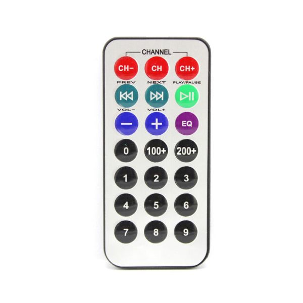

ຕົວຢ່າງການນຳໃຊ້ອຸປະກອນ
IR Remote Control ຍັງຄົງເປັນມາດຕະຖານໃນການຄວບຄຸມອຸປະກອນເອເລັກໂທຣນິກພາຍໃນເຮືອນ ເນື່ອງຈາກຕົ້ນທຶນຕໍ່າແລະຄວາມເຊື່ອຖືໄດ້:

|**ຫົວຂໍ້ການນຳໃຊ້**|**ລາຍລະອຽດ**|
|---|---|
|**Consumer Electronics**|**ເຄື່ອງໃຊ້ເພື່ອຄວາມບັນເທິງ:** ໂທລະພາບ, ເຄື່ອງຫຼິ້ນ DVD/Blu-ray, ເຄື່ອງຮັບສັນຍານດາວທຽມ/ສາຍເຄເບິນ, ແລະ ເຄື່ອງສຽງ Stereo.|
|**Home Climate Control**|**ການຄວບຄຸມອຸນຫະພູມ:** ຣີໂມດຄວບຄຸມເຄື່ອງປັບອາກາດ (Air Conditioner), ພັດລົມ, ແລະ ເຄື່ອງເຮັດຄວາມຮ້ອນ.|
|**Projectors and Displays**|**ອຸປະກອນການນຳສະເໜີ:** ຣີໂມດສຳລັບເຄື່ອງໂປຣເຈັກເຕີ ແລະ ບາງຈໍສະແດງຜົນ (ຄວບຄຸມການເປີດ/ປິດ ແລະ ການປ່ຽນ Input).|
|**Smart Home Integration**|**ການຄວບຄຸມເຮືອນອັດສະລິຍະ:** ໃຊ້ IR Blasters (ອຸປະກອນສົ່ງ IR ແບບສູນກາງ) ເພື່ອລວມການຄວບຄຸມອຸປະກອນ IR ເກົ່າເຂົ້າໃນລະບົບເຮືອນອັດສະລິຍະ (Smart Home).|
|**Toys and Robotics**|**ຂອງຫຼິ້ນຄວບຄຸມ:** ລົດບັງຄັບ ຫຼື ຫຸ່ນຍົນຂອງຫຼິ້ນແບບງ່າຍໆ ທີ່ໃຊ້ IR ສຳລັບການສື່ສານໄລຍະໃກ້.|

**33, Joystick module** ແມ່ນອຸປະກອນປ້ອນຂໍ້ມູນ (Input Device) ທີ່ຖືກອອກແບບມາເພື່ອວັດແທກ ການເຄື່ອນໄຫວໃນ 2 ມິຕິ (2-axis) (ແນວນອນ (X-axis) ແລະ ແນວຕັ້ງ (Y-axis)) ໂດຍປົກກະຕິແລ້ວມັນຈະຄ້າຍຄືກັບ joystick ທີ່ພົບໃນເຄື່ອງຫຼິ້ນເກມ PS2 ຫຼື Xbox.
    ໃຊ້ໃນຫຸ່ນຍົນ ຫຼື ເກມເພື່ອການຄວບຄຸມທິດທາງ
    Joystick Module ເຮັດວຽກໂດຍອີງໃສ່ຫຼັກການຂອງ **ຕົວຕ້ານທານປັບຄ່າໄດ້ (Potentiometer)**.
#### ກ. ສ່ວນປະກອບຫຼັກ
ໂມດູນ joystick ປະກອບດ້ວຍ 3 ສ່ວນຫຼັກທີ່ໃຫ້ສັນຍານອອກ:
1. **Potentiometer ສຳລັບແກນ X (VRx):** ໃຊ້ສຳລັບວັດແທກການເຄື່ອນໄຫວ ຊ້າຍ - ຂວາ.
2. **Potentiometer ສຳລັບແກນ Y (VRy):** ໃຊ້ສຳລັບວັດແທກການເຄື່ອນໄຫວ ເທິງ - ລຸ່ມ.
3. **ປຸ່ມກົດ (Switch/SW):** ໃຫ້ສັນຍານ **Digital** (ກົດ/ບໍ່ກົດ).
#### ຂ. ຫຼັກການເຮັດວຽກ
- **Potentiometer:** Potentiometer ແຕ່ລະອັນຖືກເຊື່ອມຕໍ່ລະຫວ່າງແຮງດັນໄຟຟ້າ (VCC 5V) ແລະ ດິນ (GND). ມັນເຮັດໜ້າທີ່ເປັນ Voltage Divider.
- **ການເຄື່ອນໄຫວ:** ເມື່ອຍ້າຍ joystick:
    - ກົນໄກພາຍໃນ (Gimbal mechanism) ຈະໝູນແກນ X ແລະ/ຫຼື ແກນ Y.
    - ການໝູນນີ້ຈະປ່ຽນຕໍາແໜ່ງຂອງ Potentiometer ທັງສອງຕາມລຳດັບ.
    - ການປ່ຽນແປງຂອງຕໍາແໜ່ງ Potentiometer ເຮັດໃຫ້ ແຮງດັນໄຟຟ້າອອກ (Analog Voltage) ຢູ່ປາຍ VRx ແລະ VRy ປ່ຽນແປງ.
- **ການອ່ານຄ່າ:**
    - **ຕຳແໜ່ງພັກ (Center):** ເມື່ອ joystick ຢູ່ກາງ (ບໍ່ໄດ້ຍ້າຍ), ແຮງດັນອອກຈະຢູ່ທີ່ເຄິ່ງໜຶ່ງຂອງແຮງດັນສະໜອງ (ເຊັ່ນ: ປະມານ 2.5V ຖ້າໃຊ້ 5V), ເຊິ່ງ Microcontroller (ເຊັ່ນ: Arduino) ຈະອ່ານຄ່າໄດ້ປະມານ 512 (ຄ່າເຕັມ 0 ຫາ 1023).
    - **ການເຄື່ອນທີ່:** ເມື່ອຍ້າຍ joystick ໄປໃນທິດທາງໃດໜຶ່ງ, ຄ່າຈະປ່ຽນຈາກ 0 (ປາຍສຸດໜຶ່ງ) ໄປຫາ 1023 (ປາຍສຸດອີກດ້ານໜຶ່ງ).
- **ປຸ່ມກົດ (SW):** ໃຫ້ສັນຍານ LOW (0V) ເມື່ອກົດ ແລະ HIGH (VCC) ເມື່ອບໍ່ໄດ້ກົດ.
  

ຕົວຢ່າງການນຳໃຊ້ອຸປະກອນ
Joystick Module ແມ່ນອຸປະກອນປ້ອນຂໍ້ມູນທີ່ນິຍົມທີ່ສຸດໃນໂຄງການ DIY ເນື່ອງຈາກຄວາມສາມາດໃນການຄວບຄຸມ 2 ມິຕິ:

|**ຫົວຂໍ້ການນຳໃຊ້**|**ລາຍລະອຽດ**|
|---|---|
|**Robotics Control**|**ການຄວບຄຸມຫຸ່ນຍົນ:** ໃຊ້ joystick ເພື່ອຄວບຄຸມການເຄື່ອນທີ່ຂອງຫຸ່ນຍົນ RC (ລົດບັງຄັບ, ຫຸ່ນຍົນແຂນ) ໂດຍກຳນົດທິດທາງ (X}, \text{Y) ແລະ ຄວາມໄວ.|
|**Servo/Stepper Motor Control**|**ຄວບຄຸມ Motor:** ໃຊ້ joystick ເພື່ອຄວບຄຸມຕຳແໜ່ງຂອງ Servo Motor 2 ອັນ (ສຳລັບແກນ X ແລະ Y) ເຊັ່ນ: ການຄວບຄຸມກ້ອງ ຫຼື ຫົວຈັບ (gripper) ຂອງແຂນຫຸ່ນຍົນ.|
|**DIY Game Controllers**|**ເຄື່ອງຄວບຄຸມເກມ DIY:** ສ້າງເຄື່ອງຄວບຄຸມເກມແບບງ່າຍດາຍສຳລັບຄອມພິວເຕີ ຫຼື ເກມທີ່ສ້າງຂຶ້ນເອງໃນ Microcontroller.|
|**Cursor/Menu Navigation**|**ການເລື່ອນເມນູ:** ໃຊ້ joystick ເພື່ອເລື່ອນຕົວຊີ້ (cursor) ຫຼື ເລືອກລາຍການໃນເມນູທີ່ສະແດງເທິງໜ້າຈໍ LCD ຫຼື OLED. ປຸ່ມກົດ SW ສາມາດໃຊ້ເປັນປຸ່ມເລືອກ (Select).|
|**LED Matrix Control**|**ຄວບຄຸມ LED Matrix:** ໃຊ້ joystick ເພື່ອຍ້າຍຮູບພາບ ຫຼື ຈຸດໄຟຢູ່ເທິງກະດານໄຟ LED ທີ່ມີຂະໜາດໃຫຍ່.|

**34, 4x4 Matrix Keyboard Module** ແມ່ນອຸປະກອນປ້ອນຂໍ້ມູນ (Input Device) ທີ່ປະກອບດ້ວຍ **16 ປຸ່ມ** ທີ່ຈັດລຽງເປັນຮູບແບບ **4 ແຖວ (Rows) ແລະ 4 ຖັນ (Columns) (4 * 4)**. ມັນຖືກນໍາໃຊ້ເພື່ອຮັບຄ່າປ້ອນຂໍ້ມູນ (input) ຈາກຜູ້ໃຊ້ໃນໂຄງການໄມໂຄຄອນໂທນເລີ (Microcontroller) ເຊັ່ນ: Arduino ຫຼື Raspberry Pi.
    ໃຊ້ສຳລັບການປ້ອນລະຫັດຜ່ານ, ການເລືອກອິນພຸດ ຫຼື ການຄວບຄຸມລະບົບ
    ການເຮັດວຽກຂອງ 4x4 Matrix Keyboard ແມ່ນອີງໃສ່ເຕັກນິກທີ່ເອີ້ນວ່າ **ການສະແກນ Matrix** ເພື່ອກໍານົດວ່າປຸ່ມໃດຖືກກົດໂດຍການສົ່ງ ແລະ ອ່ານສັນຍານຜ່ານແຖວ ແລະ ຖັນ.
#### ກ. ໂຄງສ້າງພາຍໃນ
ພາຍໃຕ້ປຸ່ມກົດແຕ່ລະອັນ ແມ່ນມີປຸ່ມກົດແບບງ່າຍດາຍ (Simple Switch).
- ປາຍສາຍໄຟຂອງປຸ່ມກົດແຕ່ລະອັນໃນແຖວໜຶ່ງຖືກເຊື່ອມຕໍ່ເຂົ້າກັນ.
- ປາຍສາຍໄຟຂອງປຸ່ມກົດແຕ່ລະອັນໃນຖັນໜຶ່ງຖືກເຊື່ອມຕໍ່ເຂົ້າກັນ.
#### ຂ. ຫຼັກການສະແກນ (Scanning Algorithm)
Microcontroller ຈະເຮັດວຽກເປັນຂັ້ນຕອນເພື່ອຊອກຫາຈຸດຕັດກັນຂອງແຖວແລະຖັນທີ່ຖືກເຊື່ອມຕໍ່:
1. **ກໍານົດວ່າມີການກົດປຸ່ມແລ້ວບໍ່:**
    - Microcontroller ຕັ້ງຄ່າ 4 pins ຂອງແຖວ (Rows) ໃຫ້ເປັນຜົນອອກ (Output) ແລະ ສົ່ງຄ່າໄຟຟ້າ **LOW (0)** ໄປທັງ 4 ແຖວ.
    - Microcontroller ຕັ້ງຄ່າ 4 pins ຂອງຖັນ (Columns) ໃຫ້ເປັນປ້ອນເຂົ້າ (Input) ໂດຍມີ Pull-up Resistor (ເຮັດໃຫ້ມັນເປັນຄ່າ **HIGH (1)** ໂດຍຄ່າເລີ່ມຕົ້ນ).
    - ຖ້າມີປຸ່ມໃດຖືກກົດ, ມັນຈະເຮັດໃຫ້ແຖວທີ່ເປັນ LOW ເຊື່ອມຕໍ່ກັບຖັນ. ດັ່ງນັ້ນ, ຖັນນັ້ນຈະປ່ຽນຈາກ HIGH ໄປເປັນ **LOW**.
    - ຖ້າ Microcontroller ອ່ານໄດ້ຄ່າ LOW ຈາກຖັນໃດໜຶ່ງ, ມັນຮູ້ວ່າມີການກົດປຸ່ມແລ້ວ.
2. **ການກໍານົດຕໍາແໜ່ງຂອງປຸ່ມທີ່ຖືກກົດ:**
    - ເມື່ອກວດພົບການກົດ, Microcontroller ຈະເລີ່ມຂະບວນການສະແກນ:
    - ມັນຈະສົ່ງຄ່າ **LOW (0)** ໄປທີ່ແຖວເທື່ອລະອັນ (ສ່ວນແຖວອື່ນຍັງຄົງເປັນ HIGH).
    - ໃນຂະນະທີ່ແຖວໃດໜຶ່ງເປັນ LOW, ມັນຈະກວດສອບຄ່າຂອງ 4 ຖັນ.
    - **ຈຸດຕັດກັນ:** ແຖວໃດທີ່ເຮັດໃຫ້ຄ່າຂອງຖັນກາຍເປັນ **LOW**, ນັ້ນແມ່ນຕໍາແໜ່ງຂອງປຸ່ມທີ່ຖືກກົດ.
        - **ຕົວຢ່າງ:** ຖ້າສົ່ງ LOW ໄປທີ່ **ແຖວ 2** ແລະ ຖັນ **Column 3** ກາຍເປັນ LOW, ປຸ່ມທີ່ຖືກກົດແມ່ນປຸ່ມທີ່ຢູ່ຈຸດຕັດກັນຂອງ **ແຖວ 2 ແລະ ຖັນ 3**.
          
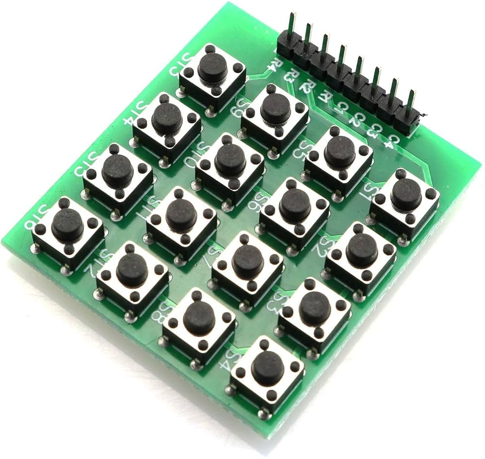

ຕົວຢ່າງການນຳໃຊ້ອຸປະກອນ
4x4 Matrix Keyboard Module ເປັນທາງເລືອກທີ່ດີເລີດສຳລັບການນຳໃຊ້ທີ່ຕ້ອງການການປ້ອນຂໍ້ມູນເປັນຕົວເລກ ຫຼື ເປັນຕົວອັກສອນງ່າຍໆ:

|**ຫົວຂໍ້ການນຳໃຊ້**|**ລາຍລະອຽດ**|
|---|---|
|**Digital Lock System (Keypad Security)**|**ລະບົບລັອກລະຫັດ:** ໃຊ້ແປ້ນພິມເພື່ອປ້ອນລະຫັດຜ່ານ (PIN) ເພື່ອຄວບຄຸມການເປີດ/ປິດ ປະຕູ, ຕູ້ເຊບ, ຫຼື ເປີດເຄື່ອງຈັກ.|
|**Calculator (DIY) (4 * 4)**|**ເຄື່ອງຄິດເລກ DIY:** ປຸ່ມຕ່າງໆສາມາດຖືກກໍານົດໃຫ້ເປັນຕົວເລກ (0-9), ແລະ ສັນຍາລັກທາງຄະນິດສາດ (+, -, *, /) ເພື່ອສ້າງເຄື່ອງຄິດເລກຂະໜາດນ້ອຍ.|
|**Menu Navigation & Data Entry**|**ການເລືອນເມນູ ແລະ ປ້ອນຂໍ້ມູນ:** ໃຊ້ແປ້ນພິມນີ້ເພື່ອປ້ອນຄ່າຕ່າງໆ (setting), ເລືອກທາງເລືອກໃນເມນູທີ່ສະແດງຢູ່ໃນໜ້າຈໍ LCD ຫຼື OLED.|
|**Simple Game Controller**|**ເຄື່ອງຄວບຄຸມເກມແບບງ່າຍດາຍ:** ປຸ່ມສາມາດໃຊ້ເປັນປຸ່ມຄວບຄຸມ Up, Down, Left, Right ແລະ ປຸ່ມຟັງຊັນຕ່າງໆສຳລັບເກມແບບງ່າຍດາຍ.|

**35, Relay module** ແມ່ນແຜງວົງຈອນທີ່ປະກອບດ້ວຍອຸປະກອນ **ຣີເລ (Relay) ໄຟຟ້າ-ແມ່ເຫຼັກ (Electromagnetic Relay)** ແລະ ອົງປະກອບເສີມອື່ນໆ (Diode, Transistor, LED). ມັນເຮັດໜ້າທີ່ເປັນ **ສະວິດໄຟຟ້າ (Electrically Operated Switch)**.
    ໃຊ້ໃນການຄວບຄຸມມໍເຕີ, ໄຟ, ຫຼື ເຄື່ອງໃຊ້ໄຟຟ້າອື່ນໆ
        ຫຼັກການເຮັດວຽກຂອງ Relay Module ແມ່ນອີງໃສ່ການໃຊ້ແມ່ເຫຼັກໄຟຟ້າ (Electromagnet) ເພື່ອຄວບຄຸມການເປີດ/ປິດຂອງໜ້າສໍາຜັດທາງກົນຈັກ (Mechanical Contacts) ໃນວົງຈອນອື່ນ.

|**ຂັ້ນຕອນ**|**ການກະທໍາ**|**ລາຍລະອຽດ**|
|---|---|---|
|**1. ປ້ອນສັນຍານຄວບຄຸມ**|**Microcontroller ສົ່ງສັນຍານ (HIGH ຫຼື LOW)** ໄປທີ່ pin ປ້ອນເຂົ້າ (IN) ຂອງ Relay Module.|ສັນຍານນີ້ກະຕຸ້ນ transistor ທີ່ຢູ່ໃນໂມດູນເພື່ອໃຫ້ກະແສໄຟຟ້າໄຫຼເຂົ້າສູ່ Coil (ຂົດລວດ).|
|**2. ການສ້າງແມ່ເຫຼັກ**|ກະແສໄຟຟ້າໄຫຼຜ່ານ Coil ຂອງ Relay.|ສິ່ງນີ້ສ້າງສະໜາມແມ່ເຫຼັກ (Magnetic Field).|
|**3. ການປ່ຽນຕໍາແໜ່ງສະວິດ**|ສະໜາມແມ່ເຫຼັກດຶງດູດ Armature (ແຂນໂລຫະທີ່ເຄື່ອນທີ່ໄດ້) ພາຍໃນ Relay.|ການເຄື່ອນໄຫວນີ້ເຮັດໃຫ້ **ໜ້າສຳຜັດ (Contacts)** ປ່ຽນຕຳແໜ່ງ (ເປີດ ຫຼື ປິດ).|
|**4. ຄວບຄຸມວົງຈອນໂຫຼດ**|- ຖ້າໃຊ້ຈຸດ **NO (Normally Open)**: ວົງຈອນຈະ **ປິດ** (Load ເປີດ). - ຖ້າໃຊ້ຈຸດ **NC (Normally Closed)**: ວົງຈອນຈະ **ເປີດ** (Load ປິດ).|ວົງຈອນໂຫຼດທີ່ມີພະລັງງານສູງຖືກເປີດ ຫຼື ປິດໂດຍການກະທໍານີ້.|

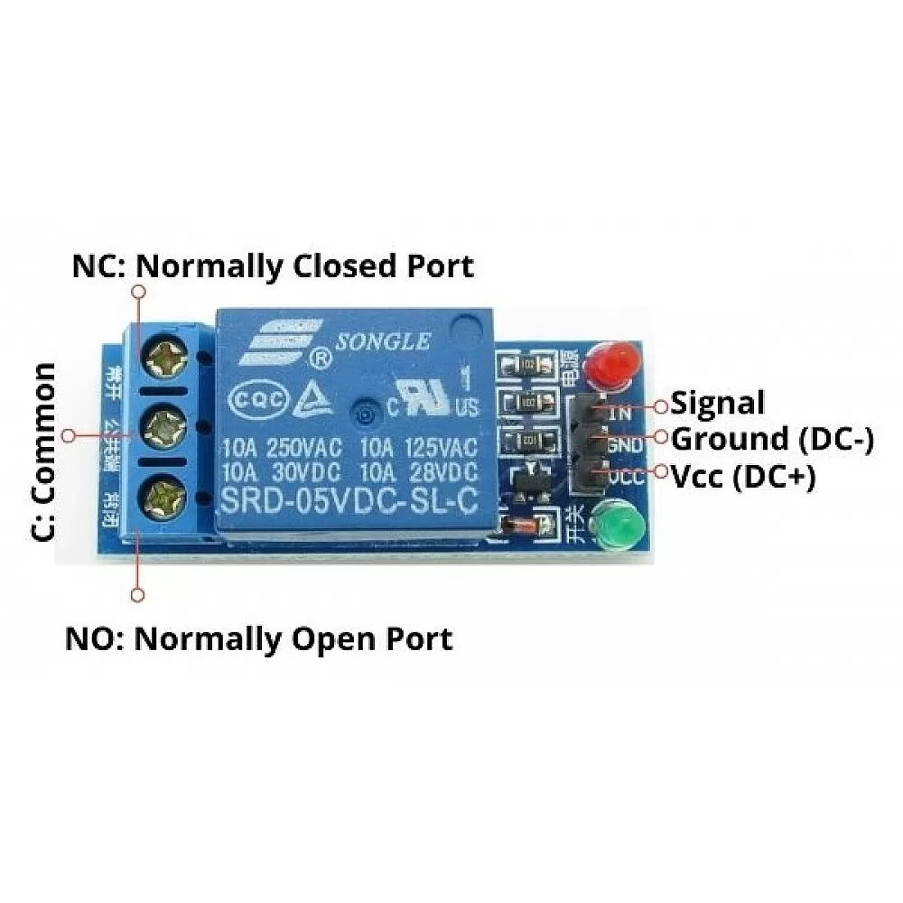

ຕົວຢ່າງການນຳໃຊ້ອຸປະກອນ
Relay Module ແມ່ນພື້ນຖານຂອງໂຄງການອັດຕະໂນມັດ ແລະ ລະບົບ IoT (ອິນເຕີເນັດຂອງສິ່ງຂອງ) ສ່ວນໃຫຍ່, ໂດຍສະເພາະບ່ອນທີ່ຕ້ອງຄວບຄຸມໄຟຟ້າບ້ານ (AC Mains).

|**ຫົວຂໍ້ການນຳໃຊ້**|**ລາຍລະອຽດ**|
|---|---|
|**Home Automation (Smart Home)**|**ລະບົບໄຟອັດສະລິຍະ:** ຄວບຄຸມການເປີດ/ປິດໄຟສາຍ, ພັດລົມ, ຫຼື ເຄື່ອງໃຊ້ໄຟຟ້າພາຍໃນເຮືອນຜ່ານແອັບຯ (Wi-Fi) ຫຼື ຜ່ານເຊັນເຊີ.|
|**Motor Control (DC/AC)**|**ການຄວບຄຸມມໍເຕີ:** ໃຊ້ເພື່ອຄວບຄຸມມໍເຕີປັ໊ມນ້ໍາຂະໜາດໃຫຍ່ໂດຍອີງໃສ່ລະດັບນ້ໍາ (Water Level Sensor).|
|**Security System Interface**|**ການເຊື່ອມຕໍ່ລະບົບປ້ອງກັນ:** ໃຊ້ເພື່ອເປີດ Siren ຫຼື ໄຟສາຍຂະໜາດໃຫຍ່ເມື່ອກວດພົບການບຸກລຸກ (Intrusion).|
|**Temperature Control System**|**ລະບົບຄວບຄຸມອຸນຫະພູມ:** ເປີດ/ປິດເຄື່ອງເຮັດຄວາມຮ້ອນ (Heater) ຫຼື ເຄື່ອງເຮັດຄວາມເຢັນ (Cooler) ໂດຍອີງຕາມຂໍ້ມູນຈາກເຊັນເຊີອຸນຫະພູມ.|
# ⚙️ Motors & Drivers
**36, Servo motor** ແມ່ນ **ມໍເຕີທີ່ເຮັດໜ້າທີ່ຂັບເຄື່ອນ (Rotary ຫຼື Linear Actuator)** ທີ່ອະນຸຍາດໃຫ້ມີການຄວບຄຸມມຸມ (Angular Position), ຄວາມໄວ (Velocity), ແລະ ຄວາມເລັ່ງ (Acceleration) ໄດ້ຢ່າງ **ຊັດເຈນ** ໃນລະບົບກົນຈັກ.
    ໃຊ້ໃນໂປຣເຈັກທີ່ຕ້ອງການ ການເຄື່ອນໄຫວທີ່ແມ້ນຍຳເຊັ່ນ ຫຸ່ນຍົນ
        ການເຮັດວຽກຂອງ Servo Motor ແມ່ນອີງໃສ່ການໃຊ້ສັນຍານ **PWM (Pulse Width Modulation)** ເພື່ອກໍານົດຕໍາແໜ່ງມຸມທີ່ຕ້ອງການ.
#### ຫຼັກການເຮັດວຽກດ້ວຍສັນຍານ PWM

|**ອົງປະກອບ**|**ການກະທໍາ**|**ລາຍລະອຽດ**|
|---|---|---|
|**1. ການສັ່ງການ (Command)**|**Microcontroller ສົ່ງສັນຍານ PWM** ທີ່ມີຄວາມກວ້າງຂອງ Pulse ທີ່ປ່ຽນແປງໄດ້ (Pulse Width).|ມໍເຕີ Servo ສ່ວນໃຫຍ່ໃຊ້ຄວາມຖີ່ 50Hz (ໄລຍະເວລາ Pulse ທັງໝົດ 20ms).|
|**2. ການກໍານົດຕຳແໜ່ງ**|**ຄວາມກວ້າງຂອງ Pulse** (ໄລຍະເວລາ ON) ກໍານົດມຸມທີ່ຕ້ອງການ.|> **ຕົວຢ່າງ:** * 1.0ms} \approx \text{0 ອົງສາ * 1.5ms} \approx \text{90 ອົງສາ (ຕຳແໜ່ງກາງ) * 2.0ms} \approx \text{180 ອົງສາ|
|**3. ການປຽບທຽບ (Error Sensing)**|ວົງຈອນຄວບຄຸມພາຍໃນມໍເຕີປຽບທຽບ: **ຕຳແໜ່ງທີ່ຕ້ອງການ** (ຈາກສັນຍານ PWM) ກັບ **ຕຳແໜ່ງປັດຈຸບັນ** (ຈາກ Position Sensor).|ຖ້າມີຄວາມຜິດພາດ (Error), ວົງຈອນຈະສ້າງສັນຍານເພື່ອໃຫ້ມໍເຕີໝູນ.|
|**4. ການເຄື່ອນທີ່ ແລະ ການຢຸດ**|ມໍເຕີຈະໝູນໄປໃນທິດທາງທີ່ຖືກຕ້ອງເພື່ອຫຼຸດຜ່ອນຄວາມຜິດພາດ.|ເມື່ອແກນມໍເຕີໄປຮອດຕຳແໜ່ງທີ່ຕ້ອງການແລ້ວ (Error} \approx 0$), ມໍເຕີຈະຢຸດ ແລະ **ຮັກສາ** ຕຳແໜ່ງນັ້ນໄວ້ຢ່າງໝັ້ນຄົງໂດຍການໃຊ້ແຮງບິດ (Holding Torque).|

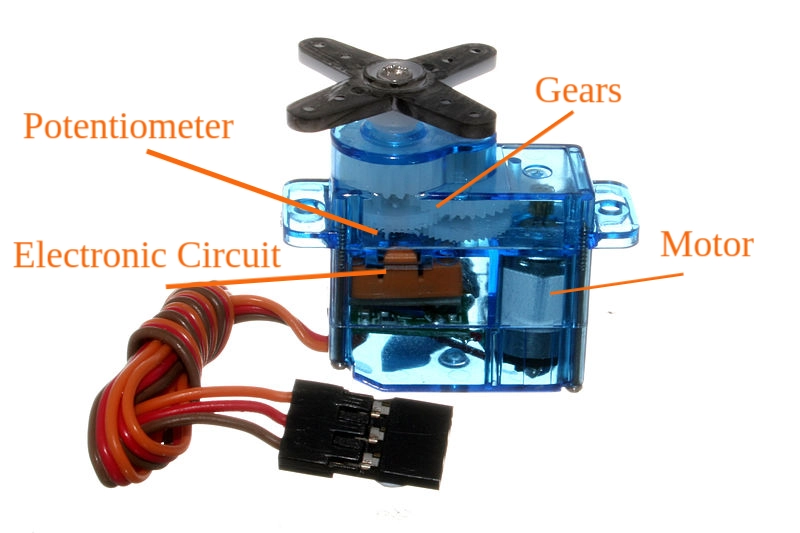

ຕົວຢ່າງການນຳໃຊ້ອຸປະກອນ
Servo Motor ແມ່ນອຸປະກອນຫຼັກໃນການເຄື່ອນໄຫວທີ່ຊັດເຈນຂອງລະບົບຫຸ່ນຍົນ ແລະ ລະບົບອັດຕະໂນມັດຂະໜາດນ້ອຍ.

|**ຫົວຂໍ້ການນຳໃຊ້**|**ລາຍລະອຽດ**|
|---|---|
|**Robotics**|**ແຂນຫຸ່ນຍົນ (Robotic Arms):** ໃຊ້ໃນຂໍ້ຕໍ່ (Joints) ຂອງແຂນຫຸ່ນຍົນເພື່ອຄວບຄຸມຕຳແໜ່ງ, ການຈັບ ແລະ ການວາງສິ່ງຂອງດ້ວຍຄວາມຊັດເຈນ.|
|**Radio-Controlled (RC) Models**|**ເຄື່ອງບິນ ແລະ ລົດ RC:** ໃຊ້ຄວບຄຸມທິດທາງຂອງປີກຍົນ (Ailerons, Elevators, Rudders) ແລະ ການເລັ່ງຂອງລົດ.|
|**Automated Camera/Sensor Mounts**|**ແທ່ນກ້ອງ/ເຊັນເຊີ:** ໃຊ້ເພື່ອໝູນກ້ອງວົງຈອນປິດ (CCTV) ຫຼື ເຊັນເຊີໃຫ້ຊີ້ໄປຫາຈຸດທີ່ສະເພາະ.|
|**Gate/Damper Control**|**ການຄວບຄຸມປະຕູ/ລີ້ນປິດ:** ໃຊ້ໃນການເປີດ/ປິດປະຕູອັດຕະໂນມັດຂະໜາດນ້ອຍ, ຫຼື ຄວບຄຸມການໄຫຼຂອງອາກາດ (HVAC Damper).|
|**Sorting Systems**|**ລະບົບຄັດແຍກ:** ໃຊ້ໃນສາຍພານການຜະລິດເພື່ອຜັກດັນ (Push) ສິນຄ້າໄປຍັງເສັ້ນທາງທີ່ຖືກຕ້ອງ.|

**37, Stepper motor** ແມ່ນ **ມໍເຕີໄຟຟ້າ DC ແບບ Brushless** ທີ່ບໍ່ໄດ້ໝູນວຽນຢ່າງຕໍ່ເນື່ອງຄືກັບມໍເຕີທົ່ວໄປ, ແຕ່ມັນໝູນວຽນໄປຕາມ ຂັ້ນຕອນ (Steps)** ທີ່ມີມຸມນ້ອຍໆທີ່ກໍານົດໄວ້ລ່ວງໜ້າ.
    ໃຊ້ໃນໂປຣເຈັກທີ່ຕ້ອງການ ການເຄື່ອນໄຫວທີ່ຄວບຄຸມໄດ້ແມ້ນຍຳເຊັ່ນ: ເຄື່ອງພິມ 3D ຫຼື ເຄື່ອງ CNC
        ການເຮັດວຽກຂອງ Stepper Motor ແມ່ນອີງໃສ່ຫຼັກການຂອງ **ການດຶງດູດຂອງແມ່ເຫຼັກໄຟຟ້າ (Electromagnetic Attraction)** ໂດຍການເປີດ/ປິດຂົດລວດ (Windings/Phases) ທີ່ Stator ຕາມລໍາດັບທີ່ສະເພາະ.
#### ຫຼັກການການເຄື່ອນທີ່ຕາມຂັ້ນຕອນ:

|**ຂັ້ນຕອນ**|**ການກະທໍາ**|**ຜົນໄດ້ຮັບ**|
|---|---|---|
|**1. ການໃຫ້ພະລັງງານ (Energizing)**|**Driver Circuit** ສົ່ງ Pulse ໄຟຟ້າໄປຍັງຂົດລວດຊຸດທຳອິດທີ່ Stator (ເຊັ່ນ: Phase A).|ຂົດລວດ A ຈະກາຍເປັນແມ່ເຫຼັກໄຟຟ້າ ແລະ **ດຶງດູດ** ແຂ້ວຂອງ Rotor ໃຫ້ມາຈັດລຽນຕາມແນວແມ່ເຫຼັກຂອງ A.|
|**2. ການເຄື່ອນທີ່ 1 ຂັ້ນຕອນ**|**Driver** ປິດ Phase A ແລະ ເປີດ Phase B (ຂົດລວດຊຸດຕໍ່ໄປ).|ແຂ້ວຂອງ Rotor ຈະເສຍການຈັດລຽນຈາກ A ແລະ ໝູນໄປ **ໜຶ່ງຂັ້ນຕອນ** ເພື່ອຈັດລຽນກັບແນວແມ່ເຫຼັກຂອງ B ທີ່ຖືກເປີດໃໝ່.|
|**3. ການໝູນວຽນຕໍ່ເນື່ອງ**|ຂະບວນການເປີດ/ປິດຂົດລວດຕາມລໍາດັບ (A} \rightarrow \text{B} \rightarrow \text{C} \rightarrow \text{D} \rightarrow \text{A}...$) ຈະຖືກເຮັດຊ້ຳ.|ການສັບປ່ຽນລໍາດັບການໃຫ້ພະລັງງານຢ່າງຕໍ່ເນື່ອງເຮັດໃຫ້ Rotor ໝູນວຽນຕໍ່ເນື່ອງໃນມຸມນ້ອຍໆ, ເຮັດໃຫ້ເກີດການເຄື່ອນທີ່ທີ່ຊັດເຈນ.|
|**4. ການຄວບຄຸມ**|**ທິດທາງ:** ຄວບຄຸມໂດຍລໍາດັບຂອງການໃຫ້ພະລັງງານ.|**ຄວາມໄວ:** ຄວບຄຸມໂດຍຄວາມຖີ່ຂອງ Pulses ທີ່ສົ່ງເຂົ້າໄປ.|
||**ຄວາມລະອຽດ (Microstepping):** ສາມາດຄວບຄຸມກະແສໄຟຟ້າໃນຂົດລວດພ້ອມກັນເພື່ອສ້າງຂັ້ນຕອນ (Steps) ທີ່ນ້ອຍກວ່າ (ເຊັ່ນ: Half-Step ຫຼື Microstep).

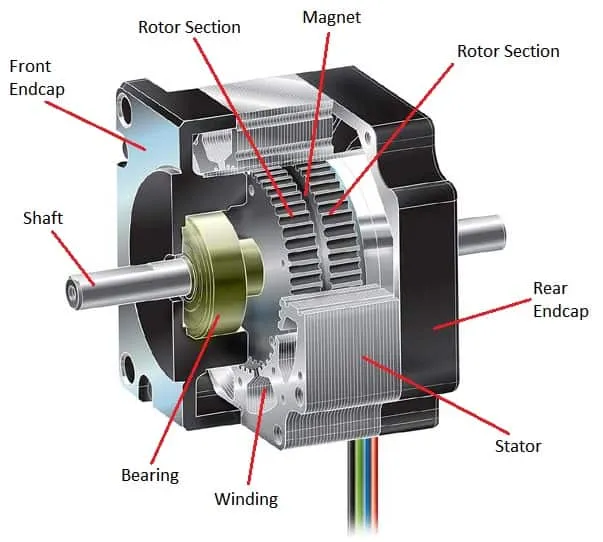

ຕົວຢ່າງການນຳໃຊ້ອຸປະກອນ
Stepper Motor ຖືກນຳໃຊ້ຢ່າງກວ້າງຂວາງໃນອຸປະກອນທີ່ຕ້ອງການການເຄື່ອນທີ່ທີ່ຊັດເຈນ ແລະ ສາມາດເຮັດຊ້ຳໄດ້ຢ່າງຖືກຕ້ອງ:

|**ຫົວຂໍ້ການນຳໃຊ້**|**ລາຍລະອຽດ**|
|---|---|
|**3D Printers**|**ການເຄື່ອນທີ່ຂອງແກນ (X, Y, Z Axis):** ໃຊ້ເພື່ອຄວບຄຸມການເຄື່ອນທີ່ຂອງຫົວພິມ (Extruder) ໃຫ້ໄດ້ຕຳແໜ່ງທີ່ຊັດເຈນຫຼາຍໃນການສ້າງຊັ້ນຕໍ່ຊັ້ນ.|
|**CNC Machines**|**ເຄື່ອງຈັກຕັດ/ແກະສະຫຼັກແບບອັດຕະໂນມັດ:** ຄວບຄຸມການເຄື່ອນທີ່ຂອງເຄື່ອງມືຕັດໃນຫຼາຍແກນດ້ວຍຄວາມຊັດເຈນສູງ.|
|**Scanners & Printers**|**ເຄື່ອງສະແກນ/ເຄື່ອງພິມ:** ຄວບຄຸມການເຄື່ອນທີ່ຂອງຫົວສະແກນ/ຫົວພິມທີ່ຕ້ອງການຄວາມໄວ ແລະ ຕຳແໜ່ງທີ່ຊັດເຈນເພື່ອຮັບປະກັນຄຸນນະພາບຂອງຮູບພາບ.|
|**Automated Valves**|**ວາວຄວບຄຸມ:** ໃຊ້ເພື່ອຄວບຄຸມຕຳແໜ່ງການເປີດ/ປິດຂອງວາວຂອງແຫຼວ ຫຼື ອາຍແກັສໃນອຸປະກອນທາງການແພດ ຫຼື ອຸດສາຫະກຳ.|
|**Disk Drives (CD/DVD/HDD)**|**ການຄວບຄຸມຫົວອ່ານ:** ໃຊ້ໃນການຍ້າຍຫົວອ່ານຂອງ Hard Disk Drives (HDD) ໄປຍັງຕຳແໜ່ງທີ່ຖືກຕ້ອງຂອງຂໍ້ມູນ.|

**38, Stepper motor driver board** ແມ່ນ ວົງຈອນເອເລັກໂຕຣນິກຂົວຕໍ່ ທີ່ສໍາຄັນລະຫວ່າງ Microcontroller (ເຊັ່ນ: Arduino ຫຼື PLC) ແລະ Stepper Motor. ມັນເຮັດໜ້າທີ່ປ່ຽນສັນຍານຄວບຄຸມ Low-Power ຈາກ Microcontroller ໄປເປັນ **ສັນຍານໄຟຟ້າ High-Power ແລະ ລໍາດັບທີ່ຖືກຕ້ອງ** ເພື່ອໃຫ້ຂົດລວດຂອງມໍເຕີໝູນວຽນໄປຕາມຂັ້ນຕອນທີ່ຕ້ອງການ.
    ໃຊ້ຊ່ວຍໃຫ້ Arduino ສາມາດຄວບຄຸມມໍເຕີສະເຕັບເປີ້ໄດ້ໂດຍການຈ່າຍພະລັງງານ ແລະ ສັນຍານທີ່ຖືກຕ້ອງ
         Driver Board ປ່ຽນຄຳສັ່ງງ່າຍໆຈາກ Microcontroller ໃຫ້ເປັນການຄວບຄຸມກະແສໄຟຟ້າທີ່ຊັບຊ້ອນ.
#### ຫຼັກການເຮັດວຽກ ແລະ ຕຳແໜ່ງ:

|**ອົງປະກອບ**|**ປ້ອນຂໍ້ມູນ (Input ຈາກ Microcontroller)**|**ຜົນຜະລິດ (Output ໄປ Stepper Motor)**|
|---|---|---|
|**1. Pin STEP**|ຮັບສັນຍານ Pulse ດິຈິຕອລ (Digital Pulse).|**ປ່ຽນ Pulse 1 ອັນ ເປັນ ການໝູນວຽນ 1 Step (ຫຼື Microstep) ຂອງມໍເຕີ.**|
|**2. Pin DIR**|ຮັບສັນຍານ ຕຳແໜ່ງ HIGH ຫຼື LOW.|**ກຳນົດທິດທາງ** ຂອງການໝູນວຽນ (ໝູນຕາມເຂັມໂມງ ຫຼື ທວນເຂັມໂມງ).|
|**3. ວົງຈອນຂັບ (Internal Circuit)**|ຮັບພະລັງງານໄຟຟ້າ High-Voltage/Current ຈາກພາຍນອກ.|**ປ່ຽນສັນຍານ STEP ແລະ DIR ໃຫ້ເປັນລໍາດັບການສະໜອງໄຟຟ້າທີ່ຖືກຕ້ອງ** ໄປຫາຂົດລວດມໍເຕີ.|
|**4. Microstepping**|ຕັ້ງຄ່າ Microstepping (MS1, MS2, MS3 Pins).|ຄວບຄຸມກະແສໄຟຟ້າໃນຂົດລວດຢ່າງລະອຽດເພື່ອ **ແບ່ງ Step ໃຫຍ່ໃຫ້ເປັນ Microsteps ນ້ອຍໆ**, ເຮັດໃຫ້ການເຄື່ອນທີ່ລຽບນຽນຂຶ້ນ ແລະ ຫຼຸດສຽງລົບກວນ.|

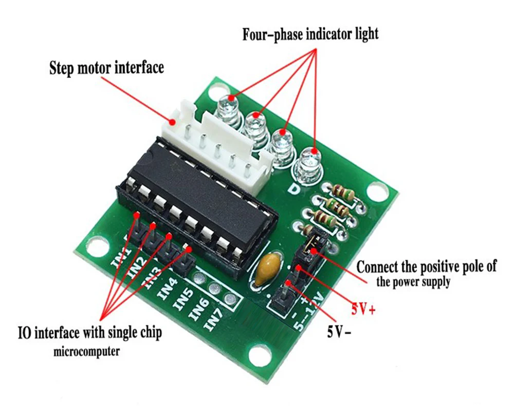

ຕົວຢ່າງການນຳໃຊ້ອຸປະກອນ
Stepper Motor Driver Board ແມ່ນສ່ວນປະກອບທີ່ຂາດບໍ່ໄດ້ໃນທຸກລະບົບທີ່ໃຊ້ Stepper Motor ເພື່ອຄວບຄຸມຕຳແໜ່ງດ້ວຍຄວາມຊັດເຈນ.

|**ຫົວຂໍ້ການນຳໃຊ້**|**ບົດບາດຂອງ Driver**|
|---|---|
|**3D Printers/CNC Machines**|**ຄວບຄຸມແກນ X, Y, Z:** Driver (ເຊັ່ນ: DRV8825) ຮັບ Pulses ຈາກແຜງຄວບຄຸມຫຼັກ (Main Board) ແລະ ປ່ຽນມັນໃຫ້ເປັນການເຄື່ອນທີ່ຂອງມໍເຕີຢ່າງຊັດເຈນ (Microstepping) ເພື່ອໃຫ້ໄດ້ຕຳແໜ່ງທີ່ຖືກຕ້ອງ.|
|**Robotics & Automation**|**ການຄວບຄຸມສາຍພານ/ເຄື່ອງປ້ອນ:** ໃຊ້ Driver ເພື່ອກໍານົດຄວາມໄວ ແລະ ຕຳແໜ່ງຂອງສາຍພານລໍາລຽງ ຫຼື ອຸປະກອນປ້ອນອາຫານດ້ວຍຄວາມຊັດເຈນ.|
|**ອຸປະກອນທາງການແພດ**|**ເຄື່ອງສູບ (Pumps) & ເຄື່ອງຈ່າຍຢາ:** ໃຊ້ Driver ເພື່ອຄວບຄຸມມໍເຕີທີ່ຂັບເຄື່ອນເຄື່ອງສູບຂອງແຫຼວໃນປະລິມານທີ່ຊັດເຈນຫຼາຍ.|
|**ລະບົບປັບໄຟໜ້າລົດ**|**ການປັບມຸມໄຟໜ້າອັດຕະໂນມັດ:** Driver ຮັບສັນຍານຈາກ ECU ຂອງລົດ ແລະ ຂັບເຄື່ອນ Stepper Motor ເພື່ອປັບມຸມສາຍໄຟໜ້າຕາມຄວາມເໝາະສົມ.|
# 🧠 ICs & Modules
**39, Real-time Clock Module DS1302** ແມ່ນ Real-Time Clock (RTC) Chip ຫຼື Module (ອຸປະກອນໂມງເວລາຈິງ) ທີ່ອອກແບບມາເພື່ອຮັກສາ ວັນທີ ແລະ ເວລາທີ່ຊັດເຈນ ຢ່າງຕໍ່ເນື່ອງ, ເຖິງແມ່ນວ່າລະບົບຫຼັກ (ເຊັ່ນ: Arduino ຫຼື Microcontroller) ຈະຖືກປິດໄຟຟ້າກໍຕາມ. ມັນນັບວິນາທີ, ນາທີ, ຊົ່ວໂມງ, ວັນທີ, ເດືອນ, ວັນໃນອາທິດ, ແລະ ປີ, ພ້ອມທັງສາມາດປັບປີອະທິກະສູດ (Leap Year) ອັດຕະໂນມັດໄດ້ເຖິງປີ 2100.
    ໃຊ້ໃນໂປຣເຈັກທີ່ຕ້ອງການ ການຕິດຕາມເວລາເຊັ່ນ: ໂມງ ຫຼື ບັນທຶກເວລາການໃຊ້ງານ
         DS1302 ຕິດຕໍ່ສື່ສານກັບ Microcontroller ຜ່ານລະບົບ Serial Communication ທີ່ງ່າຍດາຍທີ່ເອີ້ນວ່າ **3-Wire Interface** (Three-Wire Interface).
#### ຫຼັກການເຮັດວຽກ:
1. **ການນັບເວລາຢ່າງຊັດເຈນ:**
    - RTC ໃຊ້ຄວາມຖີ່ຄົງທີ່ຂອງ 32.768 kHz Crystal ແລະວົງຈອນແບ່ງຄວາມຖີ່ (Frequency Divider) ພາຍໃນເພື່ອປ່ຽນຄວາມຖີ່ດັ່ງກ່າວໃຫ້ເປັນ 1 Hz (1 Pulse ຕໍ່ວິນາທີ) ເພື່ອໃຊ້ໃນການນັບເວລາ.
2. **ການຕິດຕໍ່ສື່ສານ (Interface):**
    - ການສື່ສານກັບ Microcontroller ໃຊ້ພຽງ 3 ສາຍເທົ່ານັ້ນ:
        - **CE (Chip Enable ຫຼື RST):** ໃຊ້ເພື່ອເລີ່ມຕົ້ນແລະສິ້ນສຸດການສື່ສານ.
        - **I/O (Data Input/Output):** ສາຍຂໍ້ມູນທີ່ໃຊ້ສົ່ງ ແລະ ຮັບຂໍ້ມູນເວລາ/ວັນທີ
        - **SCLK (Serial Clock):** ສາຍ Clock ທີ່ຊິ້ງ (Synchronize) ການສົ່ງຂໍ້ມູນ.
3. **ລະບົບໄຟຟ້າສອງແຫຼ່ງ (Dual Power Supply):**
    - DS1302 ມີສອງ Power Pins ຄື VCC1 (ໄຟຟ້າສຳຮອງ/ແບັດເຕີຣີ) ແລະ VCC2 (ໄຟຟ້າຫຼັກຈາກລະບົບ).
    - ອຸປະກອນຈະເຮັດວຽກໂດຍໃຊ້ແຫຼ່ງພະລັງງານທີ່ມີ Voltage ສູງກວ່າ.
    - ເມື່ອໄຟຟ້າຫຼັກ (VCC2) ຖືກຕັດ, ໂມດູນຈະສະຫຼັບໄປໃຊ້ພະລັງງານຈາກແບັດເຕີຣີສຳຮອງ (VCC1) ໂດຍອັດຕະໂນມັດ, ເຮັດໃຫ້ໂມງຍັງຄົງນັບເວລາຕໍ່ໄປໂດຍບໍ່ມີການຢຸດ.
      
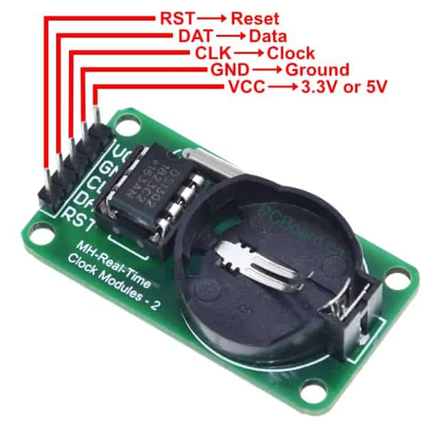

ຕົວຢ່າງການນຳໃຊ້ອຸປະກອນ
DS1302 RTC ຖືກນໍາໃຊ້ໃນທຸກໂຄງການທີ່ຕ້ອງການຄວາມຖືກຕ້ອງຂອງວັນທີແລະເວລາທີ່ບໍ່ຂຶ້ນກັບການເຊື່ອມຕໍ່ອິນເຕີເນັດ ຫຼື ໄຟຟ້າຫຼັກ.

| **ຫົວຂໍ້ການນຳໃຊ້**                            | **ລາຍລະອຽດການນຳໃຊ້**                                                                                                                                               |
| --------------------------------------------- | ------------------------------------------------------------------------------------------------------------------------------------------------------------------ |
| **Data Logger (ເຄື່ອງບັນທຶກຂໍ້ມູນ)** | ໃຊ້ເພື່ອປະທັບເວລາ (Time-Stamp) ໃສ່ຂໍ້ມູນທີ່ເກັບໄດ້ (ເຊັ່ນ: ອຸນຫະພູມ, ຄວາມຊຸ່ມຊື່ນ) ເພື່ອໃຫ້ຮູ້ວ່າຂໍ້ມູນນັ້ນຖືກເກັບໃນເວລາໃດ.                               |
| **ລະບົບຈັບເວລາ ແລະ ຕັ້ງປຸກ**                  | **ໂມງດິຈິຕອນ ແລະ ໂມງປຸກ:** ເຮັດໜ້າທີ່ເປັນ Clock ຫຼັກໃນການສະແດງເວລາໃນຈໍສະແດງຜົນ, ແລະ ໃຊ້ເພື່ອກໍານົດເວລາປຸກທີ່ແນ່ນອນ.                                       |
| **ລະບົບ Timer ຄວບຄຸມອັດຕະໂນມັດ**     | **ເຄື່ອງຄວບຄຸມຫົດນ້ຳຕົ້ນໄມ້/ປິດ-ເປີດໄຟ:** ໃຊ້ RTC ເພື່ອເປີດລະບົບໃນເວລາທີ່ກຳນົດໄວ້ເຊັ່ນ: ເປີດໄຟຕາມຖະໜົນໃນເວລາ 18:00 ແລະ ປິດໃນເວລາ 06:00. |
| **ເຄື່ອງກວດສອບການເຂົ້າ-ອອກ**                  | **ເຄື່ອງສະແກນລາຍນິ້ວມື/ບັດ:** ໃຊ້ RTC ເພື່ອບັນທຶກເວລາທີ່ພະນັກງານເຂົ້າ ແລະ ອອກຈາກຫ້ອງການດ້ວຍຄວາມຊັດເຈນ.                                                    |

**40, 74HC595 Chip** ແມ່ນຊິບທີ່ໃຊ້ໃນການຂະຫຍາຍຈຳນວນພິນເອົ້າພຸດຂອງ Arduino. ມັນຖືກນໍາໃຊ້ເພື່ອ **ຂະຫຍາຍຈໍານວນ Output Pins** ຂອງ Microcontroller (ເຊັ່ນ: Arduino ຫຼື ESP32). ໂດຍປົກກະຕິແລ້ວ, ທ່ານສາມາດໃຊ້ 74HC595 ໂຕດຽວເພື່ອຄວບຄຸມ 8 Output Pins ດ້ວຍການໃຊ້ພຽງ **3 Pins** ຂອງ Microcontroller ເທົ່ານັ້ນ.
    ໃຊ້ສຳລັບຄວບຄຸມ LED ຫຼື ອຸປະກອນຈຳນວນຫຼາຍໂດຍໃຊ້ພິນນ້ອຍລົງ
         74HC595 ປະກອບດ້ວຍ Registers ພາຍໃນສອງອັນທີ່ເຮັດວຽກປະສານກັນ: Shift Register ແລະ Storage Register.
#### ຫຼັກການເຮັດວຽກ:
1. **ການສົ່ງຂໍ້ມູນເຂົ້າແບບ Serial (Serial In):**
    - **SER (Serial Data Input):** ຂໍ້ມູນ (0 ຫຼື 1) ຈະຖືກສົ່ງເຂົ້າໄປທາງ Pin ນີ້ເທື່ອລະ Bit (One Bit at a Time) ຈາກ Microcontroller.
    - **SRCLK (Shift Register Clock):** ທຸກຄັ້ງທີ່ Clock Signal ປ່ຽນຈາກ LOW ເປັນ HIGH (Rising Edge), Shift Register ຈະຍ້າຍ (Shift) ຂໍ້ມູນທີ່ມີຢູ່ພາຍໃນໄປທາງຂວາ 1 Position ແລະ ຮັບ Bit ໃໝ່ທີ່ຢູ່ SER ເຂົ້າມາໃນ Position ທໍາອິດ.
    - ຂະບວນການນີ້ຈະຖືກເຮັດຊ້ຳ 8 ເທື່ອເພື່ອບັນຈຸຂໍ້ມູນ 8-bit ເຂົ້າໄປໃນ Shift Register ຢ່າງສົມບູນ.
2. **ການສົ່ງຂໍ້ມູນອອກແບບ Parallel (Parallel Out):**
    - RCLK (Register Latch Clock): ເມື່ອຂໍ້ມູນ 8-bit ຖືກໂຫຼດເຂົ້າໄປໃນ Shift Register ແລ້ວ, Microcontroller ຈະສົ່ງ Pulse ໄປຫາ RCLK Pin.
    - Pulse ນີ້ຈະເຮັດໃຫ້ຂໍ້ມູນທັງ 8 bits ທີ່ຢູ່ໃນ Shift Register ຖືກສຳເນົາໄປໃສ່ Storage Register **ໃນເວລາດຽວກັນ**.
    - Q0 ຫາ Q7: Storage Register ແມ່ນເຊື່ອມຕໍ່ໂດຍກົງກັບ 8 Output Pins (Q0 ຫາ Q7), ເຊິ່ງຈະສະແດງສະຖານະ (HIGH ຫຼື LOW) ຂອງຂໍ້ມູນທີ່ຖືກໂຫຼດເຂົ້າມາທັນທີ.
3. **QH' (Serial Out):** Pin ນີ້ຈະສົ່ງ Bit ສຸດທ້າຍທີ່ຖືກຍ້າຍອອກຈາກ Shift Register. ມັນຖືກນໍາໃຊ້ເພື່ອເຊື່ອມຕໍ່ (Cascade) 74HC595 ໂຕຕໍ່ໄປ, ໂດຍການເຊື່ອມຕໍ່ QH' ຂອງໂຕທີ 1 ເຂົ້າກັບ SER ຂອງໂຕທີ 2.

| Pin                   | ໜ້າທີ່               | ລາຍລະອຽດ                                                 |
| ------------------------- | ------------------------ | -------------------------------------------------------------- |
| SER (DS)     | Data Input      | ຮັບຂໍ້ມູນ Serial ເທື່ອລະ bit.                |
| SRCLK (SHCP) | Shift Clock     | ຄວບຄຸມການຍ້າຍຂໍ້ມູນເຂົ້າໃນ Shift Register.            |
| RCLK (STCP)* | Latch Clock     | ຄວບຄຸມການສະແດງຂໍ້ມູນອອກ Output Pins (Q0-Q7). |
| Q0 - Q7      | Parallel Output | 8 Output Pins ທີ່ຄວບຄຸມອຸປະກອນພາຍນອກ.                 |

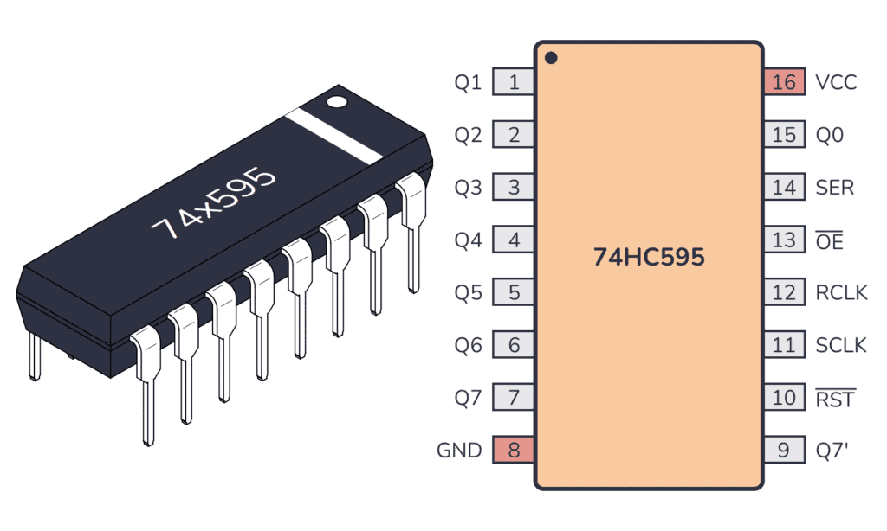

ຕົວຢ່າງການນຳໃຊ້ອຸປະກອນ
74HC595 ເປັນທີ່ນິຍົມໃນການນໍາໃຊ້ເພື່ອເພີ່ມ Output ໃຫ້ກັບ Microcontroller ໂດຍປະຢັດ Pins ໃຫ້ຫຼາຍທີ່ສຸດ.

|**ຫົວຂໍ້ການນຳໃຊ້**|**ລາຍລະອຽດການນຳໃຊ້**|
|---|---|
|**LED Array/Display Driver**|**ການຄວບຄຸມໄຟ LED ຈໍານວນຫຼາຍ:** ໃຊ້ 74HC595 ໂຕດຽວເພື່ອຄວບຄຸມໄຟ LED 8 ດອກ ຫຼື ໃຊ້ຫຼາຍໂຕເພື່ອເຮັດເປັນ LED Matrix ຂະໜາດໃຫຍ່ (ເຊັ່ນ: 8x8 LED Matrix) ໂດຍໃຊ້ພຽງ 3 Pins ຂອງ Microcontroller.|
|**7-Segment Display**|**ການສະແດງຕົວເລກຫຼາຍຫຼັກ:** ໃຊ້ 74HC595 ເພື່ອຄວບຄຸມແຕ່ລະຫຼັກ (Digit) ຂອງ 7-Segment Display ທີ່ຕ້ອງການ 7 ຫຼື 8 Output Pins ຕໍ່ Digit ເພື່ອສະແດງຕົວເລກ.|
|**ການຄວບຄຸມ Relay/Motor Driver**|**ລະບົບຄວບຄຸມອັດຕະໂນມັດ:** ໃຊ້ 8 Output Pins ຂອງ 74HC595 ເພື່ອຄວບຄຸມ Relay Module 8 Channels ເພື່ອເປີດ-ປິດເຄື່ອງໃຊ້ໄຟຟ້າ ຫຼື ຄວບຄຸມ Stepper Motors ຫຼາຍອັນ.|
|**Digital Buffer/Data Latch**|**ການເກັບຮັກສາສະຖານະຊົ່ວຄາວ:** ໃຊ້ Storage Register ເພື່ອເກັບສະຖານະຂອງຂໍ້ມູນ 8-bit ໄວ້ຈົນກວ່າຈະມີການອັບເດດໃໝ່.|
