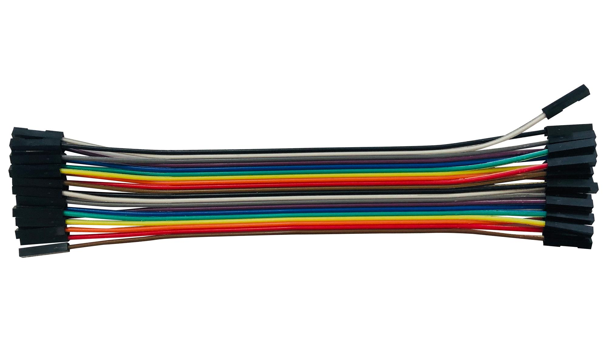
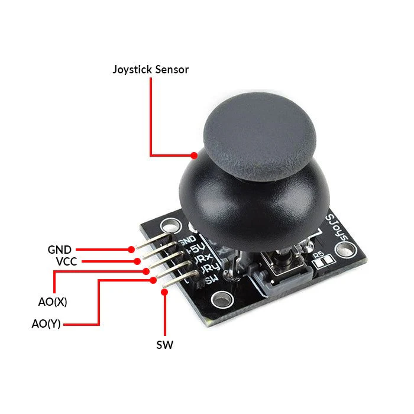

# ✅ Arduino Starter Kit Numbered Checklist 
# 🔌 Core Boards & Interfaces
 **1, Arduino Uno board** ແມ່ນບອດຄວບຄຸມອິເລັກໂຕຣນິກທີ່ຖືກອອກແບບມາໃຫ້ໃຊ້ງານງ່າຍ ແລະ ເໝາະສຳລັບການຮຽນຮູ້ການພັດທະນາອຸປະກອນອິເລັກໂຕຣນິກ. ມັນໃຊ້ໃນການຄວບຄຸມອຸປະກອນຕ່າງໆ ເຊັ່ນ ໄຟ LED, ມໍເຕີ, ຊິບສື່ສານ, ແລະ ອຸປະກອນວັດຄ່າ.
    ໃຊ້ເປັນຕົວຄວບຄຸມຫຼັກໃນໂປຣເຈັກອີເລັກໂທນິກ ສາມາດອ່ານຂໍ້ມູນຈາກເຊັນເຊີ ແລະ ຄວບຄຸມອຸປະກອນຕ່າງໆ

 ຕົວຢ່າງໂຄງການທີ່ນຳ Arduino Uno ໄປໃຊ້
- **ລະບົບຄວບຄຸມໄຟສ່ອງສວ່າງ**: ໃຊ້ Digital Pins ເພື່ອຄວບຄຸມ LED ໃຫ້ເປີດ/ປິດຕາມເວລາ.
- **ການວັດອຸນຫະພູມ**: ໃຊ້ Analog Pins ກັບເ຋ັນເຊີວັດອຸນຫະພູມແລ້ວສະແດງຜົນຜ່ານ LCD.
- **ລະບົບກວດຈັບການເຄື່ອນໄຫວ**: ໃຊ້ກັບ PIR Sensor ເພື່ອແຈ້ງເຕືອນຫາກມີການເຄື່ອນໄຫວ.
- **ລະບົບປະຕູອັດຕະໂນມັດ**: ໃຊ້ກັບ Servo Motor ເພື່ອເປີດ/ປິດປະຕູຕາມຄຳສັ່ງ
 
 **2, Breadboards** ແມ່ນອຸປະກອນທີ່ໃຊ້ໃນການປະກອບວົງຈອນອິເລັກໂຕຣນິກໂດຍບໍ່ຈໍາເປັນຕ້ອງບັດຫຼືຕໍ່ສາຍ.ມັນເຫຼາະສົມສໍາລັບການທົດລອງ ແລະພັດທະນາໂຄງການໃໝ່ໆ.
    ໃຊ້ເປັນແຜ່ນທົດລອງເພື່ອເຊື່ອມຕໍ່ອຸປະກອນ ແລະ ທົດລອງວົງຈອນອີເລັກໂທນິກ
    - ບໍ່ຈໍາເປັນຕ້ອງບັດສາຍ ເພາະສາມາດສຽບສາຍລົງໃນຮູໄດ້ເລີຍ
    - ສາມາດທົດລອງວົງຈອນໄດ້ຢ່າງງ່າຍດາຍ ແລະປ່ຽນແປງໄດ້ໄວ
    - ມັກໃຊ້ກັບ Arduino ເພື່ອປະກອບໂຄງການຕ່າງ
 
ຕົວຢ່າງໂຄງການທີ່ໃຊ້ Breadboard
- **ວົງຈອນ LED Blink:** ຕໍ່ LED ກັບຕົວຕ້ານແລ້ວຄວບຄຸມດ້ວຍ Arduino
- **ວົງຈອນກວດຈັບແສງ:** ໃຊ້ LDR ເພື່ອກວດຈັບຄວາມສວ່າງ ແລ້ວເຮັດໃຫ້ LED ເປີດ/ປິດ
- **ລະບົບແຈ້ງເຕືອນດ້ວຍ Buzzer:** ຕໍ່ Buzzer ກັບ Sensor ເພື່ອແຈ້ງເຕືອນຫາກມີການເຄື່ອນໄຫວ

**3, USB cable** ແມ່ນສາຍທີ່ໃຊ້ເຊື່ອມຕໍ່ອຸປະກອນອິເລັກໂຕຣນິກເພື່ອສົ່ງຂໍ້ມູນ ແລະຈ່າຍໄຟ. ມີຫຼາຍຊະນິດຕາມຮູບແບບຂອງຫົວຕໍ່ ແລະຄວາມໄວໃນການສົ່ງຂໍ້ມູນ.
    ໃຊ້ງານ USB Cable
    - **ສົ່ງຂໍ້ມູນ:** ລະຫວ່າງອຸປະກອນ (ເຊັ່ນ ມືຖືກັບຄອມພິວເຕີ)
    - **ຈ່າຍໄຟ:** ຊາຈອຸປະກອນເຊັ່ນ ມືຖື, ແທັບເລັດ, ລົດຖ່ານ
    - **ສື່ສານຂໍ້ມູນພາຍໃນ:** ໃຊ້ໃນວົງຈອນ Arduino ເພື່ອອັບໂຫຼດໂຄດ

ຕົວຢ່າງການນຳໃຊ້
- **ເຊື່ອມ Arduino ກັບຄອມພິວເຕີ:** ໃຊ້ USB-A ທໍາມະດາເຂົ້າຫາ USB-B ຫຼື USB-C ຂຶ້ນກັບບອດ
- **ຊາຈມືຖື:** ໃຊ້ USB-C ຫຼື Micro-USB ຕໍ່ກັບ Adapter
- **ເຊື່ອມຕໍ່ກ້ອງຖ່າຍຮູບກັບຄອມ:** ໃຊ້ Mini-USB ຫຼື USB-B

# 🧵 Wiring & Connectors
**4, Jumper wires (male-to-male)**  ແມ່ນສາຍຕໍ່ທີ່ມີຂົວເຫຼັກ (pin) ທັງສອງຂ້າງ ໃຊ້ເພື່ອເຊື່ອມຕໍ່ລະຫວ່າງ breadboard ແລະອຸປະກອນອື່ນໆ ຢ່າງງ່າຍດາຍ.
    ໃຊ້ເຊື່ອມຕໍ່ລະຫວ່າງບອດ Arduino ແລະ ສ່ວນປະກອບຕ່າງໆເທິງແຜ່ນທົດລອງວົງຈອນ
    - **Male-to-male jumper wires** ແມ່ນສາຍທີ່ມີຂົວ pin ທັງສອງຂ້າງ ເຫຼາະສົມສໍາລັບການຕໍ່ລະຫວ່າງ breadboard ແລະບອດ Arduino, Raspberry Pi ຫຼືອຸປະກອນອື່ນໆ.
    - ມັກໃຊ້ໃນການທົດລອງວົງຈອນຊົ່ວຄາວ ໂດຍບໍ່ຈໍາເປັນຕ້ອງບັດສາຍ.
    - ມີຫຼາຍສີເພື່ອຊ່ວຍໃຫ້ການຈັດການວົງຈອນງ່າຍຂຶ້ນ (ສີບໍ່ມີຄວາມໝາຍທາງວິທະຍາສາດແຕ່ຊ່ວຍໃຫ້ຈຳໄດ້ງ່າຍ).

ຕົວຢ່າງການນຳໃຊ້
- **ຕໍ່ LED ກັບ breadboard:** ນຳສາຍ male-to-male ຕໍ່ຈາກ pin ຂອງ Arduino ໄປຫາຂາຂອງ LED ຜ່ານ breadboard.
- **ຕໍ່ sensor ກັບ Arduino:** ເຊັ່ນ PIR sensor ຫຼື DHT11 ສາມາດໃຊ້ jumper wire ເຊື່ອມຕໍ່ຂາ VCC, GND, ແລະ Data.
- **ທົດລອງວົງຈອນ logic gates:** ຕໍ່ລະຫວ່າງຊິບ logic ກັບອຸປະກອນອື່ນໆໃນ breadboard.

**5, Jumper wires (male-to-female)** ແມ່ນສາຍຕໍ່ທີ່ມີຂົວ pin ຂ້າງໜຶ່ງ (male) ແລະຮູຮັບຂົວ (female) ອີກຂ້າງໜຶ່ງ. ມັນເຫຼາະສົມສໍາລັບການຕໍ່ລະຫວ່າງ breadboard ແລະອຸປະກອນທີ່ມີ pin ອອກ.
    ໃຊ້ເຊື່ອມຕໍ່ສ່ວນປະກອບທີ່ມີຂາທ້າຍແບບຊາຍໄປຍັງບອດ Arduino ທີ່ມີຫົວຕໍ່ຍິງ
    - **Male-to-female jumper wires** ໃຊ້ເຊື່ອມຕໍ່ລະຫວ່າງ breadboard ຫຼື Arduino ກັບອຸປະກອນທີ່ມີຂາ pin ອອກ (ເຊັ່ນ sensor, module, motor).
    - ຂົວ male ສາມາດສຽບເຂົ້າ breadboard ຫຼື pin Arduino, ແລະຂົວ female ສາມາດຮັບຂາອຸປະກອນອື່ນໆ.
    - ມັກໃຊ້ໃນການທົດລອງວົງຈອນທີ່ຕ້ອງການຄວາມຍືດຫຍຸ້ນ ແລະບໍ່ຕ້ອງບັດສາຍ

ຕົວຢ່າງການນຳໃຊ້
- **ຕໍ່ sensor DHT11 ກັບ Arduino:** ຂາຂອງ sensor ເປັນ pin ຊາຍ ເຂົ້າຫາ female ຂອງ jumper wire ແລ້ວຕໍ່ male ເຂົ້າ breadboard.
- **ຕໍ່ module Bluetooth HC-05:** ຂາ TX/RX ຂອງ module ເຂົ້າ female jumper wire ແລ້ວຕໍ່ male ເຂົ້າ Arduino.
- **ຕໍ່ servo motor:** ຂາ signal ຂອງ motor ເຂົ້າ female jumper wire ແລ້ວຕໍ່ male ເຂົ້າ breadboard ຫຼື Arduino.

**6, Jumper wires (female-to-female)** ແມ່ນສາຍຕໍ່ທີ່ມີຮູຮັບຂົວ (female connector) ທັງສອງຂ້າງ ເຫຼາະສົມສໍາລັບການຕໍ່ອຸປະກອນທີ່ມີ pin ອອກໄປຫາ pin ອອກອື່ນໆ.
    ໃຊ້ເຊື່ອມຕໍ່ສ່ວນປະກອບທີ່ມີຫົວຕໍ່ຍິງ ຫຼື ເຊື່ອມກັບບອດ Arduino
    - ມັກໃຊ້ໃນການຕໍ່ລະຫວ່າງ module ຫຼື sensor ທີ່ມີຂາ pin ອອກ ໄປຫາອຸປະກອນອື່ນໆ ເຊັ່ນ Arduino, Raspberry Pi, ESP32 ທີ່ມີຂາ pin ອອກເຊັ່ນກັນ.
    - ຂົວ female ຈະຮັບຂາ pin ຂອງອຸປະກອນໄດ້ແນ່ນຫນາ ແລະບໍ່ຫຼຸດງ່າຍ.
    - ມີຫຼາຍສີເພື່ອຊ່ວຍໃນການຈັດການວົງຈອນໃຫ້ມີລະບຽບ

ຕົວຢ່າງການນຳໃຊ້
- **ຕໍ່ module Bluetooth HC-05 ກັບ ESP32:** ຂາ TX/RX ຂອງທັງສອງອຸປະກອນເປັນ pin ຊາຍ ຈຶ່ງຕ້ອງໃຊ້ female-to-female jumper wire ເພື່ອຕໍ່ກັນ.
- **ຕໍ່ sensor ultrasonic HC-SR04 ກັບ Raspberry Pi:** ຂາ VCC, Trig, Echo, GND ທັງໝົດເປັນ pin ຊາຍ ຈຶ່ງຕ້ອງໃຊ້ female-to-female jumper wire.
- **ຕໍ່ LED strip ກັບ power supply:** ບາງລຸ້ນມີ pin ຊາຍອອກ ຈຶ່ງຕ້ອງໃຊ້ female-to-female jumper wire ເພື່ອຕໍ່ໄຟ.

**7, 9V Battery Connector** ແມ່ນອຸປະກອນທີ່ໃຊ້ເຊື່ອມຕໍ່ຖ່ານໄຟ 9V ເຂົ້າຫາວົງຈອນອິເລັກໂຕຣນິກ ເພື່ອຈ່າຍໄຟໃຫ້ກັບອຸປະກອນ. ມັນເປັນອຸປະກອນພື້ນຖານທີ່ຈໍາເປັນໃນໂຄງການທີ່ໃຊ້ Arduino ຫຼືວົງຈອນແບບພົດພາ.
    ໃຊ້ເພື່ອຈ່າຍພະລັງງານໃຫ້ກັບ Arduino ສຳລັບໂປຣເຈັກທີ່ຕ້ອງການພະລັງງານຈາກແບັດເຕີລີ້
    - ຕໍ່ຖ່ານໄຟ 9V ເຂົ້າຫົວຕໍ່ຂອງ connector
    - ນໍາສາຍສີແດງໄປຫາ pin VCC ແລະສາຍສີດໍາໄປຫາ GND ຂອງ Arduino ຫຼື breadboard
    - ສາມາດໃຊ້ກັບ voltage regulator ກ່ອນເຂົ້າ Arduino ເພື່ອປ້ອງກັນຄ່າໄຟເກີນ
 
ຕົວການນຳໃຊ້
- **ປະຕູອັດຕະໂນມັດກັບ Servo Motor:** ໃຊ້ 9V battery ເພື່ອຈ່າຍໄຟໃຫ້ motor ຜ່ານ connector
- **ລະບົບກວດຈັບການເຄື່ອນໄຫວ:** ໃຊ້ battery ເພື່ອໃຫ້ຄວາມເປັນອິດສະຫຼະໃນການຕິດຕັ້ງ
- **ວົງຈອນສະແດງອຸນຫະພູມກັບ LCD:** ຈ່າຍໄຟໃຫ້ກັບ Arduino ແລະ LCD ຜ່ານ battery connector

# 💡 Basic Components
**8, LEDs (Red: 5, Yellow: 5, Blue: 5, RGB: 1)** ແມ່ນໄດໂອດປ່ອຍແສງຫຼາຍສີ.
EX: ໃຊ້ສະແດງສະຖານະ ຫຼື  ໃຫ້ຜົນຕອບຮັບທາງສາຍຕາໃນໂປຣເຈັກ

ຕົວຢ່າງທີ່ນຳໃຊ້
- ໃຊ້ Red, Yellow, Blue ເພື່ອສະແດງສະຖານະຈາກສັນຍາຈາກ Arduino
-  ຕໍ່ຜ່ານ breadboard ກັບຕົວຕ້ານ 220Ω
- ໃຊ້ RGB LED ກັບສັນຍາ PWM ຈາກ Arduino ເພື່ອປັບສີໄດ້ຕາມຄ່າອຸນຫະພູມ ຫຼືຄ່າ sensor
- ໃຊ້ Red, Yellow, Blue ເພື່ອສະແດງຈໍານວນການນັບຈາກ button ຫຼື sensor
- ໃຊ້ LED ແຕ່ລະສີເພື່ອສະແດງສະຖານະຂອງ sensor ເຊັ່ນ PIR, DHT11, ຫຼື ultrasonic

**9, RGB module** ແມ່ນອຸປະກອນທີ່ລວມ LED ສີແດງ (Red), ສີຂຽວ (Green), ແລະ ສີຟ້າ (Blue) ເຂົ້າໃນດວງດຽວ ເພື່ອສ້າງສີຫຼາຍສີໄດ້ດ້ວຍການປັບຄ່າຄວາມສວ່າງຂອງແຕ່ລະສີ. ມັນເຫຼາະສົມສໍາລັບໂຄງການທີ່ຕ້ອງການສີສັນທີ່ປັບໄດ້ ເຊັ່ນ ການສະແດງສະຖານະ, ການຕົບແຕ່ງແສງ, ຫຼືການສື່ສານຜ່ານສີ.
    ໃຊ້ສະແດງສີທີ່ແຕກຕ່າງກັນຕາມສັນຍານທີ່ຄວບຄຸມ
    - **PWM (Pulse Width Modulation):** ການປັບຄ່າຄວາມສວ່າງຂອງແຕ່ລະສີໂດຍການສົ່ງສັນຍາດິຈິຕອນທີ່ມີຄ່າ duty cycle ຕ່າງກັນ
    - **ການຜະສົມສີ:** ການປັບຄ່າ R, G, B ພ້ອມກັນ ຈະເຮັດໃຫ້ໄດ້ສີໃໝ່ໆ (ເຊັ່ນ R+G = ສີເຫຼືອງ)

ຕົວຢ່າງທີ່ນໍາໃຊ້
1. **RGB Mood Light**
- ປັບສີຕາມອາລົມ ຫຼືຄ່າ sensor
- ຕົວຢ່າງ: ສີຟ້າເມື່ອອຸນຫະພູມຕໍາ, ສີແດງເມື່ອອຸນຫະພູມສູງ
2. **Status Indicator**
- ສະແດງສະຖານະຂອງລະບົບ: ສີແດງ = error, ສີຂຽວ = OK, ສີຟ້າ = standby
3. **Color Mixing Demo**
- ສະແດງການຜະສົມສີດ້ວຍການປັບຄ່າ PWM ຂອງ R, G, B
4. **Remote-Controlled RGB Lamp**
- ຄວບຄຸມສີຜ່ານ Bluetooth ຫຼື IR remote

**10, Resistors (220Ω, 1kΩ, 10kΩ)** ແມ່ນອຸປະກອນພື້ນຖານໃນວົງຈອນອິເລັກໂຕຣນິກ ທີ່ໃຊ້ໃນການຈໍາກັດກະແສໄຟຟ້າ ແລະປ້ອງກັນອຸປະກອນອື່ນໆ ຈາກຄ່າໄຟເກີນ. ຄ່າຂອງຕົວຕ້ານຈະຖືກວັດເປັນໂອມ (Ω).
    ໃຊ້ປ້ອງກັນສ່ວນປະກອບຕ່າງໆ ຈາກກະແສໄຟຟ້າທີ່ຫຼາຍເກີນໄປ ແລະ ປັບລະດັບສັນຍານ

ຕົວຢ່າງການນຳໃຊ້
1. **220Ω + LED + Arduino**
- ຕໍ່ LED ຂະໜາດ 5mm ຜ່ານ 220Ω ເຂົ້າ pin Arduino
- ປ້ອງກັນກະແສເກີນ ທີ່ອາດເຮັດໃຫ້ LED ແຕກ
2. **1kΩ Pull-down Resistor**
- ຕໍ່ປຸ່ມກົດໃສ່ pin digital
- ປ້ອງກັນສັນຍານລອຍ (floating signal)
3. **10kΩ Voltage Divider**
- ຕໍ່ກັບ sensor ເຊັ່ນ LDR ຫຼື TMP36
- ປັບແຮງດັນໃຫ້ເໝາະກັບ input ຂອງ ADC

**11, Push Buttons (x4 with Lids )** ແມ່ນສະວິດທີ່ໃຊ້ກົດເພື່ອໃຫ້ກະແສໄຟຟ້າໄຫຼຜ່ານ ຫຼືຂັດຂວາງການໄຫຼ. ເມື່ອກົດປຸ່ມ ວົງຈອນຈະຖືກເຊື່ອມຕໍ່ (closed circuit), ແລະເມື່ອປ່ອຍອອກ ຈະຂາດການເຊື່ອມຕໍ່ (open circuit).
    ໃຊ້ສຳລັບຮັບຂໍ້ມູນຈາກຜູ້ໃຊ້ເຊັ່ນ: ເປີດ/ປິດ ຫຼື ກະຕຸ້ນການທຳງານ
- Normally Open (NO): ໂດຍປົກກະຕິແລ້ວສາຍຕໍ່ແມ່ນເປີດ (ບໍ່ມີກະແສໄຟຟ້າຜ່ານ). ເມື່ອກົດປຸ່ມ, ສາຍຕໍ່ຈະປິດ (ໃຫ້ກະແສໄຟຟ້າຜ່ານ).
- **Normally Closed (NC):** ໂດຍປົກກະຕິແລ້ວສາຍຕໍ່ແມ່ນປິດ (ໃຫ້ກະແສໄຟຟ້າຜ່ານ). ເມື່ອກົດປຸ່ມ, ສາຍຕໍ່ຈະເປີດ (ບໍ່ມີກະແສໄຟຟ້າຜ່ານ).
- **"with Lids" (ພ້ອມຝາປິດ):** ປົກກະຕິແລ້ວໝາຍເຖິງປຸ່ມກົດທີ່ມີໝວກສີ ຫຼື ຝາປິດຢູ່ເທິງກົນໄກຂອງປຸ່ມ, ເພື່ອຄວາມງາມ, ເພື່ອບອກເຖິງການໃຊ້ງານ (ເຊັ່ນ: ສີແດງສຳລັບ "ຢຸດ", ສີຂຽວສຳລັບ "ເລີ່ມຕົ້ນ"), ຫຼື ເພື່ອປ້ອງກັນຝຸ່ນ.

ຕົວຢ່າງການນຳໃຊ້:
ໃນໂຄງການໄມໂຄຣຄອນໂທຣນເລີ (ເຊັ່ນ: Arduino):
1. **ການປ້ອນຂໍ້ມູນ (Input):** ໃຊ້ເປັນປຸ່ມເພື່ອກໍານົດຄ່າ, ເລືອກເມນູ, ຫຼືໃຫ້ຄໍາສັ່ງແກ່ໂຄງການ.
    - **ປຸ່ມ 1, 2, 3, 4:** ອາດຈະໃຊ້ເປັນປຸ່ມ ຂຶ້ນ (Up), ລົງ (Down), ເລືອກ (Select), ແລະ ກັບຄືນ (Back) ໃນການໂຕ້ຕອບກັບຜູ້ໃຊ້.
2. ເກມ ຫຼື ໂຄງການຄວບຄຸມ: ໃຊ້ເປັນຕົວຄວບຄຸມສໍາລັບໂຄງການເກມງ່າຍໆ ຫຼື ເປັນປຸ່ມຄວບຄຸມທິດທາງ (ເຊັ່ນ: ໜ້າ, ຫຼັງ, ຊ້າຍ, ຂວາ).
3. **ການຄວບຄຸມອຸປະກອນ:** ປຸ່ມແຕ່ລະອັນອາດຈະຖືກໃຊ້ເພື່ອເປີດ/ປິດ ຫຼື ປ່ຽນຮູບແບບການເຮັດວຽກຂອງອຸປະກອນ ຫຼື ໂມດູນທີ່ແຕກຕ່າງກັນ.

**12, Potentiometer (5kΩ)** ແມ່ນຕົວຕ້ານທານທີ່ສາມາດປັບຄ່າໄດ້. ເປັນຕົວຕ້ານທານທີ່ມີສາມຂາ. ມັນເຮັດໜ້າທີ່ເປັນ **voltage divider (ຕົວແບ່ງແຮງດັນ)** ທີ່ສາມາດປັບຄ່າໄດ້.
    ໃຊ້ໃນການປັບຄ່າຕ່າງໆເຊັ່ນ: ປັບສຽງ, ການຄວບຄຸມຄວາມສະຫວ່າງ
    Potentiometer ມີສາມຂາ:
- **ຂາ 1 (ປາຍ):** ຕໍ່ກັບ $\text{GND}$ (ພື້ນດິນ/0V).
- ຂາ 3 (ປາຍ): ຕໍ່ກັບ $\text{VCC}$ (ແຮງດັນໄຟຟ້າສູງ, ເຊັ່ນ: 5V ຫຼື 3.3V ຈາກ Arduino).
- ຂາ 2 (ກາງ/Wiper): ເປັນຂາອອກຂອງແຮງດັນໄຟຟ້າທີ່ຖືກແບ່ງ. **ແຮງດັນໄຟຟ້າອອກຈາກຂານີ້ຈະປ່ຽນແປງເມື່ອທ່ານໝູນ ຫຼື ເລື່ອນປຸ່ມຄວບຄຸມ.**

ຕົວຢ່າງການນຳໃຊ້:
- **ການປັບຄວາມສະຫວ່າງຂອງ $\text{LED}$:** ຕໍ່ຂາກາງຂອງ $\text{Potentiometer}$ ເຂົ້າກັບ $\text{Analog Input}$ ຂອງ $\text{Arduino}$. ອ່ານຄ່າຈາກ $\text{Potentiometer}$ (0-1023) ແລ້ວໃຊ້ມັນເພື່ອຄວບຄຸມຄວາມສະຫວ່າງຂອງ $\text{LED}$ ໂດຍໃຊ້ $\text{PWM}$ (Pulse-Width Modulation).
- **ການປັບຄວາມໄວ $\text{Motor}$:** ໃຊ້ຄ່າທີ່ອ່ານໄດ້ຈາກ $\text{Potentiometer}$ ເພື່ອຄວບຄຸມຄວາມໄວຂອງ $\text{DC Motor}$ ຫຼື ຕຳແໜ່ງຂອງ $\text{Servo Motor}$.
- ການປ້ອນຄ່າໃນການໂຕ້ຕອບກັບຜູ້ໃຊ້ ($\text{User Input}$):** ໃຊ້ເປັນປຸ່ມໝູນ (Knob) ເພື່ອກຳນົດຄ່າຕົວເລກ, ເລືອກທາງເລືອກ, ຫຼືປັບລະດັບສຽງ.

**13, Active Buzzer** (ບັສເຊີທີ່ມີການເຄື່ອນໄຫວ): ແມ່ນ $\text{buzzer}$ ທີ່ ມີວົງຈອນກຳເນີດສັນຍານ ($\text{Oscillator}$) ສ້າງສຽງຢູ່ໃນຕົວ.
    ໃຊ້ໃນການໃຫ້ການຕອບສະໜອງດ້ວຍສຽງ ຫຼື ການແຈ້ງເຕືອນ
- ຫຼັກການເຮັດວຽກ: ມັນຕ້ອງການພຽງແຕ່ **ແຮງດັນໄຟຟ້າ $\text{DC}$ ທີ່ສະໝໍ່າສະເໝີ (ເຊັ່ນ: 5V) ປ້ອນເຂົ້າໄປ. ເມື່ອແຮງດັນໄຟຟ້າເຂົ້າ, ວົງຈອນພາຍໃນຈະສ້າງສັນຍານຄວາມຖີ່ຄົງທີ່ເພື່ອສັ່ນສະເທືອນແຜ່ນ $\text{piezoelectric}$ ແລະສ້າງສຽງອອກມາ (ປົກກະຕິແມ່ນສຽງ "ປີບ" ຄົງທີ່).

 ຕົວຢ່າງການຕໍ່ກັບ Arduino:
$\text{Active Buzzer}$ ສ່ວນຫຼາຍມີສອງຂາ (ບາງໂມດູນມີສາມຂາ: $\text{VCC, GND, I/O}$):
1. **ຂາ $\mathbf{+ (VCC)}$:** ຕໍ່ເຂົ້າກັບແຮງດັນໄຟຟ້າ $\text{5V}$ ຂອງ $\text{Arduino}$ (ໃນບາງກໍລະນີອາດຈະຜ່ານ $\text{transistor}$ ເພື່ອປ້ອງກັນ $\text{Arduino}$).
2. **ຂາ $\mathbf{- (GND)}$:** ຕໍ່ເຂົ້າກັບ $\text{GND}$ (ພື້ນດິນ) ຂອງ $\text{Arduino}$.
3. **ການຄວບຄຸມດ້ວຍ $\text{Arduino}$ ($\text{Digital Pin}$):**
    - ເຊື່ອມຕໍ່ຂາບວກ $\mathbf{(+)}$ ຂອງ $\text{Buzzer}$ ເຂົ້າກັບຂາ $\text{Digital}$ ໃດໜຶ່ງຂອງ $\text{Arduino}$ (ເຊັ່ນ: Pin 8).
    - ເຊື່ອມຕໍ່ຂາລົບ $\mathbf{(-)}$ ຂອງ $\text{Buzzer}$ ເຂົ້າກັບ $\text{GND}$ ຂອງ $\text{Arduino}$.
    - ການເຮັດວຽກ:
        - ເມື່ອຕັ້ງ $\text{Pin}$ ໃຫ້ເປັນ $\text{HIGH}$ ($\text{digitalWrite(8, HIGH)}$), ບັສເຊີຈະດັງ.
        - ເມື່ອຕັ້ງ $\text{Pin}$ ໃຫ້ເປັນ $\text{LOW}$ ($\text{digitalWrite(8, LOW)}$), ບັສເຊີຈະມິດ.

**14, Passive Buzzer** (ບັສເຊີທີ່ບໍ່ມີການເຄື່ອນໄຫວ): ໝາຍເຖິງ $\text{buzzer}$ ທີ່ ບໍ່ມີວົງຈອນກຳເນີດສັນຍານ ($\text{Oscillator}$) ສ້າງສຽງຢູ່ໃນຕົວ.
    ໃຊ້ຄ້າຍກັບບັດເຊີ Active ແຕ່ຕ້ອງການສັນຍານຄວາມຖີ່ຈາກ Arduino
- ຕ້ອງການສັນຍານພາຍນອກ: ເພື່ອໃຫ້ $\text{Passive Buzzer}$ ສ້າງສຽງ, ມັນຕ້ອງໄດ້ຮັບສັນຍານໄຟຟ້າທີ່ເປັນຄື້ນສີ່ຫຼ່ຽມ (Square Wave) ທີ່ມີການປ່ຽນແປງຄວາມຖີ່ (ເຊັ່ນ: $\text{PWM}$ $\text{Signal}$) ຈາກໄມໂຄຣຄອນໂທຣນເລີ (ເຊັ່ນ: $\text{Arduino}$).
- ການຄວບຄຸມ $\text{Pitch}$: ຄວາມຖີ່ຂອງສັນຍານທີ່ປ້ອນເຂົ້າໄປຈະກຳນົດ **$\text{Pitch}$ (ສຽງສູງ/ຕໍ່າ)** ຂອງສຽງທີ່ $\text{buzzer}$ ສ້າງອອກມາ.
**ຂໍ້ໄດ້ປຽບ:**
- ສ້າງສຽງດົນຕີໄດ້: ຂໍ້ໄດ້ປຽບຫຼັກແມ່ນຄວາມສາມາດໃນການປ່ຽນແປງຄວາມຖີ່ຂອງສຽງ, ເຮັດໃຫ້ມັນສາມາດຫຼິ້ນ $\text{Melody}$ (ເພງ) ຫຼື ສຽງທີ່ມີໂຕນທີ່ແຕກຕ່າງກັນໄດ້.
- ການຄວບຄຸມລະອຽດ: ເໝາະສຳລັບໂຄງການທີ່ຕ້ອງການສຽງທີ່ສັບສົນກວ່າສຽງ "ປີບ" ຄົງທີ່.

**ການຕໍ່ກັບ Arduino:**
ການນໍາໃຊ້ $\text{Passive Buzzer}$ ກັບ $\text{Arduino}$ ແມ່ນງ່າຍດາຍ, ແຕ່ຕ້ອງການການຄວບຄຸມໃນໂຄ໊ດ:
1. **ເຊື່ອມຕໍ່:**
    - **ຂາ $\mathbf{+ (Positive)}$:** ຕໍ່ກັບຂາ $\text{Digital Pin}$ ຂອງ $\text{Arduino}$ (ເຊັ່ນ: $\text{Pin 8}$).
    - **ຂາ $\mathbf{- (Negative)}$:** ຕໍ່ກັບ $\text{GND}$ ຂອງ $\text{Arduino}$.
    - (ບາງຄັ້ງອາດຈະເພີ່ມ $\text{Resistor}$ 100$\Omega$ ເຖິງ 220$\Omega$ ເຂົ້າໃນວົງຈອນເພື່ອຈຳກັດກະແສໄຟຟ້າ).
2. **ການຄວບຄຸມດ້ວຍໂຄ໊ດ ($\text{tone()}$ function):**
    - $\text{Arduino}$ ມີຟັງຊັນທີ່ຊື່ວ່າ **$\text{tone(pin, frequency, duration)}$** ເພື່ອສ້າງຄື້ນສີ່ຫຼ່ຽມທີ່ມີຄວາມຖີ່ທີ່ຕ້ອງການ:
        - `pin`: ຂາ $\text{Digital}$ ທີ່ຕໍ່ກັບ $\text{buzzer}$ (ເຊັ່ນ: 8).
        - `frequency`: ຄວາມຖີ່ຂອງສຽງທີ່ຕ້ອງການໃນ $\text{Hertz (Hz)}$ (ເຊັ່ນ: 440 $\text{Hz}$ ເພື່ອຫຼິ້ນສຽງໂນ໊ດ $\text{A4}$).
        - `duration`: ໄລຍະເວລາທີ່ສຽງຈະດັງໃນ $\text{Milliseconds (ms)}$ (ເປັນທາງເລືອກ).
    - ໃຊ້ຟັງຊັນ **$\text{noTone(pin)}$** ເພື່ອຢຸດສຽງ.
    
# 📟 Displays & Output
**15, 16x2 LCD display** ແມ່ນຈໍສະແດງຜົນອັກສອນ 16ໂຕ ແລະ 2ບັນທັດ.
- **ຂະໜາດ:** ມັນສາມາດສະແດງຕົວອັກສອນໄດ້ທັງໝົດ $16 \times 2 = 32$ ຕົວອັກສອນພ້ອມກັນ.
- **ປະເພດ:** ມັນເປັນຈໍສະແດງຜົນແບບຕົວອັກສອນ ($\text{Character LCD}$) ເຊິ່ງແຕ່ລະຕົວອັກສອນແມ່ນປະກອບດ້ວຍ $\text{Dot Matrix}$ ຂະໜາດ $5 \times 8$ ພິກເຊວ.
  ໃຊ້ສະແດງຂໍ້ມູນເປັນຂໍ້ຄວາມ
- ມັນຖືກນຳໃຊ້ຢ່າງກວ້າງຂວາງໃນໂຄງການ $\text{Arduino}$ ແລະ ລະບົບຝັງຕົວ ($\text{Embedded Systems}$) ເພື່ອສະແດງຂໍ້ຄວາມ, ຂໍ້ມູນຈາກເຊັນເຊີ, ເວລາ, ຫຼື ເມນູງ່າຍໆ.
- **Controller:** ໂມດູນສ່ວນໃຫຍ່ມັກໃຊ້ຊິບ $\text{Controller}$ ເຊັ່ນ **$\text{Hitachi HD44780}$** ຫຼື ຕົວທີ່ທຽບເທົ່າ.

### ການເຊື່ອມຕໍ່ກັບ Arduino (ສອງປະເພດຫຼັກ)
ມີສອງວິທີຫຼັກໃນການເຊື່ອມຕໍ່ $\text{16x2 LCD}$ ກັບ $\text{Arduino}$, ຂຶ້ນກັບໂມດູນທີ່ທ່ານມີ:
#### 1. ການເຊື່ອມຕໍ່ແບບຂະໜານ (Standard Parallel Connection)
- ເປັນການເຊື່ອມຕໍ່ແບບດັ້ງເດີມທີ່ໃຊ້ຂາ $\text{I/O}$ ຫຼາຍທີ່ສຸດ (ປົກກະຕິ 6 ຂາ $\text{Digital}$ ຫຼື 11 ຂາ $\text{Digital}$).
- **ຂາທີ່ຕ້ອງການເຊື່ອມຕໍ່:** $\text{RS, E, D4, D5, D6, D7}$ (ສຳລັບ $\text{4-bit mode}$) ພ້ອມດ້ວຍ $\text{VCC, GND}$, ແລະ $\text{Potentiometer}$ ສຳລັບປັບຄ່າ $\text{Contrast (Vo)}$.
- **$\text{Library}$ ທີ່ໃຊ້:** **$\text{LiquidCrystal}$** $\text{Library}$ ມາດຕະຖານຂອງ $\text{Arduino}$.

#### 2. ການເຊື່ອມຕໍ່ແບບ I2C (I2C Module)
- ເປັນວິທີທີ່ນິຍົມທີ່ສຸດໃນປະຈຸບັນ ເພາະມັນ **ຫຼຸດຜ່ອນຈຳນວນສາຍທີ່ໃຊ້** ຢ່າງຫຼວງຫຼາຍ.
- **ໂມດູນ:** ຕ້ອງມີ $\text{LCD 16x2}$ ທີ່ມີ $\text{I2C Adapter Board}$ ຕິດຢູ່ທາງຫຼັງ (ມັກຈະມີ $\text{PCF8574}$ chip).
- **ຂາທີ່ຕ້ອງການເຊື່ອມຕໍ່ (ພຽງ 4 ສາຍ):**
    - **$\text{VCC}$** $\rightarrow$ $\text{5V}$
    - **$\text{GND}$** $\rightarrow$ $\text{GND}$
    - **$\text{SDA}$** $\rightarrow$ $\text{Analog Pin A4}$ (ສຳລັບ $\text{Arduino Uno}$)
    - **$\text{SCL}$** $\rightarrow$ $\text{Analog Pin A5}$ (ສຳລັບ $\text{Arduino Uno}$)
- **$\text{Library}$ ທີ່ໃຊ້:** ຕ້ອງໃຊ້ $\text{Library}$ ເພີ່ມເຕີມ ເຊັ່ນ: **$\text{LiquidCrystal\_I2C}$** $\text{Library}$.

**16, I2C Serial Adapter board module** ແມ່ນໂມດູນເຊື່ອມຕໍ່ 12C ໃຊ້ໃນການເຊື່ອມຕໍ່ອຸປະກອນ 12C. ມັນແມ່ນແຜງວົງຈອນຂະໜາດນ້ອຍທີ່ຖືກອອກແບບມາເພື່ອ $\text{attach}$ (ຕິດ) ໃສ່ດ້ານຫຼັງຂອງ $\text{16x2}$ ຫຼື $\text{20x4 LCD}$ $\text{Character Display}$.
    ໃຊ້ລົດຈຳນວນພິນທີ່ໃຊ້ໃນການເຊື່ອມຕໍ່ກັບອຸປະກອນ 12C ເຊັ່ນ LCD
- ມັນເຮັດໜ້າທີ່ເປັນ **$\text{I/O Expander}$** (ເຄື່ອງຂະຫຍາຍຂາ $\text{Input/Output}$) ໂດຍໃຊ້ຊິບເຊັ່ນ $\text{PCF8574}$. ຊິບນີ້ຈະແປຄຳສັ່ງທີ່ສົ່ງມາຕາມສັນຍານ $\text{I2C}$ 2 ສາຍ ໃຫ້ເປັນສັນຍານແບບຂະໜານ ($\text{Parallel}$) ທີ່ຈໍ $\text{LCD}$ ຕ້ອງການ.

**17, 7-segment display (Common Cathode +)**  ແມ່ນອຸປະກອນສະແດງຜົນເອເລັກໂຕຣນິກທີ່ໃຊ້ເພື່ອສະແດງຕົວເລກເລກຖານສິບ ($\text{0-9}$) ແລະຕົວອັກສອນບາງຕົວ. ມັນປະກອບດ້ວຍ $\text{7}$ ສ່ວນຍ່ອຍ ($\text{segments}$) ຂອງ $\text{LED}$ ($\text{Light Emitting Diode}$) ທີ່ຖືກຈັດຮຽງຢູ່ໃນຮູບຊົງຂອງເລກ $\text{8}$ (
    ໃຊ້ສະແດງໂຕເລກໃນໂປຣເຈັກຕ່າງໆ ເຊັ່ນ ໂມງດິຈີຕອນ
    ການເຮັດວຽກຂອງ $\text{7-Segment Display}$ (ປະເພດ $\text{CC}$) ກັບ $\text{Microcontroller}$ (ເຊັ່ນ $\text{Arduino}$) ມີຂັ້ນຕອນດັ່ງນີ້:
#### 1. ຕາຕະລາງການເຮັດວຽກ (Logic Table)
ເພື່ອສະແດງຕົວເລກໃດໜຶ່ງ, ທ່ານຕ້ອງຮູ້ວ່າ $\text{Segment}$ ໃດທີ່ຕ້ອງເປີດ ($\text{HIGH}$/$\text{1}$) ແລະ $\text{Segment}$ ໃດທີ່ຕ້ອງປິດ ($\text{LOW}$/$\text{0}$).

|**ຕົວເລກທີ່ສະແດງ**|**a**|**b**|**c**|**d**|**e**|**f**|**g**|**DP**|
|---|---|---|---|---|---|---|---|---|
|**0**|1|1|1|1|1|1|0|0|
|**1**|0|1|1|0|0|0|0|0|
|**2**|1|1|0|1|1|0|1|0|
|**8**|1|1|1|1|1|1|1|0|

#### 2. ການຄວບຄຸມດ້ວຍ Microcontroller
1. **ການເຊື່ອມຕໍ່:** $\text{Segment Pin}$ ທັງ $\text{7}$ (ຫຼື $\text{8}$) ຖືກເຊື່ອມຕໍ່ກັບ $\text{Digital Output Pin}$ ຂອງ $\text{Arduino}$ (ເຊັ່ນ: $\text{Pin 2}$ ຫາ $\text{Pin 9}$).
2. **ຕົວຕ້ານທານ ($\text{Resistor}$):** **ຕ້ອງ** ມີຕົວຕ້ານທານ ຕໍ່ອະນຸກົມໃສ່ $\text{Pin}$ ຂອງແຕ່ລະ $\text{Segment}$ ເພື່ອຈໍາກັດກະແສໄຟຟ້າ ແລະ ປ້ອງກັນ $\text{LED}$ ບໍ່ໃຫ້ເສຍຫາຍ.
3. **ການສົ່ງສັນຍານ:** $\text{Microcontroller}$ ຈະສົ່ງສັນຍານ $\text{HIGH}$ ໄປຫາ $\text{Pin}$ ທີ່ກົງກັບ $\text{Segment}$ ທີ່ຕ້ອງການໃຫ້ສ່ອງແສງ, ແລະສົ່ງ $\text{LOW}$ ໄປຫາ $\text{Segment}$ ທີ່ຕ້ອງການໃຫ້ປິດ.

ຕົວຢ່າງການນຳໃຊ້ອຸປະກອນ
$\text{7-Segment Display}$ ແມ່ນພົບເຫັນທົ່ວໄປໃນອຸປະກອນທີ່ສະແດງຜົນເປັນຕົວເລກ:

|**ຫົວຂໍ້ການນຳໃຊ້**|**ລາຍລະອຽດ**|
|---|---|
|**Digital Counter**|ການນັບຕົວເລກຂຶ້ນ/ລົງ (ເຊັ່ນ: $\text{0}$ ຫາ $\text{9}$). ນິຍົມໃຊ້ໃນເຄື່ອງຈັກ ຫຼື ເຄື່ອງນັບສະຕັອກ.|
|**Digital Clock/Timer**|ການສະແດງເວລາ (ຊົ່ວໂມງ, ນາທີ, ວິນາທີ) ຫຼື ການນັບຖອຍຫຼັງໃນໂມງປຸກ ຫຼື ໂມງຈັບເວລາ.|
|**Scoreboard**|ການນັບຄະແນນໃນເກມ ຫຼື ກິລາແບບງ່າຍດາຍ.|
|**Frequency Display**|ການສະແດງຄ່າຄວາມຖີ່ (ເຊັ່ນ: $\text{FM Radio}$) ຫຼື ຄ່າອື່ນໆຈາກເຊັນເຊີ (ເຊັ່ນ: ອຸນຫະພູມ).|
|**Traffic Light Timer**|ໂມງນັບຖອຍຫຼັງສຳລັບໄຟອຳນາດ.|

**18, 4-Digit 7-Segment Display** ແມ່ນອຸປະກອນສະແດງຜົນດິຈິຕອລທີ່ລວມເອົາ $\text{7-Segment Display}$ ໄວ້ $\text{4}$ ຫຼັກໃນຊຸດດຽວ (ເຊິ່ງມັກຈະມີເຄື່ອງໝາຍ $\text{Colon} (:)$ ຢູ່ລະຫວ່າງຫຼັກ $\text{2}$ ແລະ $\text{3}$ ສຳລັບການສະແດງເວລາ).
- **ປະເພດ $\text{Common}$:** ເຊັ່ນດຽວກັບ $\text{1-Digit}$, ມັນມີທັງແບບ $\text{Common Cathode}$ ($\text{CC}$) ແລະ $\text{Common Anode}$ ($\text{CA}$).
- ຄວາມແຕກຕ່າງສຳຄັນ: ການຫຼຸດ Pin
ຖ້າພວກເຮົາຕໍ່ $\text{4-Digit}$ ແບບທຳມະດາ, ມັນຈະຕ້ອງໃຊ້ $\text{32 Pins}$ ($\text{4}$ ຫຼັກ $\times$ $\text{8}$ $\text{Segments}$) ເຊິ່ງມັນຫຼາຍເກີນໄປສຳລັບ $\text{Microcontroller}$ ສ່ວນໃຫຍ່. ດັ່ງນັ້ນ, $\text{4-Digit Display}$ ສ່ວນຫຼາຍຈຶ່ງຖືກເຊື່ອມຕໍ່ແບບພິເສດເພື່ອ **ຫຼຸດຈຳນວນ $\text{Pin}$**.
    ໃຊ້ສະແດງໂຕເລກ 4 ຫຼັກ  ຫຼື ເວລາ
    ຫຼັກການ $\text{Multiplexing}$
- **ການເຊື່ອມຕໍ່ $\text{Segments}$ ຮ່ວມກັນ:** $\text{Pin}$ ຂອງ $\text{Segment}$ ທີ່ຄ້າຍຄືກັນໃນທັງ $\text{4}$ ຫຼັກ (ເຊັ່ນ: $\text{Segment 'a'}$ ຂອງທຸກຫຼັກ) ແມ່ນຖືກເຊື່ອມຕໍ່ເຂົ້າກັນ. ນີ້ຫຼຸດ $\text{Pin}$ ຄວບຄຸມ $\text{Segment}$ ຈາກ $\text{28}$ ເປັນພຽງ $\text{8}$ $\text{Pins}$ ($\text{a}$ ຫາ $\text{g}$ ແລະ $\text{DP}$).
- **$\text{Pin}$ ຄວບຄຸມຫຼັກ ($\text{Digit Control Pins}$):** ແຕ່ລະຫຼັກມີ $\text{Pin}$ $\text{Common}$ ຂອງຕົນເອງ (ເຊັ່ນ: $\text{D1, D2, D3, D4}$) ທີ່ໃຊ້ເພື່ອເປີດ/ປິດໄຟໃຫ້ຫຼັກນັ້ນທັງໝົດ.
 - **$\text{Total Pins}$:** ດັ່ງນັ້ນ, ຈໍສະແດງຜົນຈະມີພຽງ $\text{8}$ $\text{Segment Pins} + \text{4}$ $\text{Digit Pins} = \text{12 Pins}$ (ບໍ່ລວມ $\text{Power/GND}$).

ຕົວຢ່າງການເຮັດວຽກ
$\text{Microcontroller}$ (ເຊັ່ນ: $\text{Arduino}$) ຈະສະແດງຕົວເລກ $\text{4}$ ຫຼັກ ($\text{D1, D2, D3, D4}$) ໂດຍການເຮັດຊ້ຳຂັ້ນຕອນຕໍ່ໄປນີ້ຢ່າງວ່ອງໄວ:

|**ຂັ້ນຕອນ**|**ການກະທຳ**|**ຜົນໄດ້ຮັບ**|
|---|---|---|
|**1.**|ສົ່ງ $\text{Logic}$ ທີ່ຕ້ອງການສະແດງຕົວເລກໃນ **$\text{D1}$** ໄປຫາ $\text{Segment Pins}$ ທັງ $\text{8}$.|$\text{Segments}$ ທັງໝົດຂອງທຸກຫຼັກພ້ອມທີ່ຈະສະແດງຄ່ານັ້ນ.|
|**2.**|ເປີດ $\text{Digit Control Pin}$ ຂອງ **$\text{D1}$** (ປິດ $\text{D2, D3, D4}$).|ມີພຽງແຕ່ $\text{LED}$ ຂອງຫຼັກ $\text{D1}$ ເທົ່ານັ້ນທີ່ສ່ອງແສງ.|
|**3.**|ປິດ $\text{D1}$ ຊົ່ວຄາວ.|ຫຼັກ $\text{D1}$ ປິດໄຟ.|
|**4.**|ສົ່ງ $\text{Logic}$ ທີ່ຕ້ອງການສະແດງຕົວເລກໃນ **$\text{D2}$** ໄປຫາ $\text{Segment Pins}$.|$\text{Segments}$ ທັງໝົດພ້ອມທີ່ຈະສະແດງຄ່າໃໝ່.|
|**5.**|ເປີດ $\text{Digit Control Pin}$ ຂອງ **$\text{D2}$** (ປິດ $\text{D1, D3, D4}$).|ມີພຽງແຕ່ $\text{LED}$ ຂອງຫຼັກ $\text{D2}$ ເທົ່ານັ້ນທີ່ສ່ອງແສງ.|
|**6.**|ເຮັດຊ້ຳສຳລັບ $\text{D3}$ ແລະ $\text{D4}$.|ຫຼັກ $\text{D3}$ ແລະ $\text{D4}$ ສະແດງຜົນຕາມລຳດັບ.|

**19, 8x8 Dot Matrix display** ແມ່ນອຸປະກອນສະແດງຜົນເອເລັກໂຕຣນິກທີ່ປະກອບດ້ວຍໄຟ $\text{LED}$ ຂະໜາດນ້ອຍ $\text{64}$ ດວງ ($\text{8}$ ແຖວ $\times$ $\text{8}$ ຖັນ) ຈັດລຽງເປັນຮູບສີ່ຫຼ່ຽມມົນ.
    ໃຊ້ສະແດງຕົວອັກສອນ ຫຼື ກາບຟິກ
- ການສະແດງຮູບພາບ ຫຼື ຕົວອັກສອນເທິງ $\text{8x8 Dot Matrix}$ ແມ່ນໃຊ້ຫຼັກການທີ່ເອີ້ນວ່າ **$\text{Multiplexing}$** ເຊັ່ນດຽວກັບ $\text{7-Segment Display}$, ແຕ່ເຮັດໃນຮູບແບບ $\text{Matrix}$ (ແຖວ-ຖັນ).
#### ຫຼັກການ $\text{Multiplexing}$ (ການສະແກນ)
ເນື່ອງຈາກແຖວ ແລະ ຖັນຖືກເຊື່ອມຕໍ່ເຂົ້າກັນ, ບໍ່ສາມາດເປີດ $\text{LED}$ ແຕ່ລະດວງໄດ້ພ້ອມກັນໂດຍກົງ. ວິທີການເຮັດວຽກແມ່ນ:
1. **ເລືອກແຖວ ($\text{Row Select}$):** ເປີດໄຟພຽງແຕ່ $\text{1}$ ແຖວເທົ່ານັ້ນໃນແຕ່ລະຄັ້ງ (ເຊັ່ນ: ແຖວ $\text{1}$).
2. **ເລືອກຖັນ ($\text{Column Select}$):** ສົ່ງຂໍ້ມູນທີ່ຕ້ອງການສະແດງໄປຫາ $\text{8}$ ຖັນພ້ອມກັນ.
    - **ຕົວຢ່າງ:** ຖ້າຕ້ອງການໃຫ້ $\text{LED}$ ດວງທີ $\text{3}$ ໃນແຖວ $\text{1}$ ຕິດ, ຕ້ອງສົ່ງສັນຍານເພື່ອເປີດ $\text{Column 3}$ ແລະປິດ $\text{Columns}$ ອື່ນໆ, ພ້ອມທັງເປີດ $\text{Row 1}$.
3. **ສະແກນ:** ຫຼັງຈາກນັ້ນ, ປິດແຖວ $\text{1}$ ແລະ ຍ້າຍໄປເປີດແຖວ $\text{2}$ ແລະສົ່ງຂໍ້ມູນຂອງແຖວ $\text{2}$.
4. **ເຮັດຊໍ້າ:** ຂັ້ນຕອນນີ້ຈະຖືກເຮັດຊໍ້າຢ່າງວ່ອງໄວຈາກແຖວ $\text{1}$ ຫາແຖວ $\text{8}$ (ເຊັ່ນ: $\text{100}$ ຄັ້ງຕໍ່ວິນາທີ).
#### ຜົນໄດ້ຮັບ: $\text{Persistence of Vision}$
ເນື່ອງຈາກການສະແກນເກີດຂຶ້ນໄວຫຼາຍ, ຕາຂອງມະນຸດຈະຮັບຮູ້ວ່າທຸກແຖວເປີດຢູ່ຕະຫຼອດເວລາ, ເຊິ່ງເຮັດໃຫ້ເຫັນພາບທີ່ສົມບູນ (ຕົວອັກສອນ ຫຼື ຮູບພາບ) ໂດຍບໍ່ມີການກະພິບ.

ຕົວຢ່າງການນຳໃຊ້ອຸປະກອນ
$\text{8x8 Dot Matrix Display}$ ແມ່ນເໝາະສຳລັບໂຄງການທີ່ຕ້ອງການສະແດງຂໍ້ຄວາມ ແລະ ເຄື່ອນໄຫວຂະໜາດນ້ອຍ.

|**ຫົວຂໍ້ການນຳໃຊ້**|**ລາຍລະອຽດ**|
|---|---|
|**Scrolling Text Display**|ສະແດງຂໍ້ຄວາມຂະໜາດຍາວ (ເຊັ່ນ: ຂໍ້ຄວາມໂຄສະນາ ຫຼື ຊື່) ໂດຍການເລື່ອນ $\text{Pixel}$ ໄປທາງຊ້າຍ ຫຼື ຂວາ.|
|**Simple Game Display**|ໃຊ້ເປັນຈໍສະແດງຜົນສຳລັບເກມຄລາສສິກງ່າຍໆ ເຊັ່ນ: ເກມ $\text{Snake}$ ຫຼື $\text{Tetris}$ ຂະໜາດນ້ອຍ.|
|**Animated Emojis/Icons**|ສະແດງພາບເຄື່ອນໄຫວງ່າຍໆ ເຊັ່ນ: ຮູບຫົວໃຈເຕັ້ນ, ໃບໜ້າສະແດງອາລົມ, ຫຼື ໄອຄອນແຈ້ງເຕືອນ.|
|**Digital VU Meter**|ສະແດງລະດັບຄວາມດັງຂອງສຽງໂດຍການຕິດໄຟ $\text{LED}$ ຂຶ້ນລົງຄືກັບແຖບວັດແທກ.|
|**Clock with Temperature**|ໃຊ້ສະແດງເວລາ $\text{HH:MM}$ ສະຫຼັບກັບການສະແດງອຸນຫະພູມທີ່ອ່ານໄດ້.|

# 📡 Sensors & Input Modules
20, Temperature and humidity sensor (DHT11) ແມ່ນເຊັນເຊີທີ່ໃຊ້ວັດອຸນຫະພູມ ແລະ ຄວາມຊື້ນຂອງສະພາບແວດລ້ອມ.
    ໃຊ້ໃນລະບົບກວດສອບສະພາບແວດລ້ອມ
 - **ການວັດແທກຄວາມຊື້ນ:** ໃຊ້ **$\text{Capacitive Humidity Sensor}$** ທີ່ປະກອບດ້ວຍແຜ່ນໂລຫະ $\text{2}$ ແຜ່ນທີ່ມີ $\text{Substrate}$ (ວັດສະດຸທີ່ສາມາດດູດຊຶມຄວາມຊື້ນໄດ້) ຢູ່ລະຫວ່າງກາງ. ເມື່ອຄວາມຊື້ນໃນອາກາດປ່ຽນ, ຄວາມສາມາດໃນການເກັບປະຈຸໄຟຟ້າ ($\text{Capacitance}$) ຂອງ $\text{Sensor}$ ກໍ່ຈະປ່ຽນແປງໄປນໍາ.
- **ການວັດແທກອຸນຫະພູມ:** ໃຊ້ **$\text{NTC Thermistor}$** ($\text{Negative Temperature Coefficient}$). ຄວາມຕ້ານທານຂອງມັນຈະຫຼຸດລົງເມື່ອອຸນຫະພູມສູງຂຶ້ນ.
- **ການປ່ຽນເປັນດິຈິຕອລ:** $\text{Microcontroller}$ ຂະໜາດນ້ອຍທີ່ຝັງຢູ່ໃນ $\text{DHT11}$ ຈະວັດແທກການປ່ຽນແປງຂອງຄ່າຄວາມສາມາດເກັບປະຈຸ ແລະ ຄວາມຕ້ານທານນີ້, ປະມວນຜົນດ້ວຍ $\text{Calibration Coefficients}$ ທີ່ຖືກເກັບໄວ້, ແລະປ່ຽນເປັນຄ່າດິຈິຕອລທີ່ພ້ອມສົ່ງອອກ.

ຕົວຢ່າງການນຳໃຊ້ອຸປະກອນ
ເຊັນເຊີ $\text{DHT11}$ ຖືກນຳໃຊ້ຢ່າງກວ້າງຂວາງໃນໂຄງການ $\text{DIY}$ ແລະ $\text{IoT}$ ( $\text{Internet of Things}$) ພື້ນຖານ.

|**ຫົວຂໍ້ການນຳໃຊ້**|**ລາຍລະອຽດ**|
|---|---|
|**Smart Home Thermostat**|ລະບົບຄວບຄຸມເຄື່ອງປັບອາກາດ ຫຼື ພັດລົມອັດຕະໂນມັດ ໂດຍອີງໃສ່ອຸນຫະພູມທີ່ວັດໄດ້ ເພື່ອຮັກສາຄວາມເຢັນທີ່ກຳນົດໄວ້.|
|**Mini Weather Station**|ສ້າງສະຖານີວັດສະພາບອາກາດຂະໜາດນ້ອຍທີ່ສະແດງອຸນຫະພູມ ແລະ ຄວາມຊື້ນເທິງຈໍ $\text{LCD}$ ຫຼືສົ່ງຂໍ້ມູນຂຶ້ນຄລາວ.|
|**Plant Watering Monitor**|ໃຊ້ໃນກະສິກໍາ ຫຼື ຟາມປູກພືດໃນເຮືອນກະຈົກ ເພື່ອກວດສອບຄວາມຊື້ນ ແລະ ອຸນຫະພູມເພື່ອຕັດສິນໃຈວ່າຄວນຫົດນ້ໍາຕົ້ນໄມ້ເມື່ອໃດ.|
|**Data Logger**|ບັນທຶກຄ່າອຸນຫະພູມ ແລະ ຄວາມຊື້ນຢ່າງຕໍ່ເນື່ອງໃນແຕ່ລະຊ່ວງເວລາ ລົງໃນ $\text{SD Card}$ ຫຼື ຖານຂໍ້ມູນ ເພື່ອຕິດຕາມສະພາບແວດລ້ອມໃນໄລຍະຍາວ.|
|**Air Quality Monitor**|ລວມກັບເຊັນເຊີອື່ນໆ (ເຊັ່ນ: $\text{Dust Sensor}$) ເພື່ອສ້າງລະບົບຕິດຕາມຄຸນນະພາບອາກາດພາຍໃນເຮືອນ.|

**21, LM35 Temperature Sensor** ແມ່ນ $\text{Sensor}$ ວັດອຸນຫະພູມແບບ $\text{Integrated Circuit (IC)}$ ທີ່ມີຄວາມແມ່ນຍໍາສູງ, ຖືກອອກແບບມາເພື່ອໃຫ້ຜົນຜະລິດອອກມາເປັນ **ແຮງດັນໄຟຟ້າອະນາລັອກ ($\text{Analog Voltage}$)** ທີ່ສອດຄ່ອງໂດຍກົງກັບອຸນຫະພູມໃນຫົວໜ່ວຍ **ອົງສາເຊນຊຽສ ($\text{Celsius}$ ຫຼື $\text{Centigrade}$)**.
    ໃຊ້ໃນການວັດອຸນຫະພູມ ແລະ ສົ່ງສັນຍານອານາລັອກ. $\text{LM35}$ ຖືກຈັດເປັນ $\text{Analog Sensor}$. ການເຮັດວຽກຂອງມັນແມ່ນອີງໃສ່ຫຼັກການປ່ຽນແປງຂອງແຮງດັນໄຟຟ້າຕາມອຸນຫະພູມ.

ຕົວຢ່າງການນຳໃຊ້ອຸປະກອນ
$\text{LM35}$ ເປັນເຊັນເຊີທີ່ນິຍົມໃຊ້ໃນໂຄງການພື້ນຖານເນື່ອງຈາກຄວາມງ່າຍ ແລະ ຄວາມແມ່ນຍໍາຂອງມັນໃນການວັດອຸນຫະພູມ:

|**ຫົວຂໍ້ການນຳໃຊ້**|**ລາຍລະອຽດ**|
|---|---|
|**Digital Thermometer**|ສ້າງເຄື່ອງວັດອຸນຫະພູມດິຈິຕອລທີ່ງ່າຍດາຍ ແລະ ແມ່ນຍໍາ, ສະແດງຄ່າເທິງຈໍ $\text{LCD}$ ຫຼື $\text{7-Segment Display}$.|
|**Temperature Controlled Fan**|ລະບົບຄວບຄຸມຄວາມຮ້ອນອັດຕະໂນມັດ: ຖ້າອຸນຫະພູມສູງກວ່າຄ່າທີ່ກຳນົດໄວ້, ຈະເປີດພັດລົມ (ຫຼືລະບົບຄວາມເຢັນ) ອັດຕະໂນມັດ.|
|**Overheat Protection System**|ໃຊ້ໃນການຕິດຕາມອຸນຫະພູມຂອງອຸປະກອນເອເລັກໂຕຣນິກ (ເຊັ່ນ: $\text{CPU}$ ຫຼື ແບັດເຕີຣີ) ເພື່ອປິດລະບົບເມື່ອອຸນຫະພູມສູງເກີນໄປ.|
|**Fire Alarm System**|ໃຊ້ເປັນເຊັນເຊີກວດຈັບການເພີ່ມຂຶ້ນຂອງອຸນຫະພູມທີ່ໄວຜິດປົກກະຕິ ເຊິ່ງເປັນຕົວຊີ້ບອກເຖິງການເກີດໄຟໄໝ້.|
|**Temperature Logger**|ບັນທຶກອຸນຫະພູມໃນແຕ່ລະໄລຍະ ເພື່ອຕິດຕາມສະພາບແວດລ້ອມໃນການເກັບຮັກສາສິນຄ້າ ຫຼື ອາຫານ.|

**22, Tilt sensor (x2**) ແມ່ນເຊັນເຊີທີ່ໃຊ້ໃນການກວດຈັບການປ່ຽນແປງຂອງມຸມຂອງວັດຖຸທີ່ມັນຖືກຕິດຢູ່ ໂດຍທຽບກັບແຮງໂນ້ມຖ່ວງຂອງໂລກ.
    ໃຊ້ສໍາລັບກວດຈັບການອຽງ ຫຼື ການປ່ຽນແປງມຸມໃນໂປຣເຈັກ. ມັກຖືກໃຊ້ເປັນ **ສະວິດ ($\text{Switch}$)** ດິຈິຕອລແບບງ່າຍໆ ທີ່ປ່ຽນສະຖານະ ($\text{ON/OFF}$ ຫຼື $\text{HIGH/LOW}$) ເມື່ອມັນອຽງກາຍມຸມທີ່ກຳນົດໄວ້.
    
ສຳລັບ $\text{Tilt Sensor}$ ແບບ $\text{Ball-Type}$ (ເຊັ່ນ: $\text{SW-520D}$), ການເຮັດວຽກຂອງມັນແມ່ນຄ້າຍຄືກັບສະວິດທຳມະດາ:
1. **ໂຄງສ້າງ:** ປະກອບມີກໍລະນີ ($\text{Case}$) ພາຍໃນມີລູກບານໂລຫະນ້ອຍໆ ແລະ ຂົ້ວຕໍ່ ($\text{Contacts}$) ທາງໄຟຟ້າ $\text{2}$ ອັນ.
2. **ສະພາບປົກກະຕິ ($\text{Not Tilted}$):** ເມື່ອ $\text{Sensor}$ ຕັ້ງຊື່ ຫຼື ຢູ່ໃນທິດທາງທີ່ຖືກຕ້ອງ, ລູກບານໂລຫະຈະ **ສຳຜັດ** ກັບຂົ້ວຕໍ່ທັງສອງ, ເຮັດໃຫ້ວົງຈອນ **ປິດ** ($\text{Closed Circuit}$ ຫຼື $\text{Logic LOW/ON}$).
3. **ສະພາບອຽງ ($\text{Tilted}$):** ເມື່ອ $\text{Sensor}$ ຖືກອຽງເກີນມຸມທີ່ກຳນົດໄວ້, ແຮງໂນ້ມຖ່ວງຈະດຶງລູກບານໂລຫະໃຫ້ **ເຄື່ອນທີ່ໜີ** ອອກຈາກຂົ້ວຕໍ່, ເຮັດໃຫ້ວົງຈອນ **ເປີດ** ($\text{Open Circuit}$ ຫຼື $\text{Logic HIGH/OFF}$).
4. **ຜົນຜະລິດ:** ຜົນຜະລິດຂອງມັນເປັນ **ສັນຍານດິຈິຕອລ ($\text{Digital Output}$)** ທີ່ບອກພຽງແຕ່ $\text{2}$ ສະຖານະຄື: "ອຽງ" ຫຼື "ບໍ່ອຽງ".

ຕົວຢ່າງການນຳໃຊ້ອຸປະກອນ
$\text{Tilt Sensor}$ ຖືກໃຊ້ໃນວຽກທີ່ຕ້ອງການກວດຈັບການປ່ຽນແປງທິດທາງ ຫຼື ການເຄື່ອນໄຫວທີ່ເກີນຂອບເຂດ:

|**ຫົວຂໍ້ການນຳໃຊ້**|**ລາຍລະອຽດ**|
|---|---|
|**Anti-Theft Alarm**|ລະບົບປ້ອງກັນການລັກ: ຕິດຕັ້ງໃສ່ລົດຖີບ, ກ່ອງເຄື່ອງ, ຫຼື ຕູ້ ເພື່ອສົ່ງສັນຍານເຕືອນ ($\text{Alarm}$) ເມື່ອວັດຖຸດັ່ງກ່າວຖືກຍົກ ຫຼື ອຽງ.|
|**Smart Lighting**|ໄຟອັດຕະໂນມັດ: ໃຊ້ໃນໂຄມໄຟຕັ້ງໂຕະ ເພື່ອປິດໄຟອັດຕະໂນມັດ ເມື່ອໂຄມໄຟລົ້ມລົງ ເພື່ອປ້ອງກັນອັນຕະລາຍ.|
|**Toy and Gaming Controller**|ຄວບຄຸມຂອງຫຼິ້ນ ຫຼື ເກມ: ໃຊ້ໃນການຄວບຄຸມທິດທາງຂອງຕົວລະຄອນໃນເກມ ໂດຍການອຽງອຸປະກອນ ($\text{Controller}$).|
|**Safety Switch for Machinery**|ສະວິດຄວາມປອດໄພຂອງເຄື່ອງຈັກ: ປິດການເຮັດວຽກຂອງເຄື່ອງຈັກອັດຕະໂນມັດ (ເຊັ່ນ: ເຄື່ອງຕັດຫຍ້າ) ເມື່ອເຄື່ອງຈັກລົ້ມລົງ ຫຼື ອຽງເກີນມຸມອັນຕະລາຍ.|
|**Automatic Screen Rotation**|ການໝູນຈໍອັດຕະໂນມັດ: ແບບງ່າຍດາຍສຳລັບໂຄງການ $\text{DIY}$ ເພື່ອກວດຈັບວ່າໜ້າຈໍຄວນສະແດງຢູ່ໃນທ່າຕັ້ງ ($\text{Portrait}$) ຫຼື ທ່າຂວາງ ($\text{Landscape}$).|

**23, Photoresistor (LDRs x3)** ແມ່ນຕົວຕ້ານທານທີ່ຂຶ້ນຢູ່ກັບແສງ ຊຶ່ງຄ່າຂອງມັນຈະປ່ຽນແປງຕາມການສຳຜັດແສງ.
    ໃຊ້ໃນວົງຈອນທີ່ໄວຕໍ່ແສງເຊັ່ນ: ລະບົບໄຟອັດຕະໂນມັດ ຫຼື ມິເຕີວັດແສງ
#### ຫຼັກການພື້ນຖານ: ຄວາມຕ້ານທານປ່ຽນໄປຕາມແສງ
1. **ເມື່ອຢູ່ໃນຄວາມມືດ (ແສງໜ້ອຍ):**
    - ບໍ່ມີ $\text{Photon}$ ພຽງພໍທີ່ຈະກະຕຸ້ນ $\text{Electron}$ ໃຫ້ເຄື່ອນທີ່ໄດ້ຢ່າງເສລີ.
    - ສະນັ້ນ, $\text{LDR}$ ຈະມີ **ຄວາມຕ້ານທານສູງຫຼາຍ** (ອາດຈະສູງເຖິງຫຼາຍ $\text{Megaohms}$).
2. **ເມື່ອຢູ່ໃນແສງສະຫວ່າງ (ແສງຫຼາຍ):**
    - ແສງທີ່ຕົກໃສ່ວັດສະດຸ $\text{Semiconductor}$ ຈະປ່ອຍພະລັງງານໃຫ້ແກ່ $\text{Electron}$.
    - $\text{Electron}$ທີ່ຖືກກະຕຸ້ນຈະກາຍເປັນ $\text{Charge Carriers}$ ທີ່ເຄື່ອນທີ່ຢ່າງເສລີ, ເພີ່ມຄວາມສາມາດໃນການນໍາໄຟຟ້າ.
    - ສະນັ້ນ, $\text{LDR}$ ຈະມີ **ຄວາມຕ້ານທານຕໍ່າລົງ** (ອາດຈະຕໍ່າລົງເຖິງສອງສາມຮ້ອຍ $\text{Ohms}$).

ຕົວຢ່າງການນຳໃຊ້ອຸປະກອນ
$\text{LDR}$ ແມ່ນເປັນທີ່ນິຍົມເນື່ອງຈາກລາຄາຖືກ ແລະ ໃຊ້ງ່າຍໃນການສ້າງ $\text{Sensor}$ ແສງພື້ນຖານ:

| **ຫົວຂໍ້ການນຳໃຊ້**                  | **ລາຍລະອຽດ**                                                                                                                                                                                        |
| ----------------------------------- | --------------------------------------------------------------------------------------------------------------------------------------------------------------------------------------------------- |
| **Automatic Street Light**          | ໄຟຖະໜົນອັດຕະໂນມັດ: ເປີດໄຟໃນຕອນແລງເມື່ອແສງມືດລົງ (ຄວາມຕ້ານທານສູງ) ແລະ ປິດໄຟໃນຕອນເຊົ້າເມື່ອແສງແຈ້ງຂຶ້ນ (ຄວາມຕ້ານທານຕໍ່າ).                                                                             |
| **Light Meter / $\text{Luxmeter}$** | ເຄື່ອງວັດແສງ: ວັດແທກແລະສະແດງລະດັບຄວາມເຂັ້ມຂອງແສງໃນສະພາບແວດລ້ອມ, ເຊັ່ນ: ວັດຄວາມແຈ້ງໃນຫ້ອງ.                                                                                                           |
| **Solar Tracker**                   | ລະບົບຕິດຕາມແສງຕາເວັນ: ໃຊ້ $\text{LDR}$ ສອງໂຕ ($\text{x2}$) ຕິດຕັ້ງຢູ່ສອງຂ້າງຂອງແຜງ $\text{Solar Cell}$. ຖ້າແສງຕົກໃສ່ $\text{LDR}$ ເບື້ອງໃດຫຼາຍກວ່າ, ມໍເຕີຈະໝູນແຜງໄປທາງນັ້ນ ເພື່ອໃຫ້ໄດ້ຮັບແສງສູງສຸດ. |
| **Security Alarm**                  | ສັນຍານເຕືອນຄວາມປອດໄພທີ່ໃຊ້ແສງ: ຕິດຕັ້ງ $\text{LDR}$ ເພື່ອກວດຈັບການຂັດຂວາງຂອງລໍາແສງ (ເຊັ່ນ: ແສງເລເຊີ) ເຊິ່ງຈະເຮັດໃຫ້ຄວາມຕ້ານທານປ່ຽນແປງຢ່າງກະທັນຫັນ ເມື່ອມີຄົນຍ່າງຜ່ານ.                               |
| **Light-Sensitive Toys**            | ຂອງຫຼິ້ນທີ່ເຮັດວຽກດ້ວຍແສງ: ເປີດສຽງຫຼືແສງໄຟເມື່ອຖືກແສງສະຫວ່າງ ຫຼື ຖືກມືອັດແສງ.                                                                                                                       |
|                                     |                                                                                                                                                                                                     |

**24, PIR sensor**: $\text{PIR}$ ຫຍໍ້ມາຈາກ **$\text{Passive Infrared}$** (ອິນຟຣາເຣດແບບ $\text{Passive}$). ມັນແມ່ນເຊັນເຊີທີ່ໃຊ້ສຳລັບ ກວດຈັບການເຄື່ອນໄຫວ ໂດຍການວັດແທກການປ່ຽນແປງຂອງລະດັບ ລັງສີອິນຟຣາເຣດ ($\text{Infrared}$, $\text{IR}$)**.
    ໃຊ້ໃນລະບົບກວດຈັບການເຄື່ອນໄຫວ ແລະ ສັນຍານເຕືອນໄພ
    1. **ອົງປະກອບຮັບແສງ ($\text{Pyroelectric Sensor}$):**
    - ພາຍໃນ $\text{PIR Sensor}$ ມີວັດສະດຸ $\text{Pyroelectric}$ ທີ່ສາມາດສ້າງແຮງດັນໄຟຟ້າໄດ້ ເມື່ອມັນຖືກສໍາຜັດກັບຄວາມຮ້ອນ ($\text{IR}$ Radiation).
    - ເຊັນເຊີນີ້ຖືກແບ່ງອອກເປັນສອງສ່ວນທີ່ເຮັດວຽກກົງກັນຂ້າມ ($\text{Differential}$): ສ່ວນໜຶ່ງມີຂົ້ວບວກ (+) ແລະ ອີກສ່ວນໜຶ່ງມີຂົ້ວລົບ (-).
2. **ສະພາບປົກກະຕິ (ບໍ່ມີການເຄື່ອນໄຫວ):**
    - ເມື່ອບໍ່ມີສິ່ງໃດເຄື່ອນທີ່, ທັງສອງສ່ວນຂອງ $\text{Pyroelectric Sensor}$ ຈະໄດ້ຮັບລັງສີ $\text{IR}$ ໃນລະດັບທີ່ຄົງທີ່ຈາກສະພາບແວດລ້ອມອ້ອມຂ້າງ.
    - ແຮງດັນໄຟຟ້າທີ່ສ້າງຂຶ້ນຈະ **ຍົກເລີກກັນ**, ເຮັດໃຫ້ຜົນຜະລິດອອກມາເປັນ **ສູນ** (ຫຼື $\text{Logic LOW}$).
3. **ເມື່ອມີການເຄື່ອນໄຫວ ($\text{Motion Detected}$):**
    - ເມື່ອຄົນ ຫຼື ສັດທີ່ມີຄວາມຮ້ອນຜ່ານພື້ນທີ່ກວດຈັບ, ລັງສີ $\text{IR}$ ຂອງສິ່ງນັ້ນຈະ **ຕົກໃສ່ເຊັນເຊີສ່ວນໜຶ່ງກ່ອນ**, ແລະຈາກນັ້ນຈຶ່ງໄປຕົກໃສ່ອີກສ່ວນໜຶ່ງ.
    - ການປ່ຽນແປງຂອງ $\text{IR}$ ທີ່ບໍ່ສະໝໍ່າສະເໝີນີ້ຈະສ້າງຄວາມແຕກຕ່າງຂອງແຮງດັນໄຟຟ້າຂຶ້ນ.
    - ວົງຈອນພາຍໃນຈະປ່ຽນຄວາມແຕກຕ່າງນີ້ໃຫ້ເປັນ **ສັນຍານ $\text{HIGH}$ (ON)**, ໂດຍບົ່ງບອກວ່າ **"ມີການເຄື່ອນໄຫວ"**.
4. **ເລນ $\text{Fresnel}$ (ຝາປິດພລາສຕິກ):**
    - ແມ່ນຝາປິດຮູບເຄິ່ງວົງມົນທີ່ມີລາຍທາງທີ່ຊັບຊ້ອນຢູ່ດ້ານນອກຂອງເຊັນເຊີ.
    - ມັນເຮັດໜ້າທີ່ **ລວມແສງ** $\text{IR}$ ທີ່ເຂົ້າມາໃຫ້ຕົກໃສ່ສອງສ່ວນຂອງ $\text{Pyroelectric Sensor}$ ຕາມລໍາດັບ, ເຊິ່ງຊ່ວຍເພີ່ມຄວາມລະອຽດອ່ອນ ແລະ ເພີ່ມພື້ນທີ່ກວດຈັບໃຫ້ກວ້າງຂຶ້ນ.

ຕົວຢ່າງການນຳໃຊ້ອຸປະກອນ
$\text{PIR Sensor}$ ແມ່ນຖືກນຳໃຊ້ຢ່າງກວ້າງຂວາງໃນລະບົບທີ່ຕ້ອງກວດຈັບການປະກົດຕົວຂອງຄົນ ຫຼື ການເຄື່ອນໄຫວໃນພື້ນທີ່.

|**ຫົວຂໍ້ການນຳໃຊ້**|**ລາຍລະອຽດ**|
|---|---|
|**Motion-Activated Lighting**|ໄຟເປີດອັດຕະໂນມັດ: ໃຊ້ໃນຫ້ອງນໍ້າ, ໂຖງທາງຍ່າງ, ຫຼື ເດີ່ນບ້ານ ເພື່ອເປີດໄຟເມື່ອມີຄົນຍ່າງເຂົ້າມາ ແລະ ປິດໄຟເມື່ອຄົນອອກໄປ.|
|**Home Security Alarm**|ລະບົບເຕືອນໄພບ້ານ: ຕິດຕັ້ງຢູ່ປະຕູ ຫຼື ປ່ອງຢ້ຽມ ເພື່ອສົ່ງສັນຍານເຕືອນ ($\text{Alarm}$ ຫຼື ສົ່ງແຈ້ງເຕືອນ) ເມື່ອກວດພົບການເຄື່ອນໄຫວທີ່ບໍ່ຕ້ອງການ.|
|**Visitor Counter**|ເຄື່ອງນັບຈຳນວນຄົນ: ຕິດຕັ້ງຢູ່ປະຕູທາງເຂົ້າ ເພື່ອນັບຈຳນວນຄົນທີ່ຍ່າງເຂົ້າ-ອອກ ຮ້ານຄ້າ ຫຼື ອາຄານ.|
|**Energy Saving Systems**|ລະບົບປະຢັດພະລັງງານ: ຕັດການເຊື່ອມຕໍ່ ຫຼື ປິດອຸປະກອນໄຟຟ້າ (ເຊັ່ນ: ເຄື່ອງປັບອາກາດ ຫຼື ພັດລົມ) ໃນຫ້ອງການ ຫຼື ຫ້ອງຮຽນ ເມື່ອບໍ່ມີຄົນຢູ່ພາຍໃນໄລຍະເວລາໜຶ່ງ.|
|**Automatic Door Opener**|ລະບົບເປີດປະຕູອັດຕະໂນມັດ: ຕິດຕັ້ງຢູ່ໜ້າປະຕູ ເພື່ອກວດຈັບວ່າຄວນເປີດປະຕູໃຫ້ຄົນທີ່ຍ່າງເຂົ້າມາ.|

**25, Ultrasonic module** ແມ່ນເຊັນເຊີທີ່ໃຊ້ສຳລັບ **ວັດແທກໄລຍະຫ່າງ** ໄປຫາວັດຖຸໂດຍໃຊ້ **ຄື້ນສຽງຄວາມຖີ່ສູງ ($\text{Ultrasound}$)** ເຊິ່ງບໍ່ສາມາດໄດ້ຍິນດ້ວຍຫູຂອງຄົນ.
    ໃຊ້ໃນການຫຼີກເວັ້ນອຸປະສັກ ຫຼື ການວັດລະຍະທາງ
#### ຫຼັກການຄິດໄລ່ໄລຍະທາງ ($\text{Distance Calculation}$)
1. **ການສົ່ງສັນຍານ ($\text{Trigger}$):**
    - $\text{Microcontroller}$ (ເຊັ່ນ: $\text{Arduino}$) ຈະສົ່ງສັນຍານ $\text{Pulse}$ ດິຈິຕອລສັ້ນໆ (ເຊັ່ນ: $\text{10}$ $\mu\text{s}$ ຄວາມສູງ) ໄປຫາ $\text{Pin}$ $\text{TRIG}$ ຂອງ $\text{Ultrasonic Module}$.
    - ເມື່ອໄດ້ຮັບສັນຍານ $\text{Pulse}$ ນີ້, $\text{Transmitter}$ ຈະປ່ອຍຄື້ນສຽງ $\text{Ultrasound}$ ອອກມາເປັນ $\text{8}$ ລູກຕໍ່ເນື່ອງ.
2. **ການຮັບສັນຍານ ($\text{Echo}$):**
    - ເມື່ອຄື້ນສຽງນີ້ໄປຖືກວັດຖຸ, ມັນຈະສະທ້ອນກັບຄືນມາ.
    - $\text{Receiver}$ ຈະຮັບຄື້ນທີ່ສະທ້ອນຄືນ, ແລະ $\text{Module}$ ຈະປ່ອຍສັນຍານ $\text{Pulse}$ ດິຈິຕອລອອກທາງ $\text{Pin}$ $\text{ECHO}$.
3. **ການວັດແທກເວລາ:**
    - ຄວາມຍາວຂອງ $\text{Pulse}$ ທີ່ປ່ອຍອອກຈາກ $\text{Pin}$ $\text{ECHO}$ ແມ່ນເທົ່າກັບ **ເວລາທີ່ຄື້ນສຽງໃຊ້ໃນການເດີນທາງໄປແລະກັບ**.
    - $\text{Microcontroller}$ ຈະໃຊ້ຟັງຊັນພິເສດ (ເຊັ່ນ: $\text{pulseIn()}$ ໃນ $\text{Arduino}$) ເພື່ອວັດແທກໄລຍະເວລາ $\text{Time}$ ນີ້ໃນໜ່ວຍ $\mu\text{s}$.

ຕົວຢ່າງການນຳໃຊ້ອຸປະກອນ
$\text{Ultrasonic Module}$ ແມ່ນມີປະສິດທິພາບສູງໃນການວັດແທກໄລຍະທາງ ແລະ ການກວດຈັບວັດຖຸໃນໄລຍະສັ້ນເຖິງກາງ.

|**ຫົວຂໍ້ການນຳໃຊ້**|**ລາຍລະອຽດ**|
|---|---|
|**Obstacle Avoiding Robot**|ຫຸ່ນຍົນຫຼົບຫຼີກສິ່ງກີດຂວາງ: ຕິດຕັ້ງຢູ່ດ້ານໜ້າຂອງຫຸ່ນຍົນ ເພື່ອກວດຈັບໄລຍະຫ່າງໄປຫາສິ່ງກີດຂວາງ ແລະ ປ່ຽນທິດທາງໂດຍອັດຕະໂນມັດ.|
|**Smart Parking Sensor**|ເຊັນເຊີຈອດລົດ: ຕິດຕັ້ງຢູ່ທາງເຂົ້າຈອດ ຫຼື ດ້ານຫຼັງຂອງລົດ ເພື່ອວັດແທກໄລຍະຫ່າງໄປຫາຝາ ເພື່ອຊ່ວຍໃຫ້ຜູ້ຂັບຂີ່ຈອດລົດໄດ້ຢ່າງປອດໄພ.|
|**Digital Measuring Tape**|ສາຍວັດແທກໄລຍະທາງແບບດີຈິຕອລ: ສ້າງເຄື່ອງມືວັດແທກໄລຍະທາງແບບເອເລັກໂຕຣນິກທີ່ສະແດງຄ່າເປັນຕົວເລກ.|
|**Water/Liquid Level Meter**|ເຄື່ອງວັດລະດັບນໍ້າໃນຖັງ: ວາງເຊັນເຊີໄວ້ດ້ານເທິງຂອງຖັງ ເພື່ອວັດແທກໄລຍະຫ່າງໄປຫາຜິວນໍ້າ, ເຊິ່ງສາມາດຄິດໄລ່ປ່ຽນເປັນລະດັບຄວາມສູງຂອງນໍ້າໄດ້.|
|**Human-Sensing Alarm**|ລະບົບເຕືອນໄພການເຂົ້າໃກ້: ສົ່ງສຽງເຕືອນ ຫຼື ເປີດໄຟ ເມື່ອມີຄົນເຂົ້າໃກ້ໃນໄລຍະທີ່ກຳນົດໄວ້.|

**26, Sound sensor** ແມ່ນເຊັນເຊີທີ່ຖືກອອກແບບມາເພື່ອ **ກວດຈັບການມີຢູ່ ແລະ ຄວາມເຂັ້ມຂອງສຽງ** ໃນສະພາບແວດລ້ອມ. ມັນປ່ຽນຄື້ນສຽງ (ການສັ່ນສະເທືອນທາງກົນຈັກໃນອາກາດ) ໃຫ້ເປັນ **ສັນຍານໄຟຟ້າ**.
    ໃຊ້ໃນໂປຣເຈັກທີ່ເປີດໃຊ້ງານຕາມສຽງ ຫຼື ການກວດຈັບລະດັບສຽງ
    #### ຫຼັກການປ່ຽນຄື້ນສຽງເປັນສັນຍານໄຟຟ້າ:
1. **ການຮັບຄື້ນສຽງ:**
    - ເມື່ອຄື້ນສຽງ (ເຊັ່ນ: ການຕົບມື, ສຽງເວົ້າ) ມາຮອດໄມໂຄຣໂຟນ (ປົກກະຕິແມ່ນໄມໂຄຣໂຟນ $\text{Condenser}$ ຫຼື $\text{Electret}$).
    - ຄື້ນສຽງຈະເຮັດໃຫ້ **ແຜ່ນໄດອາຟຣາມ ($\text{Diaphragm}$)** ພາຍໃນໄມໂຄຣໂຟນ **ສັ່ນສະເທືອນ**.
2. **ການສ້າງສັນຍານໄຟຟ້າ:**
    - ການສັ່ນສະເທືອນຂອງ $\text{Diaphragm}$ ຈະເຮັດໃຫ້ເກີດການປ່ຽນແປງຂອງແຮງດັນໄຟຟ້າຂຶ້ນ. ແຮງດັນໄຟຟ້ານີ້ແມ່ນອ່ອນຫຼາຍ ແລະ ເປັນສັນຍານ $\text{Analog}$ ທີ່ສະທ້ອນເຖິງຄື້ນສຽງທີ່ໄດ້ຍິນ.
3. **ການປຸງແຕ່ງສັນຍານ:**
    - **ຂະຫຍາຍສັນຍານ:** ສັນຍານ $\text{Analog}$ ທີ່ອ່ອນແອນີ້ຈະຖືກສົ່ງຜ່ານ $\text{Amplifier}$ ເພື່ອຂະຫຍາຍໃຫ້ມັນແຂງແຮງພໍທີ່ຈະນໍາໃຊ້ໄດ້.
    - **ການປຽບທຽບ (ສຳລັບ $\text{Digital Output}$):**
        - ວົງຈອນ $\text{Comparator}$ ຈະປຽບທຽບຄວາມເຂັ້ມຂອງສັນຍານ $\text{Analog}$ ທີ່ຖືກຂະຫຍາຍແລ້ວ ກັບ **ຂີດຈຳກັດ ($\text{Threshold}$)** ທີ່ຖືກຕັ້ງໄວ້ໂດຍປຸ່ມປັບ $\text{Potentiometer}$.
        - ຖ້າສຽງດັງ **ເກີນ** ຂີດຈຳກັດ, $\text{Pin DO}$ ຈະປ່ອຍສັນຍານອອກ (ເຊັ່ນ: $\text{LOW}$).
        - ຖ້າສຽງດັງ **ບໍ່ເກີນ** ຂີດຈຳກັດ, $\text{Pin DO}$ ຈະຢູ່ໃນສະພາບປົກກະຕິ (ເຊັ່ນ: $\text{HIGH}$).

ຕົວຢ່າງການນຳໃຊ້ອຸປະກອນ
$\text{Sound Sensor}$ ເປັນປະໂຫຍດໃນໂຄງການທີ່ຕ້ອງການຄວບຄຸມອຸປະກອນໂດຍອີງໃສ່ສຽງ ຫຼື ລະດັບຄວາມດັງ.

|**ຫົວຂໍ້ການນຳໃຊ້**|**ລາຍລະອຽດ**|
|---|---|
|**Clap Switch / Clap Light**|ສະວິດຄວບຄຸມດ້ວຍການຕົບມື: ໃຊ້ສຽງຕົບມືເປັນຕົວກະຕຸ້ນ (ເຊັ່ນ: ຕົບມືໜຶ່ງຄັ້ງເພື່ອເປີດໄຟ, ຕົບມືອີກຄັ້ງເພື່ອປິດ).|
|**Sound Activated Alarm**|ລະບົບເຕືອນໄພສຽງດັງ: ຕິດຕັ້ງຢູ່ໃນເຮືອນ ຫຼື ຫ້ອງ ເພື່ອກວດຈັບສຽງດັງທີ່ຜິດປົກກະຕິ (ເຊັ່ນ: ສຽງແກ້ວແຕກ, ສຽງປືນ) ແລະ ກະຕຸ້ນສັນຍານເຕືອນ.|
|**Voice Controlled Robot**|ຫຸ່ນຍົນຄວບຄຸມດ້ວຍສຽງ (ແບບງ່າຍດາຍ): ໃຊ້ສຽງທີ່ດັງໃນລະດັບຕ່າງໆ ເພື່ອສັ່ງໃຫ້ຫຸ່ນຍົນເຄື່ອນທີ່ ຫຼື ຢຸດ (ແຕກຕ່າງຈາກການຮັບຮູ້ສຽງເວົ້າທີ່ຊັບຊ້ອນ).|
|**Noise Level Monitoring**|ຕິດຕາມກວດກາລະດັບສຽງ: ໃຊ້ຜົນຜະລິດ $\text{Analog}$ ເພື່ອວັດແທກແລະບັນທຶກຄວາມດັງຂອງສຽງໃນຫ້ອງສະໝຸດ, ໂຮງງານ, ຫຼື ສະພາບແວດລ້ອມ.|
|**$\text{VU Meter}$ (Visual Sound Indicator)**|ຕົວຊີ້ບອກສຽງແບບເຫັນພາບ: ໃຊ້ $\text{LED}$ ຫຼື ໜ້າຈໍສະແດງຜົນ ເພື່ອສະແດງຄວາມເຂັ້ມຂອງສຽງທີ່ກໍາລັງຫຼິ້ນ (ຄືກັບແຖບ $\text{Equalizer}$ ໃນເຄື່ອງສຽງ).|

**27, Water sensor** ແມ່ນເຊັນເຊີກວດຈັບການມີຢູ່ຂອງນໍ້າ ຫຼື ວັດແທກລະດັບຄວາມສູງຂອງນໍ້າ (ຫຼື ຂອງແຫຼວອື່ນໆ). ມັນມີຫຼາຍປະເພດ, ເຊິ່ງແຕ່ລະປະເພດກໍມີໜ້າທີ່ ແລະ ຫຼັກການເຮັດວຽກທີ່ແຕກຕ່າງກັນ.
#### ປະເພດທົ່ວໄປຂອງ $\text{Water Sensor}$:
1. **Water Level Sensor (ເຊັນເຊີວັດລະດັບນໍ້າ):**
    - **ໜ້າທີ່:** ວັດແທກວ່າລະດັບນໍ້າໃນຖັງ, ອ່າງ, ຫຼື ແມ່ນໍ້າສູງເທົ່າໃດ.
    - **ຕົວຢ່າງ:**
        - $\text{Submersible Pressure Sensor}$
        - $\text{Ultrasonic Sensor}$ (ໃຊ້ວັດແທກໄລຍະຫ່າງຈາກຜິວນໍ້າ)
        - $\text{Float Sensor}$ (ໃຊ້ລູກລອຍ)
        - $\text{Capacitive/Resistive Water Level Sensor}$ (ໃຊ້ສາຍລວດ ຫຼື ແຜ່ນ $\text{PCB}$ ເພື່ອວັດແທກ)
2. **Water Detection/Rain Sensor (ເຊັນເຊີກວດຈັບນໍ້າ/ຝົນ):**
    - **ໜ້າທີ່:** ພຽງແຕ່ກວດຈັບວ່າພື້ນຜິວຂອງເຊັນເຊີມີນໍ້າຢູ່ ຫຼື ບໍ່ (ໃຊ້ສຳລັບກວດຈັບນໍ້າຮົ່ວ ຫຼື ຝົນ).
    - **ຕົວຢ່າງ:** $\text{Resistive Rain Sensor Module}$ (ເຊິ່ງມີແຜ່ນ $\text{PCB}$ ທີ່ມີລາຍເສັ້ນ)
ໃນການຕອບຄຳຖາມນີ້, ຂ້າພະເຈົ້າຈະເນັ້ນໃສ່ **$\text{Resistive Water Detection Sensor}$** (ເຊັນເຊີກວດຈັບນໍ້າຮົ່ວ) ເນື່ອງຈາກມັນນິຍົມໃຊ້ໃນໂຄງການ $\text{DIY}$ ງ່າຍດາຍ.
    ໃຊ້ໃນໂປຣເຈັກກວດສອບລະດັບນໍ້າ ຫຼື ການກວດຈັບການຮົ່ວໄຫຼ
    
    #### ຫຼັກການເຮັດວຽກຂອງ Resistive Water Sensoor(ເຊັນເຊີລາຍເສັ້ນ PCB):
1. **ອົງປະກອບຫຼັກ:** ປະກອບດ້ວຍແຜ່ນ $\text{PCB}$ ທີ່ມີເສັ້ນ $\text{Conductor}$ (ຕົວນໍາໄຟຟ້າ) ຫຼາຍເສັ້ນວາງຄູ່ກັນ. ເສັ້ນເຫຼົ່ານີ້ຈະຕໍ່ກັບສັນຍານ $\text{VCC}$ ແລະ $\text{GND}$ (ຫຼື $\text{Analog Pin}$) ຂອງ $\text{Microcontroller}$.
2. **ສະພາບແຫ້ງ (Dry State):**
    - ເມື່ອແຜ່ນ $\text{PCB}$ ແຫ້ງ, ເສັ້ນ $\text{Conductor}$ ຈະບໍ່ເຊື່ອມຕໍ່ກັນ.
    - ຄວາມຕ້ານທານໄຟຟ້າ ($\text{Resistance}$) ລະຫວ່າງສອງເສັ້ນແມ່ນ **ສູງທີ່ສຸດ** (ຄືກັບວົງຈອນເປີດ).
    - ຜົນຜະລິດທີ່ໄດ້ແມ່ນຄ່າ $\text{LOW}$ ຫຼື ຄ່າ $\text{Analog}$ ທີ່ຕໍ່າ.
3. **ສະພາບປຽກ (Wet State):**
    - ເມື່ອນໍ້າ (ເຊິ່ງມີສານລະລາຍ ແລະ ນໍາໄຟຟ້າໄດ້) ມາຖືກພື້ນຜິວຂອງເຊັນເຊີ, ນໍ້າຈະເຮັດໜ້າທີ່ເປັນ **ຂົວເຊື່ອມຕໍ່ໄຟຟ້າ** ລະຫວ່າງເສັ້ນ $\text{Conductor}$ ຕ່າງໆ.
    - ການເຊື່ອມຕໍ່ນີ້ເຮັດໃຫ້ຄວາມຕ້ານທານລະຫວ່າງເສັ້ນຫຼຸດລົງ ແລະ ອະນຸຍາດໃຫ້ກະແສໄຟຟ້າ $\text{A small current}$ ໄຫຼຜ່ານ.
4. **ຜົນຜະລິດ ($\text{Output}$):**
    - **Digital Output:** ຖ້ານໍ້າມາຖືກພື້ນຜິວ (ເກີນຂີດຈຳກັດທີ່ກຳນົດໄວ້), ຜົນຜະລິດຈະປ່ຽນຈາກ $\text{LOW}$ ເປັນ $\text{HIGH}$.
    - **Analog Output:** ຖ້າໃຊ້ $\text{Analog Pin}$, ຄ່ານໍ້າທີ່ກວດຈັບໄດ້ຈະເປັນຄ່າ $\text{Analog}$ ທີ່ **ເພີ່ມຂຶ້ນ** ຕາມປະລິມານຂອງເສັ້ນທີ່ຖືກປຽກນໍ້າ (ໃຊ້ສຳລັບວັດແທກລະດັບນໍ້າແບບງ່າຍດາຍ).
> **$\text{Note}$:** ປະລິມານການນຳໄຟຟ້າຂອງນໍ້າແມ່ນຂຶ້ນກັບຄວາມບໍລິສຸດຂອງນໍ້າ. ນໍ້າບໍລິສຸດ ($\text{Distilled water}$) ນຳໄຟຟ້າໄດ້ບໍ່ດີ, ແຕ່ _ນໍ້າປະປາ_ ຫຼື _ນໍ້າຝົນ_ ສາມາດນໍາໄຟຟ້າໄດ້ດີ.

ຕົວຢ່າງການນຳໃຊ້ອຸປະກອນ
$\text{Water Sensor}$ ຖືກໃຊ້ຢ່າງກວ້າງຂວາງໃນການປົກປ້ອງຊັບສິນ, ການຄວບຄຸມການກະສິກຳ ແລະ ລະບົບນໍ້າອັດຕະໂນມັດ.

|**ຫົວຂໍ້ການນຳໃຊ້**|**ປະເພດເຊັນເຊີ ແລະ ລາຍລະອຽດ**|
|---|---|
|**Automatic Water Level Indicator**|**$\text{Resistive/Ultrasonic Sensor}$:** ໃຊ້ວັດແທກລະດັບນໍ້າໃນຖັງ. ຕັ້ງ $\text{LED}$ ຕ່າງໆ ເພື່ອສະແດງລະດັບນໍ້າ: $\text{Low}$, $\text{Medium}$, $\text{Full}$, ແລະ ມີສຽງເຕືອນເມື່ອນໍ້າເຕັມ.|
|**Smart Water Leak Detector Alarm**|**$\text{Water Detection Sensor}$:** ວາງໄວ້ໃກ້ກັບເຄື່ອງຊັກຜ້າ, ອ່າງລ້າງໜ້າ, ຫຼື ພື້ນຫ້ອງໃຕ້ດິນ. ເມື່ອກວດພົບນໍ້າຮົ່ວ, ໃຫ້ສົ່ງສັນຍານເຕືອນ ($\text{Buzzer}$) ແລະ ແຈ້ງເຕືອນຜ່ານ $\text{Wi-Fi}$ ($\text{IoT}$).|
|**Rain Detection/Automated Irrigation**|**$\text{Rain Sensor}$:** ໃຊ້ກວດຈັບຝົນ. ເມື່ອກວດພົບຝົນຕົກ, ໃຫ້ຢຸດລະບົບຫົດນໍ້າອັດຕະໂນມັດ ເພື່ອປະຢັດນໍ້າ.|
|**Automatic Pump Controller**|**$\text{Float/Ultrasonic Sensor}$:** ໃຊ້ຄວບຄຸມປໍ້ານໍ້າ. ເມື່ອລະດັບນໍ້າໃນຖັງຕໍ່າກວ່າຈຸດທີ່ກຳນົດ, ໃຫ້ເປີດປໍ້ານໍ້າອັດຕະໂນມັດ; ເມື່ອນໍ້າເຕັມ, ໃຫ້ປິດປໍ້າ.|

**28, Flame sensor** ແມ່ນອຸປະກອນທີ່ຖືກອອກແບບມາເພື່ອ ກວດຈັບແປວໄຟ ຫຼື ແຫຼ່ງແສງອື່ນໆ ທີ່ມີລັກສະນະຄ້າຍຄືແປວໄຟ. ມັນຖືກນໍາໃຊ້ເປັນອົງປະກອບຫຼັກໃນລະບົບເຕືອນໄພອັກຄີໄພ.
    ໃຊ້ໃນລະບົບກວດຈັບໄຟ ຫຼື ການກວດສອບເປວໄຟ. $\text{Flame Sensor}$ ສ່ວນໃຫຍ່ທີ່ໃຊ້ໃນໂຄງການ $\text{DIY}$ ແມ່ນໃຊ້ **$\text{IR Photo Diode}$** ($\text{Infrared}$ - ແສງອິນຟາເຣດ) ເພື່ອກວດຈັບລັງສີອິນຟາເຣດທີ່ປ່ອຍອອກມາຈາກແປວໄຟ ຫຼື ວັດຖຸທີ່ຮ້ອນຈັດ.
    
    ຫຼັກການເຮັດວຽກຂອງ $\text{Flame Sensor}$ ທີ່ອີງໃສ່ $\text{IR}$ ແມ່ນຂ້ອນຂ້າງກົງໄປກົງມາ:
1. **ການຮັບລັງສີ $\text{IR}$:**
    - ເມື່ອມີແປວໄຟ ຫຼື ແຫຼ່ງຄວາມຮ້ອນໃກ້ຄຽງ, ມັນຈະປ່ອຍ **ລັງສີ $\text{Infrared}$** ອອກມາ.
    - $\text{IR Photo Diode/Transistor}$ ທີ່ຢູ່ເທິງເຊັນເຊີຈະ **ຮັບເອົາ** ລັງສີ $\text{IR}$ ນີ້.
2. **ການປ່ຽນເປັນສັນຍານໄຟຟ້າ:**
    - ເມື່ອ $\text{IR Photo Diode}$ ໄດ້ຮັບລັງສີ $\text{IR}$ ຈາກແປວໄຟ, ຄວາມຕ້ານທານພາຍໃນຂອງມັນຈະ **ຫຼຸດລົງ** ຢ່າງໄວວາ, ເຊິ່ງກໍ່ໃຫ້ເກີດການປ່ຽນແປງຂອງແຮງດັນໄຟຟ້າ (ສັນຍານ $\text{Analog}$).
3. **ການປຸງແຕ່ງສັນຍານ ($\text{Digital Output}$):**
    - $\text{Flame Sensor Module}$ ສ່ວນຫຼາຍມີ **$\text{Comparator IC}$** ($\text{LM393}$) ແລະ **ປຸ່ມປັບ $\text{Potentiometer}$** ຢູ່ເທິງແຜ່ນ.
    - ປຸ່ມປັບແມ່ນໃຊ້ເພື່ອກຳນົດ **ຂີດຈຳກັດ ($\text{Threshold}$)** ຄວາມເຂັ້ມຂອງ $\text{IR}$ ທີ່ຕ້ອງການກວດຈັບ.
    - ເມື່ອຄວາມເຂັ້ມຂອງ $\text{IR}$ ທີ່ກວດຈັບໄດ້ **ເກີນ** ຂີດຈຳກັດທີ່ກຳນົດ, $\text{Comparator}$ ຈະປ່ຽນ **$\text{Digital Output}$ ($\text{DO}$)** ຈາກ $\text{HIGH}$ ເປັນ $\text{LOW}$ (ຫຼື ປ່ຽນຕາມການອອກແບບຂອງວົງຈອນ), ເຊິ່ງເປັນສັນຍານແຈ້ງເຕືອນວ່າ "ມີແປວໄຟຖືກກວດພົບ".
4. **ຜົນຜະລິດ $\text{Analog}$ ($\text{AO}$):**
    - $\text{Pin AO}$ ຈະໃຫ້ສັນຍານແຮງດັນໄຟຟ້າທີ່ປ່ຽນແປງຕາມ **ຄວາມເຂັ້ມຂອງແປວໄຟ** ທີ່ໄດ້ຮັບ, ເຊິ່ງສາມາດນໍາໃຊ້ກັບ $\text{Microcontroller}$ ເພື່ອວັດແທກໄລຍະຫ່າງ ຫຼື ຄວາມໃຫຍ່ຂອງແປວໄຟ.

ຕົວຢ່າງການນຳໃຊ້ອຸປະກອນ
$\text{Flame Sensor}$ ແມ່ນມີຄວາມສໍາຄັນຫຼາຍໃນດ້ານຄວາມປອດໄພ ແລະ ລະບົບອັດຕະໂນມັດທີ່ກ່ຽວຂ້ອງກັບຄວາມຮ້ອນ.

|**ຫົວຂໍ້ການນຳໃຊ້**|**ລາຍລະອຽດ**|
|---|---|
|**Simple Fire Alarm System**|**ລະບົບເຕືອນໄພອັກຄີໄພແບບງ່າຍດາຍ:** ເມື່ອ $\text{Flame Sensor}$ ກວດພົບແປວໄຟ, $\text{Microcontroller}$ ຈະເປີດສຽງ $\text{Buzzer}$ (ສຽງເຕືອນ) ແລະ ເປີດໄຟ $\text{LED}$ ເພື່ອແຈ້ງເຕືອນ.|
|**Fire Fighting Robot**|**ຫຸ່ນຍົນດັບເພີງ:** ໃຊ້ $\text{Flame Sensor}$ ເປັນຕາໃນການຊອກຫາແຫຼ່ງແປວໄຟ. ເມື່ອຫຸ່ນຍົນກວດພົບແປວໄຟ, ມັນຈະເຄື່ອນທີ່ເຂົ້າຫາ ແລະ ໃຊ້ປໍ້ານໍ້າ ຫຼື ພັດລົມຂະໜາດນ້ອຍເພື່ອດັບແປວໄຟ.|
|**Industrial Boiler Monitoring**|**ການຕິດຕາມເຕົາອົບອຸດສາຫະກຳ:** ຕິດຕັ້ງຢູ່ໃນເຕົາອົບຂະໜາດໃຫຍ່ ເພື່ອຢືນຢັນວ່າໄຟໄດ້ລຸກໄໝ້ຢ່າງຖືກຕ້ອງ (ເຊັ່ນ: ກວດສອບຄວາມສອດຄ່ອງຂອງແປວໄຟ) ເພື່ອປ້ອງກັນອຸບັດຕິເຫດ.|
|**Smart $\text{IoT}$ Fire Notification**|**ລະບົບແຈ້ງເຕືອນໄຟໄໝ້ຜ່ານ $\text{Internet}$:** ເມື່ອເຊັນເຊີກວດພົບແປວໄຟ, ມັນຈະສົ່ງສັນຍານເຕືອນໄປຫາຜູ້ໃຊ້ຜ່ານທາງ $\text{Mobile Application}$ ຫຼື ອີເມວ ຜ່ານລະບົບ $\text{Wi-Fi}$ ($\text{IoT}$).|

**29, RFID module** ແມ່ນອຸປະກອນທີ່ໃຊ້ເພື່ອ ອ່ານ ຂໍ້ມູນທີ່ເກັບໄວ້ໃນ $\text{RFID Tag}$ (ບັດ ຫຼື $\text{Sticker}$) ໂດຍນໍາໃຊ້ ຄື້ນວິທະຍຸ ($\text{Radio Waves}$)**.
    ໃຊ້ໃນລະບົບຮັກສາຄວາມປອດໄພ, ການຄວບຄຸມການເຂົ້າອອກ, ຫຼື ລະບົບຈັດການຄັງສິນຄ້າ
#### ຫຼັກການເຮັດວຽກຂອງ $\text{Passive RFID}$:
1. **ການປ່ອຍພະລັງງານ:**
    - $\text{RFID Reader}$ (ເຊັ່ນ: ໂມດູນ $\text{RC522}$) ຈະປ່ອຍ **ຄື້ນວິທະຍຸ** ດ້ວຍຄວາມຖີ່ທີ່ສະເພາະ (ເຊັ່ນ: $\text{13.56 MHz}$) ຜ່ານເສົາອາກາດຂອງມັນ, ເຊິ່ງກໍ່ໃຫ້ເກີດ **ສະໜາມແມ່ເຫຼັກໄຟຟ້າ ($\text{Electromagnetic Field}$)** ອ້ອມຮອບເຄື່ອງອ່ານ.
2. **ການສາກໄຟ $\text{Tag}$:**
    - ເມື່ອ $\text{RFID Tag}$ ເຄື່ອນທີ່ເຂົ້າມາໃນເຂດສະໜາມແມ່ເຫຼັກໄຟຟ້າ, **ເສົາອາກາດ** ທີ່ຢູ່ພາຍໃນ $\text{Tag}$ ຈະ **ຮັບເອົາ** ພະລັງງານຄື້ນວິທະຍຸ ແລະ ປ່ຽນເປັນ **ກະແສໄຟຟ້າ** ຂະໜາດນ້ອຍ.
    - ກະແສໄຟຟ້ານີ້ແມ່ນພຽງພໍທີ່ຈະ **ເປີດໃຊ້ງານ** ຊິບ $\text{Microchip}$ ພາຍໃນ $\text{Tag}$ (ເພາະ $\text{Passive Tag}$ ບໍ່ມີແບັດເຕີຣີ).
3. **ການສົ່ງຂໍ້ມູນ:**
    - ຫຼັງຈາກໄດ້ຮັບພະລັງງານ, ຊິບ $\text{Microchip}$ ຈະສົ່ງ **ຂໍ້ມູນ $\text{ID}$ ສະເພາະ** ທີ່ຖືກເກັບໄວ້ອອກໄປທາງເສົາອາກາດຂອງ $\text{Tag}$ ໂດຍການປ່ຽນແປງຄຸນສົມບັດຂອງຄື້ນວິທະຍຸທີ່ສົ່ງມາຈາກ $\text{Reader}$ ($\text{Modulation}$).
4. **ການອ່ານແລະປຸງແຕ່ງຂໍ້ມູນ:**
    - $\text{RFID Reader}$ ຈະ **ຮັບ** ສັນຍານຕອບກັບທີ່ຖືກປັບປ່ຽນນັ້ນ, **ຖອດລະຫັດ** ມັນອອກມາເປັນຂໍ້ມູນ $\text{ID}$ ດິຈິຕອລ (ຕົວເລກສະເພາະ), ແລະສົ່ງຕໍ່ໄປຫາ $\text{Microcontroller}$ (ເຊັ່ນ: $\text{Arduino}$) ເພື່ອປະມວນຜົນຕໍ່ໄປ (ເຊັ່ນ: ກວດສອບຄວາມຖືກຕ້ອງ).

ຕົວຢ່າງການນຳໃຊ້ອຸປະກອນ
$\text{RFID}$ ແມ່ນເຕັກໂນໂລຊີທີ່ຖືກນໍາໃຊ້ຢ່າງກວ້າງຂວາງໃນຫຼາຍຂະແໜງການ ເນື່ອງຈາກຄວາມສາມາດໃນການລະບຸຕົວຕົນແບບບໍ່ຕ້ອງສຳຜັດ.

|**ຫົວຂໍ້ການນຳໃຊ້**|**ລາຍລະອຽດ**|
|---|---|
|**Smart Door Lock System**|**ລະບົບລັອກປະຕູອັດສະລິຍະ:** ໃຊ້ $\text{RFID Tag}$ (ບັດ ຫຼື $\text{Key Fob}$) ແທນລູກກະແຈ. ມີພຽງ $\text{Tag}$ ທີ່ໄດ້ຮັບອະນຸຍາດເທົ່ານັ້ນທີ່ສາມາດສະແກນເພື່ອປົດລັອກປະຕູໄດ້ (ໂດຍໃຊ້ $\text{Servo}$ ຫຼື $\text{Solenoid}$ ເປັນຕົວລັອກ).|
|**Attendance System**|**ລະບົບກວດສອບການເຂົ້າຮຽນ/ເຮັດວຽກ:** ພະນັກງານ/ນັກຮຽນ ສະແກນບັດ $\text{RFID}$ ເມື່ອເຂົ້າ-ອອກ. ລະບົບຈະບັນທຶກ $\text{ID}$ ບັດ ແລະ ເວລາລົງໃນຖານຂໍ້ມູນ (ເຊັ່ນ: $\text{SD Card}$ ຫຼື ສົ່ງໄປ $\text{Cloud}$).|
|**Inventory/Asset Tracking**|**ການຕິດຕາມສິນຄ້າ/ຊັບສິນ:** ຕິດ $\text{RFID Tag}$ ໃສ່ສິນຄ້າ ຫຼື ເຄື່ອງມື. ສາມາດໃຊ້ $\text{Reader}$ ແບບເຄື່ອນທີ່ເພື່ອກວດສອບສິນຄ້າໄດ້ຢ່າງວ່ອງໄວ ແລະ ຖືກຕ້ອງໂດຍບໍ່ຕ້ອງມີການເບິ່ງເຫັນໂດຍກົງ ($\text{Line-of-Sight}$).|
|**Automated Vending Machine**|**ຕູ້ຂາຍເຄື່ອງອັດຕະໂນມັດ:** ໃຊ້ $\text{RFID Tag}$ ເພື່ອເປັນລະບົບການຊຳລະເງິນ ຫຼື ການອະນຸຍາດຜູ້ໃຊ້ງານສະເພາະ ເພື່ອຮັບສິນຄ້າ.|

**30, RFID tag** ແມ່ນອຸປະກອນຂະໜາດນ້ອຍທີ່ສາມາດຕິດຢູ່ກັບວັດຖຸ, ສັດ, ຫຼື ຄົນ, ເຊິ່ງໃຊ້ເພື່ອ **ເກັບຮັກສາຂໍ້ມູນ** ແລະ **ສົ່ງຂໍ້ມູນ** ນັ້ນໄປຫາ $\text{RFID Reader}$ (ເຄື່ອງອ່ານ) ຜ່ານ **ຄື້ນວິທະຍຸ** ແບບບໍ່ຈໍາເປັນຕ້ອງມີການສຳຜັດ ຫຼື ເຫັນໂດຍກົງ ($\text{Line-of-Sight}$).
### ປະເພດແລະຫຼັກການເຮັດວຽກຂອງ $\text{RFID Tag}$
$\text{RFID Tag}$ ສາມາດແບ່ງອອກເປັນ $\text{3}$ ປະເພດຫຼັກ, ເຊິ່ງແຕ່ລະປະເພດມີຫຼັກການເຮັດວຽກທີ່ແຕກຕ່າງກັນ:
#### 1. $\text{Passive RFID Tags}$ (ບໍ່ມີແບັດເຕີຣີ)
- **ຫຼັກການເຮັດວຽກ:** ແທັກປະເພດນີ້ບໍ່ມີແຫຼ່ງພະລັງງານຂອງຕົນເອງ. ມັນໄດ້ຮັບພະລັງງານທັງໝົດຈາກ **ຄື້ນວິທະຍຸ** ທີ່ສົ່ງອອກມາຈາກ $\text{RFID Reader}$ ຜ່ານຫຼັກການ $\text{Electromagnetic Induction}$. ເມື່ອມີພະລັງງານແລ້ວ, ມັນຈຶ່ງສາມາດສົ່ງຂໍ້ມູນ $\text{ID}$ ຂອງມັນກັບຄືນໄປຫາ $\text{Reader}$ ໄດ້.
- **ຂໍ້ດີ:** ລາຄາຖືກ, ຂະໜາດນ້ອຍ, ອາຍຸຍືນ (ບໍ່ມີແບັດເຕີຣີ).
- **ຂໍ້ເສຍ:** ໄລຍະການອ່ານສັ້ນ (ສອງສາມຊັງຕີແມັດ ຫາ ສອງສາມແມັດ).
#### 2. $\text{Active RFID Tags}$ (ມີແບັດເຕີຣີ)
- **ຫຼັກການເຮັດວຽກ:** ແທັກປະເພດນີ້ມີ **ແບັດເຕີຣີ** ຂອງຕົນເອງເພື່ອໃຫ້ພະລັງງານແກ່ຊິບ $\text{IC}$ ແລະ ໃຊ້ສົ່ງສັນຍານຄື້ນວິທະຍຸອອກໄປດ້ວຍຕົວມັນເອງ.
- **ຂໍ້ດີ:** ໄລຍະການອ່ານຍາວໄກ (ເຖິງຫຼາຍຮ້ອຍແມັດ), ມີຄວາມໜ້າເຊື່ອຖືສູງ, ສາມາດສົ່ງຂໍ້ມູນໄດ້ເລື້ອຍໆ.
- **ຂໍ້ເສຍ:** ລາຄາແພງກວ່າ, ຂະໜາດໃຫຍ່ກວ່າ, ຕ້ອງມີການປ່ຽນແບັດເຕີຣີ.
#### 3. $\text{Semi-Passive (Battery-Assisted Passive) Tags}$
- **ຫຼັກການເຮັດວຽກ:** ມີແບັດເຕີຣີເພື່ອໃຫ້ພະລັງງານແກ່ຊິບ $\text{IC}$ ພາຍໃນເທົ່ານັ້ນ, ແຕ່ຍັງຕ້ອງອີງໃສ່ **ຄື້ນວິທະຍຸ** ຈາກ $\text{Reader}$ ເພື່ອ **ກະຕຸ້ນ** ໃຫ້ສົ່ງຂໍ້ມູນອອກໄປ.
- **ຂໍ້ດີ:** ປະສິດທິພາບດີກວ່າ $\text{Passive}$ (ໂດຍສະເພາະໃນການອ່ານ), ໃຊ້ແບັດເຕີຣີໄດ້ດົນກວ່າ $\text{Active}$.

### ຫົວຂໍ້ຕົວຢ່າງການນຳໃຊ້ອຸປະກອນ
$\text{RFID Tag}$ ຖືກນຳໃຊ້ຢ່າງແຜ່ຫຼາຍໃນຫຼາຍອຸດສາຫະກຳ ເພື່ອເພີ່ມຄວາມໄວ, ຄວາມຖືກຕ້ອງ ແລະ ຄວາມປອດໄພ:

|**ຫົວຂໍ້ການນຳໃຊ້**|**ລາຍລະອຽດ**|**ປະເພດ Tag ທີ່ນິຍົມໃຊ້**|
|---|---|---|
|**Retail & Inventory Management**|**ການຄຸ້ມຄອງສິນຄ້າຄົງຄັງ:** ຕິດ $\text{Tag}$ ໃສ່ຜະລິດຕະພັນທຸກລາຍການ (ເຊັ່ນ: ເສື້ອຜ້າ, ສິນຄ້າ). ເຮັດໃຫ້ສາມາດນັບສິນຄ້າຄົງຄັງໄດ້ພ້ອມກັນຫຼາຍຮ້ອຍຊິ້ນຢ່າງວ່ອງໄວ.|$\text{Passive}$|
|**Access Control (ບັດເຂົ້າອອກ)**|**ລະບົບຄວບຄຸມການເຂົ້າອອກ:** ໃຊ້ $\text{RFID Card}$ ຫຼື $\text{Key Fob}$ ເພື່ອເຂົ້າອາຄານ, ຫ້ອງການ, ຫຼື ຫ້ອງພັກໃນໂຮງແຮມ.|$\text{Passive}$|
|**Asset Tracking (ການຕິດຕາມຊັບສິນ)**|**ຕິດຕາມອຸປະກອນລາຄາແພງ/ພາຫະນະ:** ຕິດ $\text{Tag}$ ໃສ່ພາຫະນະ ຫຼື ເຄື່ອງມືໃນໂຮງງານ ເພື່ອຕິດຕາມສະຖານທີ່ແລະສະຖານະຢ່າງຕໍ່ເນື່ອງ.|$\text{Active}$ ຫຼື $\text{Semi-Passive}$|
|**Animal Identification**|**ການລະບຸຕົວຕົນຂອງສັດ:** ໃຊ້ $\text{Microchip}$ ທີ່ຝັງໄວ້ໃຕ້ຜິວໜັງຂອງສັດລ້ຽງ ເພື່ອເປັນ $\text{ID}$ ທີ່ບໍ່ສາມາດປອມແປງໄດ້.|$\text{Passive}$|
|**Toll Collection System**|**ລະບົບເກັບຄ່າທາງດ່ວນອັດຕະໂນມັດ:** ຕິດ $\text{Tag}$ ໃສ່ໜ້າລົດ ເພື່ອໃຫ້ລະບົບສາມາດອ່ານຂໍ້ມູນ ແລະ ຕັດຍອດເງິນຄ່າທາງໄດ້ໂດຍທີ່ລົດບໍ່ຕ້ອງຢຸດ.|$\text{Passive}$ ຫຼື $\text{Semi-Passive}$|

31, Infrared receiver ແມ່ນອຸປະກອນອີເລັກໂທຣນິກທີ່ຖືກອອກແບບມາເພື່ອ **ກວດຈັບ** ແລະ **ຮັບ** ສັນຍານທີ່ປ່ອຍອອກມາໃນຮູບແບບຂອງ **ແສງ $\text{Infrared}$ (ຄື້ນຄວາມຮ້ອນ)**.
#### ກ. ການເຮັດວຽກໃນໂໝດການສື່ສານ ($\text{Remote Control}$)
ອັນນີ້ແມ່ນຫຼັກການທີ່ໃຊ້ໃນການຄວບຄຸມໂທລະພາບ ຫຼື ເຄື່ອງປັບອາກາດ:
1. **ການສົ່ງສັນຍານ ($\text{IR Transmitter}$):** ເມື່ອກົດປຸ່ມເທິງຣີໂມດ, ຊິບໃນຣີໂມດຈະປ່ຽນລະຫັດຄໍາສັ່ງດິຈິຕອລ (ເຊັ່ນ: ເປີດ/ປິດ) ໃຫ້ເປັນ **ສັນຍານແສງ $\text{IR}$ ທີ່ຖືກປັບສັນຍານ ($\text{Modulated Signal}$)** ດ້ວຍຄວາມຖີ່ຂອງຄື້ນພາຫະນະ ($\text{Carrier Frequency}$) ສະເພາະ (ເຊັ່ນ: $\text{38 kHz}$).
2. **ການຮັບສັນຍານ ($\text{IR Receiver}$):**
    - $\text{IR Receiver}$ ຈະຮັບເອົາແສງ $\text{IR}$ ເຫຼົ່ານີ້.
    - ມັນຈະກວດຈັບສະເພາະແສງ $\text{IR}$ ທີ່ຖືກປັບສັນຍານດ້ວຍຄວາມຖີ່ທີ່ກຳນົດໄວ້ເທົ່ານັ້ນ, ເຊິ່ງຊ່ວຍ **ກັ່ນຕອງສິ່ງລົບກວນ** ຈາກແສງ $\text{IR}$ ທຳມະຊາດ (ເຊັ່ນ: ແສງຕາເວັນ ຫຼື ໄຟທຽນ).
    - ຈາກນັ້ນ, ມັນຈະ **ຖອດລະຫັດ ($\text{Demodulate}$)** ສັນຍານອອກ ເພື່ອໃຫ້ໄດ້ **ລະຫັດດິຈິຕອລ** ຕົ້ນສະບັບ (ຄືຄຳສັ່ງ: ເປີດ/ປິດ).
3. **ການປະມວນຜົນ:** ລະຫັດດິຈິຕອລນີ້ຈະຖືກສົ່ງໄປຫາ $\text{Microcontroller}$ ຂອງອຸປະກອນ (ເຊັ່ນ: ໂທລະພາບ) ເພື່ອປະຕິບັດຕາມຄຳສັ່ງ.

#### ຂ. ການເຮັດວຽກໃນໂໝດເຊັນເຊີກວດຈັບວັດຖຸ ($\text{IR Proximity Sensor}$)
- **ລະບົບຄູ່:** ເຊັນເຊີປະເພດນີ້ຈະມີອົງປະກອບ $\text{2}$ ສ່ວນຄື: $\text{IR LED}$ (ຕົວສົ່ງແສງ) ແລະ $\text{Photodiode}$ (ຕົວຮັບແສງ).
- **ການກວດຈັບ:**
    - $\text{IR LED}$ ຈະ **ສົ່ງແສງ $\text{IR}$** ອອກໄປຢ່າງຕໍ່ເນື່ອງ.
    - ຖ້າ **ບໍ່ມີວັດຖຸ** ຢູ່ຕໍ່ໜ້າ, ແສງ $\text{IR}$ ຈະກະຈາຍໄປ ແລະ ບໍ່ມີແສງກັບຄືນມາຫາ $\text{Photodiode}$.
    - ຖ້າມີ **ວັດຖຸ** ມາຢູ່ຕໍ່ໜ້າ, ແສງ $\text{IR}$ ຈະ **ສະທ້ອນ** ກັບມາຫາ $\text{Photodiode}$ (ເຄື່ອງຮັບ).
    - ເມື່ອ $\text{Photodiode}$ ໄດ້ຮັບແສງສະທ້ອນ, ວົງຈອນຈະປ່ຽນແປງຄ່າໄຟຟ້າ, ເຮັດໃຫ້ຮູ້ວ່າ **ມີວັດຖຸ** ຢູ່ໃກ້.

ຕົວຢ່າງການນຳໃຊ້ອຸປະກອນ
$\text{Infrared Receiver}$ ແມ່ນເຕັກໂນໂລຊີພື້ນຖານທີ່ມີການນຳໃຊ້ຢ່າງຫຼາກຫຼາຍ:

|**ຫົວຂໍ້ການນຳໃຊ້**|**ລາຍລະອຽດ**|
|---|---|
|**Home Appliance Control**|**ການຄວບຄຸມເຄື່ອງໃຊ້ໃນເຮືອນ:** ຣີໂມດໂທລະພາບ, ເຄື່ອງຫຼິ້ນ $\text{DVD}$, ໂຄມໄຟ, ແລະ ເຄື່ອງປັບອາກາດລ້ວນແຕ່ໃຊ້ $\text{IR Receiver}$ ເພື່ອຮັບຄຳສັ່ງຈາກຣີໂມດ.|
|**DIY Remote Control Projects**|**ໂຄງການຄວບຄຸມດ້ວຍຣີໂມດ ($\text{DIY}$):** ໃຊ້ $\text{IR Receiver}$ ເພື່ອຄວບຄຸມ $\text{Arduino}$ ໃຫ້ເປີດ/ປິດໄຟ, ປັບລະດັບສຽງ, ຫຼື ຄວບຄຸມຫຸ່ນຍົນດ້ວຍຣີໂມດເກົ່າ.|
|**Obstacle Avoidance Robot**|**ຫຸ່ນຍົນຫຼີກລ້ຽງສິ່ງກີດຂວາງ:** ໃຊ້ເຊັນເຊີ $\text{IR Proximity}$ (ຕົວສົ່ງແລະຕົວຮັບຄູ່ກັນ) ເພື່ອກວດຈັບວັດຖຸທີ່ຢູ່ທາງໜ້າ ເພື່ອບໍ່ໃຫ້ຫຸ່ນຍົນຕຳ.|
|**Line Follower Robot**|**ຫຸ່ນຍົນຕິດຕາມເສັ້ນ:** ໃຊ້ເຊັນເຊີ $\text{IR Proximity}$ ຫຼາຍຕົວເພື່ອແຍກແຍະລະຫວ່າງພື້ນຜິວທີ່ສະທ້ອນແສງ (ເຊັ່ນ: ສີຂາວ) ກັບພື້ນຜິວທີ່ດູດຊຶມແສງ (ເຊັ່ນ: ສີດຳ) ເພື່ອຕິດຕາມເສັ້ນທາງທີ່ຖືກກຳນົດໄວ້.|
|**Motion/Security Sensor**|**ເຊັນເຊີກວດຈັບການເຄື່ອນໄຫວ ($\text{PIR}$):** ເຖິງແມ່ນວ່າຈະເປັນ $\text{Passive IR}$, ແຕ່ມັນຍັງໃຊ້ຄື້ນ $\text{IR}$. ມັນກວດຈັບການປ່ຽນແປງຂອງຄວາມຮ້ອນ (ແສງ $\text{IR}$) ທີ່ປ່ອຍອອກມາຈາກຮ່າງກາຍຂອງຄົນ, ໃຊ້ໃນລະບົບປຸກ ແລະ ໄຟເປີດອັດຕະໂນມັດ.|

# 🎮 Remote & Control
**32, Infrared remote control** ແມ່ນອຸປະກອນໄຮ້ສາຍຂະໜາດນ້ອຍທີ່ໃຊ້ໃນການຄວບຄຸມເຄື່ອງໃຊ້ໄຟຟ້າຈາກໄລຍະໄກ. ມັນເຮັດວຽກໂດຍການສົ່ງຄຳສັ່ງໃນຮູບແບບຂອງ **ແສງ $\text{Infrared}$** (ແສງທີ່ມະນຸດເບິ່ງບໍ່ເຫັນ) ໄປຫາເຄື່ອງຮັບ $\text{IR}$ ທີ່ຕິດຢູ່ກັບອຸປະກອນເປົ້າໝາຍ (ເຊັ່ນ: ໂທລະພາບ, ເຄື່ອງປັບອາກາດ).
    ໃຊ້ໃນການຄວບຄຸບອຸປະກອນ ຫຼື ລະບົບໄລຍະໄກ
    ຂະບວນການສົ່ງຄໍາສັ່ງຈາກຣີໂມດໄປຫາອຸປະກອນຈະເກີດຂຶ້ນໃນ $\text{3}$ ຂັ້ນຕອນຫຼັກ:
#### ກ. ການປ່ຽນລະຫັດ (Encoding)
1. **ກົດປຸ່ມ:** ເມື່ອກົດປຸ່ມໃດໜຶ່ງເທິງຣີໂມດ (ເຊັ່ນ: ປຸ່ມ "$\text{Channel Up}$"), ວົງຈອນພາຍໃນຈະກວດຈັບການເຊື່ອມຕໍ່ໄຟຟ້າ.
2. **ສ້າງລະຫັດ $\text{Binary}$:** $\text{IC}$ ພາຍໃນຣີໂມດຈະປ່ຽນການກົດປຸ່ມນັ້ນໃຫ້ເປັນ **ລະຫັດດິຈິຕອລສະເພາະ** (ເຊັ່ນ: $\text{01011001}$) ທີ່ເປັນເອກະລັກສະເພາະສຳລັບຄຳສັ່ງນັ້ນ ແລະ ສຳລັບອຸປະກອນນັ້ນ ($\text{Address Code}$).
3. **ປັບສັນຍານ ($\text{Modulation}$):** ເພື່ອໃຫ້ເຄື່ອງຮັບສາມາດແຍກສັນຍານຈາກຣີໂມດອອກຈາກແສງ $\text{IR}$ ທຳມະຊາດ (ເຊັ່ນ: ແສງແດດ), ລະຫັດ $\text{Binary}$ ຈະຖືກໃຊ້ເພື່ອເປີດ-ປິດ $\text{IR LED}$ ດ້ວຍຄວາມຖີ່ຂອງຄື້ນພາຫະນະທີ່ສູງ (ປົກກະຕິແມ່ນ $\text{38 kHz}$). ນີ້ແມ່ນການສົ່ງຄໍາສັ່ງຜ່ານກຳມະຈອນແສງ $\text{IR}$.
#### ຂ. ການສົ່ງແລະຮັບສັນຍານ (Transmission)
1. **ການສົ່ງ:** $\text{IR LED}$ ຈະປ່ອຍກຳມະຈອນແສງ $\text{IR}$ ອອກໄປສູ່ອາກາດ.
2. **ເງື່ອນໄຂສຳຄັນ:** ການສົ່ງສັນຍານ $\text{IR}$ **ຕ້ອງການ $\text{Line-of-Sight}$ (ຕ້ອງເຫັນກັນໂດຍກົງ)** ລະຫວ່າງຣີໂມດກັບເຄື່ອງຮັບ. ແສງ $\text{IR}$ ບໍ່ສາມາດຜ່ານຝາ ຫຼື ສິ່ງກີດຂວາງໄດ້ (ແຕ່ມັນສາມາດສະທ້ອນກັບຝາ ຫຼື ເພດານໄດ້).
#### ຄ. ການຖອດລະຫັດແລະປະຕິບັດ (Decoding)
1. **ການຮັບ:** $\text{IR Receiver}$ ທີ່ຢູ່ໃນອຸປະກອນ (ເຊັ່ນ: ໂທລະພາບ) ຈະກວດຈັບກຳມະຈອນແສງ $\text{IR}$ ເຫຼົ່ານັ້ນ.
2. **ການກັ່ນຕອງແລະຖອດລະຫັດ:** ເຄື່ອງຮັບຈະກັ່ນຕອງເອົາສະເພາະຄວາມຖີ່ຂອງຄື້ນພາຫະນະທີ່ມັນຖືກອອກແບບມາໃຫ້ຮັບ ($\text{38 kHz}$) ແລະ ຖອດລະຫັດອອກມາເປັນລະຫັດ $\text{Binary}$ ດິຈິຕອລຕົ້ນສະບັບ.
3. **ປະຕິບັດຄຳສັ່ງ:** ລະຫັດ $\text{Binary}$ ຈະຖືກສົ່ງໄປຫາ $\text{Microprocessor}$ ຂອງອຸປະກອນ ເຊິ່ງຈະແປລະຫັດນັ້ນເປັນຄຳສັ່ງທີ່ເຂົ້າໃຈໄດ້ (ເຊັ່ນ: ເພີ່ມລະດັບສຽງ, ປ່ຽນຊ່ອງ, ປິດ).

ຕົວຢ່າງການນຳໃຊ້ອຸປະກອນ
$\text{IR Remote Control}$ ຍັງຄົງເປັນມາດຕະຖານໃນການຄວບຄຸມອຸປະກອນເອເລັກໂທຣນິກພາຍໃນເຮືອນ ເນື່ອງຈາກຕົ້ນທຶນຕໍ່າແລະຄວາມເຊື່ອຖືໄດ້:

|**ຫົວຂໍ້ການນຳໃຊ້**|**ລາຍລະອຽດ**|
|---|---|
|**Consumer Electronics**|**ເຄື່ອງໃຊ້ເພື່ອຄວາມບັນເທິງ:** ໂທລະພາບ, ເຄື່ອງຫຼິ້ນ $\text{DVD/Blu-ray}$, ເຄື່ອງຮັບສັນຍານດາວທຽມ/ສາຍເຄເບິນ, ແລະ ເຄື່ອງສຽງ $\text{Stereo}$.|
|**Home Climate Control**|**ການຄວບຄຸມອຸນຫະພູມ:** ຣີໂມດຄວບຄຸມເຄື່ອງປັບອາກາດ ($\text{Air Conditioner}$), ພັດລົມ, ແລະ ເຄື່ອງເຮັດຄວາມຮ້ອນ.|
|**Projectors and Displays**|**ອຸປະກອນການນຳສະເໜີ:** ຣີໂມດສຳລັບເຄື່ອງໂປຣເຈັກເຕີ ແລະ ບາງຈໍສະແດງຜົນ (ຄວບຄຸມການເປີດ/ປິດ ແລະ ການປ່ຽນ $\text{Input}$).|
|**Smart Home Integration**|**ການຄວບຄຸມເຮືອນອັດສະລິຍະ:** ໃຊ້ $\text{IR Blasters}$ (ອຸປະກອນສົ່ງ $\text{IR}$ ແບບສູນກາງ) ເພື່ອລວມການຄວບຄຸມອຸປະກອນ $\text{IR}$ ເກົ່າເຂົ້າໃນລະບົບເຮືອນອັດສະລິຍະ ($\text{Smart Home}$).|
|**Toys and Robotics**|**ຂອງຫຼິ້ນຄວບຄຸມ:** ລົດບັງຄັບ ຫຼື ຫຸ່ນຍົນຂອງຫຼິ້ນແບບງ່າຍໆ ທີ່ໃຊ້ $\text{IR}$ ສຳລັບການສື່ສານໄລຍະໃກ້.|

**33, Joystick module** ແມ່ນອຸປະກອນປ້ອນຂໍ້ມູນ ($\text{Input Device}$) ທີ່ຖືກອອກແບບມາເພື່ອວັດແທກ ການເຄື່ອນໄຫວໃນ $\text{2}$ ມິຕິ ($\text{2-axis}$) (ແນວນອນ ($\text{X-axis}$) ແລະ ແນວຕັ້ງ ($\text{Y-axis}$)) ໂດຍປົກກະຕິແລ້ວມັນຈະຄ້າຍຄືກັບ $\text{joystick}$ ທີ່ພົບໃນເຄື່ອງຫຼິ້ນເກມ $\text{PS2}$ ຫຼື $\text{Xbox}$.
    ໃຊ້ໃນຫຸ່ນຍົນ ຫຼື ເກມເພື່ອການຄວບຄຸມທິດທາງ
    $\text{Joystick Module}$ ເຮັດວຽກໂດຍອີງໃສ່ຫຼັກການຂອງ **ຕົວຕ້ານທານປັບຄ່າໄດ້ ($\text{Potentiometer}$)**.
#### ກ. ສ່ວນປະກອບຫຼັກ
ໂມດູນ $\text{joystick}$ ປະກອບດ້ວຍ $\text{3}$ ສ່ວນຫຼັກທີ່ໃຫ້ສັນຍານອອກ:
1. **$\text{Potentiometer}$ ສຳລັບແກນ $\text{X}$ ($\text{VRx}$):** ໃຊ້ສຳລັບວັດແທກການເຄື່ອນໄຫວ **ຊ້າຍ - ຂວາ**.
2. **$\text{Potentiometer}$ ສຳລັບແກນ $\text{Y}$ ($\text{VRy}$):** ໃຊ້ສຳລັບວັດແທກການເຄື່ອນໄຫວ **ເທິງ - ລຸ່ມ**.
3. **ປຸ່ມກົດ ($\text{Switch}$/$\text{SW}$):** ໃຫ້ສັນຍານ **$\text{Digital}$** (ກົດ/ບໍ່ກົດ).
#### ຂ. ຫຼັກການເຮັດວຽກ
- **$\text{Potentiometer}$:** $\text{Potentiometer}$ ແຕ່ລະອັນຖືກເຊື່ອມຕໍ່ລະຫວ່າງແຮງດັນໄຟຟ້າ ($\text{VCC}$ 5V) ແລະ ດິນ ($\text{GND}$). ມັນເຮັດໜ້າທີ່ເປັນ $\text{Voltage Divider}$.
- **ການເຄື່ອນໄຫວ:** ເມື່ອຍ້າຍ $\text{joystick}$:
    - ກົນໄກພາຍໃນ ($\text{Gimbal mechanism}$) ຈະໝູນແກນ $\text{X}$ ແລະ/ຫຼື ແກນ $\text{Y}$.
    - ການໝູນນີ້ຈະປ່ຽນຕໍາແໜ່ງຂອງ $\text{Potentiometer}$ ທັງສອງຕາມລຳດັບ.
    - ການປ່ຽນແປງຂອງຕໍາແໜ່ງ $\text{Potentiometer}$ ເຮັດໃຫ້ **ແຮງດັນໄຟຟ້າອອກ ($\text{Analog Voltage}$)** ຢູ່ປາຍ $\text{VRx}$ ແລະ $\text{VRy}$ ປ່ຽນແປງ.
- **ການອ່ານຄ່າ:**
    - **ຕຳແໜ່ງພັກ ($\text{Center}$):** ເມື່ອ $\text{joystick}$ ຢູ່ກາງ (ບໍ່ໄດ້ຍ້າຍ), ແຮງດັນອອກຈະຢູ່ທີ່ເຄິ່ງໜຶ່ງຂອງແຮງດັນສະໜອງ (ເຊັ່ນ: ປະມານ $\text{2.5V}$ ຖ້າໃຊ້ $\text{5V}$), ເຊິ່ງ $\text{Microcontroller}$ (ເຊັ່ນ: $\text{Arduino}$) ຈະອ່ານຄ່າໄດ້ປະມານ $\text{512}$ (ຄ່າເຕັມ $\text{0}$ ຫາ $\text{1023}$).
    - **ການເຄື່ອນທີ່:** ເມື່ອຍ້າຍ $\text{joystick}$ ໄປໃນທິດທາງໃດໜຶ່ງ, ຄ່າຈະປ່ຽນຈາກ $\text{0}$ (ປາຍສຸດໜຶ່ງ) ໄປຫາ $\text{1023}$ (ປາຍສຸດອີກດ້ານໜຶ່ງ).
- **ປຸ່ມກົດ ($\text{SW}$):** ໃຫ້ສັນຍານ $\text{LOW}$ ($\text{0V}$) ເມື່ອກົດ ແລະ $\text{HIGH}$ ($\text{VCC}$) ເມື່ອບໍ່ໄດ້ກົດ.

ຕົວຢ່າງການນຳໃຊ້ອຸປະກອນ
$\text{Joystick Module}$ ແມ່ນອຸປະກອນປ້ອນຂໍ້ມູນທີ່ນິຍົມທີ່ສຸດໃນໂຄງການ $\text{DIY}$ ເນື່ອງຈາກຄວາມສາມາດໃນການຄວບຄຸມ $\text{2}$ ມິຕິ:

|**ຫົວຂໍ້ການນຳໃຊ້**|**ລາຍລະອຽດ**|
|---|---|
|**Robotics Control**|**ການຄວບຄຸມຫຸ່ນຍົນ:** ໃຊ້ $\text{joystick}$ ເພື່ອຄວບຄຸມການເຄື່ອນທີ່ຂອງຫຸ່ນຍົນ $\text{RC}$ (ລົດບັງຄັບ, ຫຸ່ນຍົນແຂນ) ໂດຍກຳນົດທິດທາງ ($\text{X}, \text{Y}$) ແລະ ຄວາມໄວ.|
|**Servo/Stepper Motor Control**|**ຄວບຄຸມ $\text{Motor}$:** ໃຊ້ $\text{joystick}$ ເພື່ອຄວບຄຸມຕຳແໜ່ງຂອງ $\text{Servo Motor}$ $\text{2}$ ອັນ (ສຳລັບແກນ $\text{X}$ ແລະ $\text{Y}$) ເຊັ່ນ: ການຄວບຄຸມກ້ອງ ຫຼື ຫົວຈັບ ($\text{gripper}$) ຂອງແຂນຫຸ່ນຍົນ.|
|**DIY Game Controllers**|**ເຄື່ອງຄວບຄຸມເກມ $\text{DIY}$:** ສ້າງເຄື່ອງຄວບຄຸມເກມແບບງ່າຍດາຍສຳລັບຄອມພິວເຕີ ຫຼື ເກມທີ່ສ້າງຂຶ້ນເອງໃນ $\text{Microcontroller}$.|
|**Cursor/Menu Navigation**|**ການເລື່ອນເມນູ:** ໃຊ້ $\text{joystick}$ ເພື່ອເລື່ອນຕົວຊີ້ ($\text{cursor}$) ຫຼື ເລືອກລາຍການໃນເມນູທີ່ສະແດງເທິງໜ້າຈໍ $\text{LCD}$ ຫຼື $\text{OLED}$. ປຸ່ມກົດ $\text{SW}$ ສາມາດໃຊ້ເປັນປຸ່ມເລືອກ ($\text{Select}$).|
|**LED Matrix Control**|**ຄວບຄຸມ $\text{LED Matrix}$:** ໃຊ້ $\text{joystick}$ ເພື່ອຍ້າຍຮູບພາບ ຫຼື ຈຸດໄຟຢູ່ເທິງກະດານໄຟ $\text{LED}$ ທີ່ມີຂະໜາດໃຫຍ່.|

**34, 4x4 Matrix Keyboard Module** ແມ່ນອຸປະກອນປ້ອນຂໍ້ມູນ ($\text{Input Device}$) ທີ່ປະກອບດ້ວຍ **$\text{16}$ ປຸ່ມ** ທີ່ຈັດລຽງເປັນຮູບແບບ **$\text{4}$ ແຖວ ($\text{Rows}$) ແລະ $\text{4}$ ຖັນ ($\text{Columns}$) ($4 \times 4$)**. ມັນຖືກນໍາໃຊ້ເພື່ອຮັບຄ່າປ້ອນຂໍ້ມູນ ($\text{input}$) ຈາກຜູ້ໃຊ້ໃນໂຄງການໄມໂຄຄອນໂທນເລີ ($\text{Microcontroller}$) ເຊັ່ນ: $\text{Arduino}$ ຫຼື $\text{Raspberry Pi}$.
    ໃຊ້ສຳລັບການປ້ອນລະຫັດຜ່ານ, ການເລືອກອິນພຸດ ຫຼື ການຄວບຄຸມລະບົບ
    ການເຮັດວຽກຂອງ $\text{4x4 Matrix Keyboard}$ ແມ່ນອີງໃສ່ເຕັກນິກທີ່ເອີ້ນວ່າ **ການສະແກນ $\text{Matrix}$** ເພື່ອກໍານົດວ່າປຸ່ມໃດຖືກກົດໂດຍການສົ່ງ ແລະ ອ່ານສັນຍານຜ່ານແຖວ ແລະ ຖັນ.
#### ກ. ໂຄງສ້າງພາຍໃນ
ພາຍໃຕ້ປຸ່ມກົດແຕ່ລະອັນ ແມ່ນມີປຸ່ມກົດແບບງ່າຍດາຍ ($\text{Simple Switch}$).
- ປາຍສາຍໄຟຂອງປຸ່ມກົດແຕ່ລະອັນໃນແຖວໜຶ່ງຖືກເຊື່ອມຕໍ່ເຂົ້າກັນ.
- ປາຍສາຍໄຟຂອງປຸ່ມກົດແຕ່ລະອັນໃນຖັນໜຶ່ງຖືກເຊື່ອມຕໍ່ເຂົ້າກັນ.
#### ຂ. ຫຼັກການສະແກນ ($\text{Scanning Algorithm}$)
$\text{Microcontroller}$ ຈະເຮັດວຽກເປັນຂັ້ນຕອນເພື່ອຊອກຫາຈຸດຕັດກັນຂອງແຖວແລະຖັນທີ່ຖືກເຊື່ອມຕໍ່:
1. **ກໍານົດວ່າມີການກົດປຸ່ມແລ້ວບໍ່:**
    - $\text{Microcontroller}$ ຕັ້ງຄ່າ $\text{4}$ $\text{pins}$ ຂອງແຖວ ($\text{Rows}$) ໃຫ້ເປັນຜົນອອກ ($\text{Output}$) ແລະ ສົ່ງຄ່າໄຟຟ້າ **$\text{LOW}$ (0)** ໄປທັງ $\text{4}$ ແຖວ.
    - $\text{Microcontroller}$ ຕັ້ງຄ່າ $\text{4}$ $\text{pins}$ ຂອງຖັນ ($\text{Columns}$) ໃຫ້ເປັນປ້ອນເຂົ້າ ($\text{Input}$) ໂດຍມີ $\text{Pull-up Resistor}$ (ເຮັດໃຫ້ມັນເປັນຄ່າ **$\text{HIGH}$ (1)** ໂດຍຄ່າເລີ່ມຕົ້ນ).
    - ຖ້າມີປຸ່ມໃດຖືກກົດ, ມັນຈະເຮັດໃຫ້ແຖວທີ່ເປັນ $\text{LOW}$ ເຊື່ອມຕໍ່ກັບຖັນ. ດັ່ງນັ້ນ, ຖັນນັ້ນຈະປ່ຽນຈາກ $\text{HIGH}$ ໄປເປັນ **$\text{LOW}$**.
    - ຖ້າ $\text{Microcontroller}$ ອ່ານໄດ້ຄ່າ $\text{LOW}$ ຈາກຖັນໃດໜຶ່ງ, ມັນຮູ້ວ່າມີການກົດປຸ່ມແລ້ວ.
2. **ການກໍານົດຕໍາແໜ່ງຂອງປຸ່ມທີ່ຖືກກົດ:**
    - ເມື່ອກວດພົບການກົດ, $\text{Microcontroller}$ ຈະເລີ່ມຂະບວນການສະແກນ:
    - ມັນຈະສົ່ງຄ່າ **$\text{LOW}$ (0)** ໄປທີ່ແຖວເທື່ອລະອັນ (ສ່ວນແຖວອື່ນຍັງຄົງເປັນ $\text{HIGH}$).
    - ໃນຂະນະທີ່ແຖວໃດໜຶ່ງເປັນ $\text{LOW}$, ມັນຈະກວດສອບຄ່າຂອງ $\text{4}$ ຖັນ.
    - **ຈຸດຕັດກັນ:** ແຖວໃດທີ່ເຮັດໃຫ້ຄ່າຂອງຖັນກາຍເປັນ **$\text{LOW}$**, ນັ້ນແມ່ນຕໍາແໜ່ງຂອງປຸ່ມທີ່ຖືກກົດ.
        - **ຕົວຢ່າງ:** ຖ້າສົ່ງ $\text{LOW}$ ໄປທີ່ **ແຖວ 2** ແລະ ຖັນ **Column 3** ກາຍເປັນ $\text{LOW}$, ປຸ່ມທີ່ຖືກກົດແມ່ນປຸ່ມທີ່ຢູ່ຈຸດຕັດກັນຂອງ **ແຖວ 2 ແລະ ຖັນ 3**.

ຕົວຢ່າງການນຳໃຊ້ອຸປະກອນ
$\text{4x4 Matrix Keyboard Module}$ ເປັນທາງເລືອກທີ່ດີເລີດສຳລັບການນຳໃຊ້ທີ່ຕ້ອງການການປ້ອນຂໍ້ມູນເປັນຕົວເລກ ຫຼື ເປັນຕົວອັກສອນງ່າຍໆ:

|**ຫົວຂໍ້ການນຳໃຊ້**|**ລາຍລະອຽດ**|
|---|---|
|**Digital Lock System ($\text{Keypad Security}$)**|**ລະບົບລັອກລະຫັດ:** ໃຊ້ແປ້ນພິມເພື່ອປ້ອນລະຫັດຜ່ານ ($\text{PIN}$) ເພື່ອຄວບຄຸມການເປີດ/ປິດ ປະຕູ, ຕູ້ເຊບ, ຫຼື ເປີດເຄື່ອງຈັກ.|
|**Calculator ($\text{DIY}$) ($4 \times 4$)**|**ເຄື່ອງຄິດເລກ $\text{DIY}$:** ປຸ່ມຕ່າງໆສາມາດຖືກກໍານົດໃຫ້ເປັນຕົວເລກ ($\text{0-9}$), ແລະ ສັນຍາລັກທາງຄະນິດສາດ ($\text{+, -, *, /}$) ເພື່ອສ້າງເຄື່ອງຄິດເລກຂະໜາດນ້ອຍ.|
|**Menu Navigation & Data Entry**|**ການເລືອນເມນູ ແລະ ປ້ອນຂໍ້ມູນ:** ໃຊ້ແປ້ນພິມນີ້ເພື່ອປ້ອນຄ່າຕ່າງໆ ($\text{setting}$), ເລືອກທາງເລືອກໃນເມນູທີ່ສະແດງຢູ່ໃນໜ້າຈໍ $\text{LCD}$ ຫຼື $\text{OLED}$.|
|**Simple Game Controller**|**ເຄື່ອງຄວບຄຸມເກມແບບງ່າຍດາຍ:** ປຸ່ມສາມາດໃຊ້ເປັນປຸ່ມຄວບຄຸມ $\text{Up, Down, Left, Right}$ ແລະ ປຸ່ມຟັງຊັນຕ່າງໆສຳລັບເກມແບບງ່າຍດາຍ.|

**35, Relay module** ແມ່ນແຜງວົງຈອນທີ່ປະກອບດ້ວຍອຸປະກອນ **ຣີເລ ($\text{Relay}$) ໄຟຟ້າ-ແມ່ເຫຼັກ ($\text{Electromagnetic Relay}$)** ແລະ ອົງປະກອບເສີມອື່ນໆ ($\text{Diode, Transistor, LED}$). ມັນເຮັດໜ້າທີ່ເປັນ **ສະວິດໄຟຟ້າ ($\text{Electrically Operated Switch}$)**.
    ໃຊ້ໃນການຄວບຄຸມມໍເຕີ, ໄຟ, ຫຼື ເຄື່ອງໃຊ້ໄຟຟ້າອື່ນໆ
        ຫຼັກການເຮັດວຽກຂອງ $\text{Relay Module}$ ແມ່ນອີງໃສ່ການໃຊ້ແມ່ເຫຼັກໄຟຟ້າ ($\text{Electromagnet}$) ເພື່ອຄວບຄຸມການເປີດ/ປິດຂອງໜ້າສໍາຜັດທາງກົນຈັກ ($\text{Mechanical Contacts}$) ໃນວົງຈອນອື່ນ.

|**ຂັ້ນຕອນ**|**ການກະທໍາ**|**ລາຍລະອຽດ**|
|---|---|---|
|**1. ປ້ອນສັນຍານຄວບຄຸມ**|**$\text{Microcontroller}$ ສົ່ງສັນຍານ ($\text{HIGH}$ ຫຼື $\text{LOW}$)** ໄປທີ່ $\text{pin}$ ປ້ອນເຂົ້າ ($\text{IN}$) ຂອງ $\text{Relay Module}$.|ສັນຍານນີ້ກະຕຸ້ນ $\text{transistor}$ ທີ່ຢູ່ໃນໂມດູນເພື່ອໃຫ້ກະແສໄຟຟ້າໄຫຼເຂົ້າສູ່ $\text{Coil}$ (ຂົດລວດ).|
|**2. ການສ້າງແມ່ເຫຼັກ**|ກະແສໄຟຟ້າໄຫຼຜ່ານ $\text{Coil}$ ຂອງ $\text{Relay}$.|ສິ່ງນີ້ສ້າງສະໜາມແມ່ເຫຼັກ ($\text{Magnetic Field}$).|
|**3. ການປ່ຽນຕໍາແໜ່ງສະວິດ**|ສະໜາມແມ່ເຫຼັກດຶງດູດ $\text{Armature}$ (ແຂນໂລຫະທີ່ເຄື່ອນທີ່ໄດ້) ພາຍໃນ $\text{Relay}$.|ການເຄື່ອນໄຫວນີ້ເຮັດໃຫ້ **ໜ້າສຳຜັດ ($\text{Contacts}$)** ປ່ຽນຕຳແໜ່ງ (ເປີດ ຫຼື ປິດ).|
|**4. ຄວບຄຸມວົງຈອນໂຫຼດ**|- ຖ້າໃຊ້ຈຸດ **$\text{NO}$ ($\text{Normally Open}$)**: ວົງຈອນຈະ **ປິດ** ($\text{Load}$ ເປີດ). - ຖ້າໃຊ້ຈຸດ **$\text{NC}$ ($\text{Normally Closed}$)**: ວົງຈອນຈະ **ເປີດ** ($\text{Load}$ ປິດ).|ວົງຈອນໂຫຼດທີ່ມີພະລັງງານສູງຖືກເປີດ ຫຼື ປິດໂດຍການກະທໍານີ້.|

ຕົວຢ່າງການນຳໃຊ້ອຸປະກອນ
$\text{Relay Module}$ ແມ່ນພື້ນຖານຂອງໂຄງການອັດຕະໂນມັດ ແລະ ລະບົບ $\text{IoT}$ (ອິນເຕີເນັດຂອງສິ່ງຂອງ) ສ່ວນໃຫຍ່, ໂດຍສະເພາະບ່ອນທີ່ຕ້ອງຄວບຄຸມໄຟຟ້າບ້ານ ($\text{AC Mains}$).

|**ຫົວຂໍ້ການນຳໃຊ້**|**ລາຍລະອຽດ**|
|---|---|
|**Home Automation ($\text{Smart Home}$)**|**ລະບົບໄຟອັດສະລິຍະ:** ຄວບຄຸມການເປີດ/ປິດໄຟສາຍ, ພັດລົມ, ຫຼື ເຄື່ອງໃຊ້ໄຟຟ້າພາຍໃນເຮືອນຜ່ານແອັບຯ ($\text{Wi-Fi}$) ຫຼື ຜ່ານເຊັນເຊີ.|
|**Motor Control (DC/AC)**|**ການຄວບຄຸມມໍເຕີ:** ໃຊ້ເພື່ອຄວບຄຸມມໍເຕີປັ໊ມນ້ໍາຂະໜາດໃຫຍ່ໂດຍອີງໃສ່ລະດັບນ້ໍາ ($\text{Water Level Sensor}$).|
|**Security System Interface**|**ການເຊື່ອມຕໍ່ລະບົບປ້ອງກັນ:** ໃຊ້ເພື່ອເປີດ $\text{Siren}$ ຫຼື ໄຟສາຍຂະໜາດໃຫຍ່ເມື່ອກວດພົບການບຸກລຸກ ($\text{Intrusion}$).|
|**Temperature Control System**|**ລະບົບຄວບຄຸມອຸນຫະພູມ:** ເປີດ/ປິດເຄື່ອງເຮັດຄວາມຮ້ອນ ($\text{Heater}$) ຫຼື ເຄື່ອງເຮັດຄວາມເຢັນ ($\text{Cooler}$) ໂດຍອີງຕາມຂໍ້ມູນຈາກເຊັນເຊີອຸນຫະພູມ.|
# ⚙️ Motors & Drivers
**36, Servo motor** ແມ່ນ **ມໍເຕີທີ່ເຮັດໜ້າທີ່ຂັບເຄື່ອນ ($\text{Rotary}$ ຫຼື $\text{Linear Actuator}$)** ທີ່ອະນຸຍາດໃຫ້ມີການຄວບຄຸມມຸມ ($\text{Angular Position}$), ຄວາມໄວ ($\text{Velocity}$), ແລະ ຄວາມເລັ່ງ ($\text{Acceleration}$) ໄດ້ຢ່າງ **ຊັດເຈນ** ໃນລະບົບກົນຈັກ.
    ໃຊ້ໃນໂປຣເຈັກທີ່ຕ້ອງການ ການເຄື່ອນໄຫວທີ່ແມ້ນຍຳເຊັ່ນ ຫຸ່ນຍົນ
        ການເຮັດວຽກຂອງ $\text{Servo Motor}$ ແມ່ນອີງໃສ່ການໃຊ້ສັນຍານ **$\text{PWM}$ ($\text{Pulse Width Modulation}$)** ເພື່ອກໍານົດຕໍາແໜ່ງມຸມທີ່ຕ້ອງການ.
#### ຫຼັກການເຮັດວຽກດ້ວຍສັນຍານ $\text{PWM}$

|**ອົງປະກອບ**|**ການກະທໍາ**|**ລາຍລະອຽດ**|
|---|---|---|
|**1. ການສັ່ງການ ($\text{Command}$)**|**$\text{Microcontroller}$ ສົ່ງສັນຍານ $\text{PWM}$** ທີ່ມີຄວາມກວ້າງຂອງ $\text{Pulse}$ ທີ່ປ່ຽນແປງໄດ້ ($\text{Pulse Width}$).|ມໍເຕີ $\text{Servo}$ ສ່ວນໃຫຍ່ໃຊ້ຄວາມຖີ່ $\text{50Hz}$ (ໄລຍະເວລາ $\text{Pulse}$ ທັງໝົດ $\text{20ms}$).|
|**2. ການກໍານົດຕຳແໜ່ງ**|**ຄວາມກວ້າງຂອງ $\text{Pulse}$** (ໄລຍະເວລາ $\text{ON}$) ກໍານົດມຸມທີ່ຕ້ອງການ.|> **ຕົວຢ່າງ:** * $\text{1.0ms} \approx \text{0}$ ອົງສາ * $\text{1.5ms} \approx \text{90}$ ອົງສາ (ຕຳແໜ່ງກາງ) * $\text{2.0ms} \approx \text{180}$ ອົງສາ|
|**3. ການປຽບທຽບ ($\text{Error Sensing}$)**|ວົງຈອນຄວບຄຸມພາຍໃນມໍເຕີປຽບທຽບ: **ຕຳແໜ່ງທີ່ຕ້ອງການ** (ຈາກສັນຍານ $\text{PWM}$) ກັບ **ຕຳແໜ່ງປັດຈຸບັນ** (ຈາກ $\text{Position Sensor}$).|ຖ້າມີຄວາມຜິດພາດ ($\text{Error}$), ວົງຈອນຈະສ້າງສັນຍານເພື່ອໃຫ້ມໍເຕີໝູນ.|
|**4. ການເຄື່ອນທີ່ ແລະ ການຢຸດ**|ມໍເຕີຈະໝູນໄປໃນທິດທາງທີ່ຖືກຕ້ອງເພື່ອຫຼຸດຜ່ອນຄວາມຜິດພາດ.|ເມື່ອແກນມໍເຕີໄປຮອດຕຳແໜ່ງທີ່ຕ້ອງການແລ້ວ ($\text{Error} \approx 0$), ມໍເຕີຈະຢຸດ ແລະ **ຮັກສາ** ຕຳແໜ່ງນັ້ນໄວ້ຢ່າງໝັ້ນຄົງໂດຍການໃຊ້ແຮງບິດ ($\text{Holding Torque}$).|

ຕົວຢ່າງການນຳໃຊ້ອຸປະກອນ
$\text{Servo Motor}$ ແມ່ນອຸປະກອນຫຼັກໃນການເຄື່ອນໄຫວທີ່ຊັດເຈນຂອງລະບົບຫຸ່ນຍົນ ແລະ ລະບົບອັດຕະໂນມັດຂະໜາດນ້ອຍ.

|**ຫົວຂໍ້ການນຳໃຊ້**|**ລາຍລະອຽດ**|
|---|---|
|**Robotics**|**ແຂນຫຸ່ນຍົນ ($\text{Robotic Arms}$):** ໃຊ້ໃນຂໍ້ຕໍ່ ($\text{Joints}$) ຂອງແຂນຫຸ່ນຍົນເພື່ອຄວບຄຸມຕຳແໜ່ງ, ການຈັບ ແລະ ການວາງສິ່ງຂອງດ້ວຍຄວາມຊັດເຈນ.|
|**Radio-Controlled (RC) Models**|**ເຄື່ອງບິນ ແລະ ລົດ $\text{RC}$:** ໃຊ້ຄວບຄຸມທິດທາງຂອງປີກຍົນ ($\text{Ailerons, Elevators, Rudders}$) ແລະ ການເລັ່ງຂອງລົດ.|
|**Automated Camera/Sensor Mounts**|**ແທ່ນກ້ອງ/ເຊັນເຊີ:** ໃຊ້ເພື່ອໝູນກ້ອງວົງຈອນປິດ ($\text{CCTV}$) ຫຼື ເຊັນເຊີໃຫ້ຊີ້ໄປຫາຈຸດທີ່ສະເພາະ.|
|**Gate/Damper Control**|**ການຄວບຄຸມປະຕູ/ລີ້ນປິດ:** ໃຊ້ໃນການເປີດ/ປິດປະຕູອັດຕະໂນມັດຂະໜາດນ້ອຍ, ຫຼື ຄວບຄຸມການໄຫຼຂອງອາກາດ ($\text{HVAC Damper}$).|
|**Sorting Systems**|**ລະບົບຄັດແຍກ:** ໃຊ້ໃນສາຍພານການຜະລິດເພື່ອຜັກດັນ ($\text{Push}$) ສິນຄ້າໄປຍັງເສັ້ນທາງທີ່ຖືກຕ້ອງ.|

**37, Stepper motor** ແມ່ນ **ມໍເຕີໄຟຟ້າ $\text{DC}$ ແບບ $\text{Brushless}$** ທີ່ບໍ່ໄດ້ໝູນວຽນຢ່າງຕໍ່ເນື່ອງຄືກັບມໍເຕີທົ່ວໄປ, ແຕ່ມັນໝູນວຽນໄປຕາມ ຂັ້ນຕອນ ($\text{Steps}$)** ທີ່ມີມຸມນ້ອຍໆທີ່ກໍານົດໄວ້ລ່ວງໜ້າ.
    ໃຊ້ໃນໂປຣເຈັກທີ່ຕ້ອງການ ການເຄື່ອນໄຫວທີ່ຄວບຄຸມໄດ້ແມ້ນຍຳເຊັ່ນ: ເຄື່ອງພິມ 3D ຫຼື ເຄື່ອງ CNC
        ການເຮັດວຽກຂອງ $\text{Stepper Motor}$ ແມ່ນອີງໃສ່ຫຼັກການຂອງ **ການດຶງດູດຂອງແມ່ເຫຼັກໄຟຟ້າ ($\text{Electromagnetic Attraction}$)** ໂດຍການເປີດ/ປິດຂົດລວດ ($\text{Windings}$/$\text{Phases}$) ທີ່ $\text{Stator}$ ຕາມລໍາດັບທີ່ສະເພາະ.
#### ຫຼັກການການເຄື່ອນທີ່ຕາມຂັ້ນຕອນ:

|**ຂັ້ນຕອນ**|**ການກະທໍາ**|**ຜົນໄດ້ຮັບ**|
|---|---|---|
|**1. ການໃຫ້ພະລັງງານ ($\text{Energizing}$)**|**Driver Circuit** ສົ່ງ $\text{Pulse}$ ໄຟຟ້າໄປຍັງຂົດລວດຊຸດທຳອິດທີ່ $\text{Stator}$ (ເຊັ່ນ: $\text{Phase A}$).|ຂົດລວດ $\text{A}$ ຈະກາຍເປັນແມ່ເຫຼັກໄຟຟ້າ ແລະ **ດຶງດູດ** ແຂ້ວຂອງ $\text{Rotor}$ ໃຫ້ມາຈັດລຽນຕາມແນວແມ່ເຫຼັກຂອງ $\text{A}$.|
|**2. ການເຄື່ອນທີ່ 1 ຂັ້ນຕອນ**|**Driver** ປິດ $\text{Phase A}$ ແລະ ເປີດ $\text{Phase B}$ (ຂົດລວດຊຸດຕໍ່ໄປ).|ແຂ້ວຂອງ $\text{Rotor}$ ຈະເສຍການຈັດລຽນຈາກ $\text{A}$ ແລະ ໝູນໄປ **ໜຶ່ງຂັ້ນຕອນ** ເພື່ອຈັດລຽນກັບແນວແມ່ເຫຼັກຂອງ $\text{B}$ ທີ່ຖືກເປີດໃໝ່.|
|**3. ການໝູນວຽນຕໍ່ເນື່ອງ**|ຂະບວນການເປີດ/ປິດຂົດລວດຕາມລໍາດັບ ($\text{A} \rightarrow \text{B} \rightarrow \text{C} \rightarrow \text{D} \rightarrow \text{A}...$) ຈະຖືກເຮັດຊ້ຳ.|ການສັບປ່ຽນລໍາດັບການໃຫ້ພະລັງງານຢ່າງຕໍ່ເນື່ອງເຮັດໃຫ້ $\text{Rotor}$ ໝູນວຽນຕໍ່ເນື່ອງໃນມຸມນ້ອຍໆ, ເຮັດໃຫ້ເກີດການເຄື່ອນທີ່ທີ່ຊັດເຈນ.|
|**4. ການຄວບຄຸມ**|**ທິດທາງ:** ຄວບຄຸມໂດຍລໍາດັບຂອງການໃຫ້ພະລັງງານ.|**ຄວາມໄວ:** ຄວບຄຸມໂດຍຄວາມຖີ່ຂອງ $\text{Pulses}$ ທີ່ສົ່ງເຂົ້າໄປ.|
||**ຄວາມລະອຽດ ($\text{Microstepping}$):** ສາມາດຄວບຄຸມກະແສໄຟຟ້າໃນຂົດລວດພ້ອມກັນເພື່ອສ້າງຂັ້ນຕອນ ($\text{Steps}$) ທີ່ນ້ອຍກວ່າ (ເຊັ່ນ: $\text{Half-Step}$ ຫຼື $\text{Microstep}$).||

ຕົວຢ່າງການນຳໃຊ້ອຸປະກອນ
$\text{Stepper Motor}$ ຖືກນຳໃຊ້ຢ່າງກວ້າງຂວາງໃນອຸປະກອນທີ່ຕ້ອງການການເຄື່ອນທີ່ທີ່ຊັດເຈນ ແລະ ສາມາດເຮັດຊ້ຳໄດ້ຢ່າງຖືກຕ້ອງ:

|**ຫົວຂໍ້ການນຳໃຊ້**|**ລາຍລະອຽດ**|
|---|---|
|**3D Printers**|**ການເຄື່ອນທີ່ຂອງແກນ ($\text{X, Y, Z Axis}$):** ໃຊ້ເພື່ອຄວບຄຸມການເຄື່ອນທີ່ຂອງຫົວພິມ ($\text{Extruder}$) ໃຫ້ໄດ້ຕຳແໜ່ງທີ່ຊັດເຈນຫຼາຍໃນການສ້າງຊັ້ນຕໍ່ຊັ້ນ.|
|**$\text{CNC}$ Machines**|**ເຄື່ອງຈັກຕັດ/ແກະສະຫຼັກແບບອັດຕະໂນມັດ:** ຄວບຄຸມການເຄື່ອນທີ່ຂອງເຄື່ອງມືຕັດໃນຫຼາຍແກນດ້ວຍຄວາມຊັດເຈນສູງ.|
|**Scanners & Printers**|**ເຄື່ອງສະແກນ/ເຄື່ອງພິມ:** ຄວບຄຸມການເຄື່ອນທີ່ຂອງຫົວສະແກນ/ຫົວພິມທີ່ຕ້ອງການຄວາມໄວ ແລະ ຕຳແໜ່ງທີ່ຊັດເຈນເພື່ອຮັບປະກັນຄຸນນະພາບຂອງຮູບພາບ.|
|**Automated Valves**|**ວາວຄວບຄຸມ:** ໃຊ້ເພື່ອຄວບຄຸມຕຳແໜ່ງການເປີດ/ປິດຂອງວາວຂອງແຫຼວ ຫຼື ອາຍແກັສໃນອຸປະກອນທາງການແພດ ຫຼື ອຸດສາຫະກຳ.|
|**Disk Drives (CD/DVD/HDD)**|**ການຄວບຄຸມຫົວອ່ານ:** ໃຊ້ໃນການຍ້າຍຫົວອ່ານຂອງ $\text{Hard Disk Drives}$ ($\text{HDD}$) ໄປຍັງຕຳແໜ່ງທີ່ຖືກຕ້ອງຂອງຂໍ້ມູນ.|

**38, Stepper motor driver board** ແມ່ນ ວົງຈອນເອເລັກໂຕຣນິກຂົວຕໍ່ ທີ່ສໍາຄັນລະຫວ່າງ $\text{Microcontroller}$ (ເຊັ່ນ: $\text{Arduino}$ ຫຼື $\text{PLC}$) ແລະ $\text{Stepper Motor}$. ມັນເຮັດໜ້າທີ່ປ່ຽນສັນຍານຄວບຄຸມ $\text{Low-Power}$ ຈາກ $\text{Microcontroller}$ ໄປເປັນ **ສັນຍານໄຟຟ້າ $\text{High-Power}$ ແລະ ລໍາດັບທີ່ຖືກຕ້ອງ** ເພື່ອໃຫ້ຂົດລວດຂອງມໍເຕີໝູນວຽນໄປຕາມຂັ້ນຕອນທີ່ຕ້ອງການ.
    ໃຊ້ຊ່ວຍໃຫ້ Arduino ສາມາດຄວບຄຸມມໍເຕີສະເຕັບເປີ້ໄດ້ໂດຍການຈ່າຍພະລັງງານ ແລະ ສັນຍານທີ່ຖືກຕ້ອງ
         $\text{Driver Board}$ ປ່ຽນຄຳສັ່ງງ່າຍໆຈາກ $\text{Microcontroller}$ ໃຫ້ເປັນການຄວບຄຸມກະແສໄຟຟ້າທີ່ຊັບຊ້ອນ.
#### ຫຼັກການເຮັດວຽກ ແລະ ຕຳແໜ່ງ:

|**ອົງປະກອບ**|**ປ້ອນຂໍ້ມູນ (Input ຈາກ Microcontroller)**|**ຜົນຜະລິດ (Output ໄປ Stepper Motor)**|
|---|---|---|
|**1. Pin $\text{STEP}$**|ຮັບສັນຍານ $\text{Pulse}$ ດິຈິຕອລ ($\text{Digital Pulse}$).|**ປ່ຽນ $\text{Pulse}$ 1 ອັນ ເປັນ ການໝູນວຽນ $\text{1 Step}$ (ຫຼື $\text{Microstep}$) ຂອງມໍເຕີ.**|
|**2. Pin $\text{DIR}$**|ຮັບສັນຍານ ຕຳແໜ່ງ $\text{HIGH}$ ຫຼື $\text{LOW}$.|**ກຳນົດທິດທາງ** ຂອງການໝູນວຽນ (ໝູນຕາມເຂັມໂມງ ຫຼື ທວນເຂັມໂມງ).|
|**3. ວົງຈອນຂັບ ($\text{Internal Circuit}$)**|ຮັບພະລັງງານໄຟຟ້າ $\text{High-Voltage/Current}$ ຈາກພາຍນອກ.|**ປ່ຽນສັນຍານ $\text{STEP}$ ແລະ $\text{DIR}$ ໃຫ້ເປັນລໍາດັບການສະໜອງໄຟຟ້າທີ່ຖືກຕ້ອງ** ໄປຫາຂົດລວດມໍເຕີ.|
|**4. $\text{Microstepping}$**|ຕັ້ງຄ່າ $\text{Microstepping}$ ($\text{MS1, MS2, MS3}$ Pins).|ຄວບຄຸມກະແສໄຟຟ້າໃນຂົດລວດຢ່າງລະອຽດເພື່ອ **ແບ່ງ $\text{Step}$ ໃຫຍ່ໃຫ້ເປັນ $\text{Microsteps}$ ນ້ອຍໆ**, ເຮັດໃຫ້ການເຄື່ອນທີ່ລຽບນຽນຂຶ້ນ ແລະ ຫຼຸດສຽງລົບກວນ.|

ຕົວຢ່າງການນຳໃຊ້ອຸປະກອນ
$\text{Stepper Motor Driver Board}$ ແມ່ນສ່ວນປະກອບທີ່ຂາດບໍ່ໄດ້ໃນທຸກລະບົບທີ່ໃຊ້ $\text{Stepper Motor}$ ເພື່ອຄວບຄຸມຕຳແໜ່ງດ້ວຍຄວາມຊັດເຈນ.

|**ຫົວຂໍ້ການນຳໃຊ້**|**ບົດບາດຂອງ Driver**|
|---|---|
|**3D Printers/$\text{CNC}$ Machines**|**ຄວບຄຸມແກນ $\text{X, Y, Z}$:** $\text{Driver}$ (ເຊັ່ນ: $\text{DRV8825}$) ຮັບ $\text{Pulses}$ ຈາກແຜງຄວບຄຸມຫຼັກ ($\text{Main Board}$) ແລະ ປ່ຽນມັນໃຫ້ເປັນການເຄື່ອນທີ່ຂອງມໍເຕີຢ່າງຊັດເຈນ ($\text{Microstepping}$) ເພື່ອໃຫ້ໄດ້ຕຳແໜ່ງທີ່ຖືກຕ້ອງ.|
|**Robotics & Automation**|**ການຄວບຄຸມສາຍພານ/ເຄື່ອງປ້ອນ:** ໃຊ້ $\text{Driver}$ ເພື່ອກໍານົດຄວາມໄວ ແລະ ຕຳແໜ່ງຂອງສາຍພານລໍາລຽງ ຫຼື ອຸປະກອນປ້ອນອາຫານດ້ວຍຄວາມຊັດເຈນ.|
|**ອຸປະກອນທາງການແພດ**|**ເຄື່ອງສູບ ($\text{Pumps}$) & ເຄື່ອງຈ່າຍຢາ:** ໃຊ້ $\text{Driver}$ ເພື່ອຄວບຄຸມມໍເຕີທີ່ຂັບເຄື່ອນເຄື່ອງສູບຂອງແຫຼວໃນປະລິມານທີ່ຊັດເຈນຫຼາຍ.|
|**ລະບົບປັບໄຟໜ້າລົດ**|**ການປັບມຸມໄຟໜ້າອັດຕະໂນມັດ:** $\text{Driver}$ ຮັບສັນຍານຈາກ $\text{ECU}$ ຂອງລົດ ແລະ ຂັບເຄື່ອນ $\text{Stepper Motor}$ ເພື່ອປັບມຸມສາຍໄຟໜ້າຕາມຄວາມເໝາະສົມ.|
# 🧠 ICs & Modules
**39, Real-time Clock Module DS1302** ແມ່ນ $\text{Real-Time Clock (RTC)}$ $\text{Chip}$ ຫຼື $\text{Module}$ (ອຸປະກອນໂມງເວລາຈິງ) ທີ່ອອກແບບມາເພື່ອຮັກສາ ວັນທີ ແລະ ເວລາທີ່ຊັດເຈນ ຢ່າງຕໍ່ເນື່ອງ, ເຖິງແມ່ນວ່າລະບົບຫຼັກ (ເຊັ່ນ: $\text{Arduino}$ ຫຼື $\text{Microcontroller}$) ຈະຖືກປິດໄຟຟ້າກໍຕາມ. ມັນນັບວິນາທີ, ນາທີ, ຊົ່ວໂມງ, ວັນທີ, ເດືອນ, ວັນໃນອາທິດ, ແລະ ປີ, ພ້ອມທັງສາມາດປັບປີອະທິກະສູດ ($\text{Leap Year}$) ອັດຕະໂນມັດໄດ້ເຖິງປີ $\text{2100}$.
    ໃຊ້ໃນໂປຣເຈັກທີ່ຕ້ອງການ ການຕິດຕາມເວລາເຊັ່ນ: ໂມງ ຫຼື ບັນທຶກເວລາການໃຊ້ງານ
         $\text{DS1302}$ ຕິດຕໍ່ສື່ສານກັບ $\text{Microcontroller}$ ຜ່ານລະບົບ $\text{Serial Communication}$ ທີ່ງ່າຍດາຍທີ່ເອີ້ນວ່າ **$\text{3-Wire Interface}$** ($\text{Three-Wire Interface}$).
#### ຫຼັກການເຮັດວຽກ:
1. **ການນັບເວລາຢ່າງຊັດເຈນ:**
    - $\text{RTC}$ ໃຊ້ຄວາມຖີ່ຄົງທີ່ຂອງ $\text{32.768 kHz Crystal}$ ແລະວົງຈອນແບ່ງຄວາມຖີ່ ($\text{Frequency Divider}$) ພາຍໃນເພື່ອປ່ຽນຄວາມຖີ່ດັ່ງກ່າວໃຫ້ເປັນ $\text{1 Hz}$ ($\text{1 Pulse}$ ຕໍ່ວິນາທີ) ເພື່ອໃຊ້ໃນການນັບເວລາ.
2. **ການຕິດຕໍ່ສື່ສານ (Interface):**
    - ການສື່ສານກັບ $\text{Microcontroller}$ ໃຊ້ພຽງ 3 ສາຍເທົ່ານັ້ນ:
        - **$\text{CE}$ ($\text{Chip Enable}$ ຫຼື $\text{RST}$):** ໃຊ້ເພື່ອເລີ່ມຕົ້ນແລະສິ້ນສຸດການສື່ສານ.
        - **$\text{I/O}$ ($\text{Data Input/Output}$):** ສາຍຂໍ້ມູນທີ່ໃຊ້ສົ່ງ ແລະ ຮັບຂໍ້ມູນເວລາ/ວັນທີ
        - **$\text{SCLK}$ ($\text{Serial Clock}$):** ສາຍ $\text{Clock}$ ທີ່ຊິ້ງ ($\text{Synchronize}$) ການສົ່ງຂໍ້ມູນ.
3. **ລະບົບໄຟຟ້າສອງແຫຼ່ງ ($\text{Dual Power Supply}$):**
    - $\text{DS1302}$ ມີສອງ $\text{Power Pins}$ ຄື $\text{VCC1}$ (ໄຟຟ້າສຳຮອງ/ແບັດເຕີຣີ) ແລະ $\text{VCC2}$ (ໄຟຟ້າຫຼັກຈາກລະບົບ).
    - ອຸປະກອນຈະເຮັດວຽກໂດຍໃຊ້ແຫຼ່ງພະລັງງານທີ່ມີ $\text{Voltage}$ ສູງກວ່າ.
    - ເມື່ອໄຟຟ້າຫຼັກ ($\text{VCC2}$) ຖືກຕັດ, ໂມດູນຈະສະຫຼັບໄປໃຊ້ພະລັງງານຈາກແບັດເຕີຣີສຳຮອງ ($\text{VCC1}$) ໂດຍອັດຕະໂນມັດ, ເຮັດໃຫ້ໂມງຍັງຄົງນັບເວລາຕໍ່ໄປໂດຍບໍ່ມີການຢຸດ.

ຕົວຢ່າງການນຳໃຊ້ອຸປະກອນ
$\text{DS1302 RTC}$ ຖືກນໍາໃຊ້ໃນທຸກໂຄງການທີ່ຕ້ອງການຄວາມຖືກຕ້ອງຂອງວັນທີແລະເວລາທີ່ບໍ່ຂຶ້ນກັບການເຊື່ອມຕໍ່ອິນເຕີເນັດ ຫຼື ໄຟຟ້າຫຼັກ.

| **ຫົວຂໍ້ການນຳໃຊ້**                            | **ລາຍລະອຽດການນຳໃຊ້**                                                                                                                                               |
| --------------------------------------------- | ------------------------------------------------------------------------------------------------------------------------------------------------------------------ |
| **$\text{Data Logger}$ (ເຄື່ອງບັນທຶກຂໍ້ມູນ)** | ໃຊ້ເພື່ອປະທັບເວລາ ($\text{Time-Stamp}$) ໃສ່ຂໍ້ມູນທີ່ເກັບໄດ້ (ເຊັ່ນ: ອຸນຫະພູມ, ຄວາມຊຸ່ມຊື່ນ) ເພື່ອໃຫ້ຮູ້ວ່າຂໍ້ມູນນັ້ນຖືກເກັບໃນເວລາໃດ.                               |
| **ລະບົບຈັບເວລາ ແລະ ຕັ້ງປຸກ**                  | **ໂມງດິຈິຕອນ ແລະ ໂມງປຸກ:** ເຮັດໜ້າທີ່ເປັນ $\text{Clock}$ ຫຼັກໃນການສະແດງເວລາໃນຈໍສະແດງຜົນ, ແລະ ໃຊ້ເພື່ອກໍານົດເວລາປຸກທີ່ແນ່ນອນ.                                       |
| **ລະບົບ $\text{Timer}$ ຄວບຄຸມອັດຕະໂນມັດ**     | **ເຄື່ອງຄວບຄຸມຫົດນ້ຳຕົ້ນໄມ້/ປິດ-ເປີດໄຟ:** ໃຊ້ $\text{RTC}$ ເພື່ອເປີດລະບົບໃນເວລາທີ່ກຳນົດໄວ້ເຊັ່ນ: ເປີດໄຟຕາມຖະໜົນໃນເວລາ $\text{18:00}$ ແລະ ປິດໃນເວລາ $\text{06:00}$. |
| **ເຄື່ອງກວດສອບການເຂົ້າ-ອອກ**                  | **ເຄື່ອງສະແກນລາຍນິ້ວມື/ບັດ:** ໃຊ້ $\text{RTC}$ ເພື່ອບັນທຶກເວລາທີ່ພະນັກງານເຂົ້າ ແລະ ອອກຈາກຫ້ອງການດ້ວຍຄວາມຊັດເຈນ.                                                    |

**40, 74HC595 Chip** ແມ່ນຊິບທີ່ໃຊ້ໃນການຂະຫຍາຍຈຳນວນພິນເອົ້າພຸດຂອງ Arduino. ມັນຖືກນໍາໃຊ້ເພື່ອ **ຂະຫຍາຍຈໍານວນ $\text{Output Pins}$** ຂອງ $\text{Microcontroller}$ (ເຊັ່ນ: $\text{Arduino}$ ຫຼື $\text{ESP32}$). ໂດຍປົກກະຕິແລ້ວ, ທ່ານສາມາດໃຊ້ $\text{74HC595}$ ໂຕດຽວເພື່ອຄວບຄຸມ $\text{8 Output Pins}$ ດ້ວຍການໃຊ້ພຽງ **$\text{3 Pins}$** ຂອງ $\text{Microcontroller}$ ເທົ່ານັ້ນ.
    ໃຊ້ສຳລັບຄວບຄຸມ LED ຫຼື ອຸປະກອນຈຳນວນຫຼາຍໂດຍໃຊ້ພິນນ້ອຍລົງ
         $\text{74HC595}$ ປະກອບດ້ວຍ $\text{Registers}$ ພາຍໃນສອງອັນທີ່ເຮັດວຽກປະສານກັນ: $\text{Shift Register}$ ແລະ $\text{Storage Register}$.
#### ຫຼັກການເຮັດວຽກ:
1. **ການສົ່ງຂໍ້ມູນເຂົ້າແບບ $\text{Serial}$ ($\text{Serial In}$):**
    - **$\text{SER (Serial Data Input)}$:** ຂໍ້ມູນ ($\text{0}$ ຫຼື $\text{1}$) ຈະຖືກສົ່ງເຂົ້າໄປທາງ $\text{Pin}$ ນີ້ເທື່ອລະ $\text{Bit}$ ($\text{One Bit at a Time}$) ຈາກ $\text{Microcontroller}$.
    - **$\text{SRCLK (Shift Register Clock)}$:** ທຸກຄັ້ງທີ່ $\text{Clock Signal}$ ປ່ຽນຈາກ $\text{LOW}$ ເປັນ $\text{HIGH}$ ($\text{Rising Edge}$), $\text{Shift Register}$ ຈະຍ້າຍ ($\text{Shift}$) ຂໍ້ມູນທີ່ມີຢູ່ພາຍໃນໄປທາງຂວາ $\text{1 Position}$ ແລະ ຮັບ $\text{Bit}$ ໃໝ່ທີ່ຢູ່ $\text{SER}$ ເຂົ້າມາໃນ $\text{Position}$ ທໍາອິດ.
    - ຂະບວນການນີ້ຈະຖືກເຮັດຊ້ຳ $\text{8}$ ເທື່ອເພື່ອບັນຈຸຂໍ້ມູນ $\text{8-bit}$ ເຂົ້າໄປໃນ $\text{Shift Register}$ ຢ່າງສົມບູນ.
2. **ການສົ່ງຂໍ້ມູນອອກແບບ $\text{Parallel}$ ($\text{Parallel Out}$):**
    - **$\text{RCLK (Register Latch Clock)}$:** ເມື່ອຂໍ້ມູນ $\text{8-bit}$ ຖືກໂຫຼດເຂົ້າໄປໃນ $\text{Shift Register}$ ແລ້ວ, $\text{Microcontroller}$ ຈະສົ່ງ $\text{Pulse}$ ໄປຫາ $\text{RCLK Pin}$.
    - $\text{Pulse}$ ນີ້ຈະເຮັດໃຫ້ຂໍ້ມູນທັງ $\text{8 bits}$ ທີ່ຢູ່ໃນ $\text{Shift Register}$ ຖືກສຳເນົາໄປໃສ່ $\text{Storage Register}$ **ໃນເວລາດຽວກັນ**.
    - **$\text{Q0}$ ຫາ $\text{Q7}$:** $\text{Storage Register}$ ແມ່ນເຊື່ອມຕໍ່ໂດຍກົງກັບ $\text{8 Output Pins}$ ($\text{Q0}$ ຫາ $\text{Q7}$), ເຊິ່ງຈະສະແດງສະຖານະ ($\text{HIGH}$ ຫຼື $\text{LOW}$) ຂອງຂໍ້ມູນທີ່ຖືກໂຫຼດເຂົ້າມາທັນທີ.
3. **$\text{QH' (Serial Out)}$:** $\text{Pin}$ ນີ້ຈະສົ່ງ $\text{Bit}$ ສຸດທ້າຍທີ່ຖືກຍ້າຍອອກຈາກ $\text{Shift Register}$. ມັນຖືກນໍາໃຊ້ເພື່ອເຊື່ອມຕໍ່ ($\text{Cascade}$) $\text{74HC595}$ ໂຕຕໍ່ໄປ, ໂດຍການເຊື່ອມຕໍ່ $\text{QH'}$ ຂອງໂຕທີ $\text{1}$ ເຂົ້າກັບ $\text{SER}$ ຂອງໂຕທີ $\text{2}$.

| **Pin**                   | **ໜ້າທີ່**               | **ລາຍລະອຽດ**                                                   |
| ------------------------- | ------------------------ | -------------------------------------------------------------- |
| **$\text{SER (DS)}$**     | $\text{Data Input}$      | ຮັບຂໍ້ມູນ $\text{Serial}$ ເທື່ອລະ $\text{bit}$.                |
| **$\text{SRCLK (SHCP)}$** | $\text{Shift Clock}$     | ຄວບຄຸມການຍ້າຍຂໍ້ມູນເຂົ້າໃນ $\text{Shift Register}$.            |
| **$\text{RCLK (STCP)}$**  | $\text{Latch Clock}$     | ຄວບຄຸມການສະແດງຂໍ້ມູນອອກ $\text{Output Pins}$ ($\text{Q0-Q7}$). |
| **$\text{Q0 - Q7}$**      | $\text{Parallel Output}$ | $\text{8 Output Pins}$ ທີ່ຄວບຄຸມອຸປະກອນພາຍນອກ.                 |

ຕົວຢ່າງການນຳໃຊ້ອຸປະກອນ
$\text{74HC595}$ ເປັນທີ່ນິຍົມໃນການນໍາໃຊ້ເພື່ອເພີ່ມ $\text{Output}$ ໃຫ້ກັບ $\text{Microcontroller}$ ໂດຍປະຢັດ $\text{Pins}$ ໃຫ້ຫຼາຍທີ່ສຸດ.

|**ຫົວຂໍ້ການນຳໃຊ້**|**ລາຍລະອຽດການນຳໃຊ້**|
|---|---|
|**$\text{LED Array/Display Driver}$**|**ການຄວບຄຸມໄຟ $\text{LED}$ ຈໍານວນຫຼາຍ:** ໃຊ້ $\text{74HC595}$ ໂຕດຽວເພື່ອຄວບຄຸມໄຟ $\text{LED}$ $\text{8}$ ດອກ ຫຼື ໃຊ້ຫຼາຍໂຕເພື່ອເຮັດເປັນ $\text{LED Matrix}$ ຂະໜາດໃຫຍ່ (ເຊັ່ນ: $\text{8x8 LED Matrix}$) ໂດຍໃຊ້ພຽງ $\text{3 Pins}$ ຂອງ $\text{Microcontroller}$.|
|**$\text{7-Segment Display}$**|**ການສະແດງຕົວເລກຫຼາຍຫຼັກ:** ໃຊ້ $\text{74HC595}$ ເພື່ອຄວບຄຸມແຕ່ລະຫຼັກ ($\text{Digit}$) ຂອງ $\text{7-Segment Display}$ ທີ່ຕ້ອງການ $\text{7}$ ຫຼື $\text{8}$ $\text{Output Pins}$ ຕໍ່ $\text{Digit}$ ເພື່ອສະແດງຕົວເລກ.|
|**ການຄວບຄຸມ $\text{Relay/Motor Driver}$**|**ລະບົບຄວບຄຸມອັດຕະໂນມັດ:** ໃຊ້ $\text{8 Output Pins}$ ຂອງ $\text{74HC595}$ ເພື່ອຄວບຄຸມ $\text{Relay Module}$ $\text{8 Channels}$ ເພື່ອເປີດ-ປິດເຄື່ອງໃຊ້ໄຟຟ້າ ຫຼື ຄວບຄຸມ $\text{Stepper Motors}$ ຫຼາຍອັນ.|
|**$\text{Digital Buffer/Data Latch}$**|**ການເກັບຮັກສາສະຖານະຊົ່ວຄາວ:** ໃຊ້ $\text{Storage Register}$ ເພື່ອເກັບສະຖານະຂອງຂໍ້ມູນ $\text{8-bit}$ ໄວ້ຈົນກວ່າຈະມີການອັບເດດໃໝ່.|